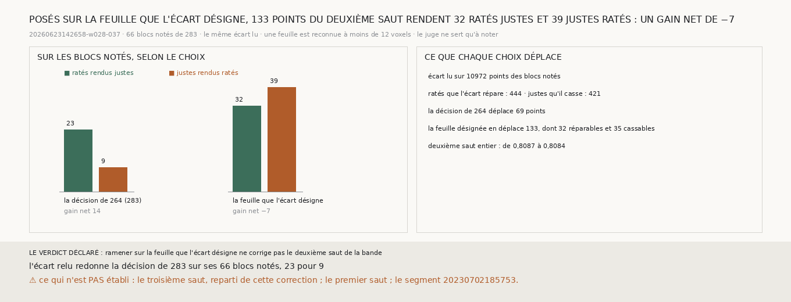

# `289` — Ramener chaque point sur la feuille que l'écart lu désigne corrige-t-il le deuxième saut de la bande ? Non : 133 points bougent, et ils rendent 32 ratés justes pour 39 justes ratés, un gain net de −7

*`282` a montré sur la bande que la marche lit les ratés, et que c'est le choix qui manque. Au deuxième saut, la décision de `264`
corrige 69 points (`283`). Elle les pose loin des feuilles : à une médiane de 36,2988 voxels de la plus proche sur le rayon du
saut (`285`). Or un glissement vrai déplace un point d'une feuille à une autre, et l'écart qui le désigne doit mener près d'une
autre feuille ; un écart de bruit ne mène près d'aucune. Cette tranche remplace la décision par ce critère : ne garder que les
écarts qui mènent à une autre feuille, et poser le point sur elle, comme la chaîne pose les siens.*

## 0. Pourquoi cette tranche

C'est `R4-P95`. Le module est écrit avant cette correction, et il déclare ses issues. Sur les blocs notés réunis, si les ratés
que la correction rend justes sont plus nombreux que les justes qu'elle rend ratés, ramener sur la feuille que l'écart désigne
corrige le deuxième saut de la bande ; sinon, non.

## 1. La correction, et le contrôle

Sur les 66 blocs notés de `283`, pour chaque point où l'écart que la décision lit est défini :
- la cible est la projection du point sur le rayon du deuxième saut, moins l'écart lu ;
- si le centre de plage de `m7` le plus proche de la cible en est à moins de 12 voxels, et n'est pas celui dont le point est le
  plus proche, le point se pose sur lui ;
- sinon, le point ne bouge pas.

Les 12 voxels sont la distance à laquelle la chaîne reconnaît sa feuille, et rien n'est réglé. Le contrôle tient : sur chacun des
66 blocs notés, la décision de `264` prise sur l'écart relu redonne les points corrigés de `283`, et, réunis, ses 23 ratés rendus
justes et ses 9 justes rendus ratés. La lecture n'a connu aucune panne.

## 2. Ce que la correction fait

L'écart est lu sur 10972 points des blocs notés. La correction en déplace **133**, contre 69 pour la décision de `264`. Parmi
eux, l'écart lu répare 32 ratés et casse 35 justes, sur les 444 ratés réparables et les 421 justes cassables des blocs.

| le choix | points déplacés | ratés rendus justes | justes rendus ratés | gain net |
|---|---|---|---|---|
| la décision de `264` (`283`) | 69 | 23 | 9 | 14 |
| **la feuille que l'écart désigne** | **133** | **32** | **39** | **−7** |

Sur les blocs notés, la part des points sur la bonne spire passe de 0,8596 à 0,8589 ; sur le deuxième saut entier, de 0,8087 à
0,8084.

⭐⭐⭐⭐ **Au deuxième saut de la bande, poser chaque point sur la feuille que l'écart lu désigne en déplace 133, qui rendent 32
ratés justes pour 39 justes ratés : un gain net de −7, quand la décision de `264` rend 23 pour 9** (`R4-F470`).

## 3. Le verdict

**RAMENER SUR LA FEUILLE QUE L'ÉCART DÉSIGNE NE CORRIGE PAS LE DEUXIÈME SAUT DE LA BANDE.**

## 4. Ce que cette tranche ne dit pas

- ⚠⚠ Pourquoi la feuille ne départage pas : autant de justes cassables que de ratés réparables mènent près d'une autre feuille,
  32 contre 35. Qu'un écart mène à une feuille n'est donc pas, à lui seul, un signe de glissement.
- ⚠ Le troisième saut, reparti de cette correction ; le premier saut ; le segment `20230702185753`.

## 5. Les sondes

Une batterie de **6** contrôles et une figure de **11**. Un écart qui mène à moins de 12 voxels d'une autre feuille y pose le
point. Un écart qui ne mène près d'aucune feuille ne déplace rien, pas plus qu'un petit écart qui ramène à la feuille où le point
est déjà. Sans écart lu, ou sans feuille sur le rayon, rien ne bouge. Les issues s'excluent, et la mesure est indécidable sans
son contrôle.

Quatre contrôles cassés exprès ont échoué : l'écart ajouté au lieu d'être retranché, la feuille où le point est déjà acceptée
comme cible, le seuil de 12 voxels retiré, un gain nul compté comme une correction. Dans la figure, deux contrôles cassés ont
échoué : une barre qui porte un autre compte que le sien, et un titre qui écrit un gain figé.

La mesure a pris 22,1 s, dans une unité systemd bornée à 7 Go et à six cœurs.

## 6. Ce qui reste

`R4-P95` reste ouverte. Sur la bande, la décision de `264` reste le meilleur choix éprouvé au deuxième saut. Poser un point sur
la feuille que l'écart désigne ne sépare pas les glissements du bruit.
