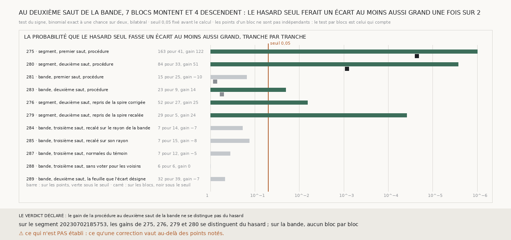

# `290` — Les gains nets publiés de `275` à `289` se distinguent-ils du hasard ? Sur le segment, oui ; sur la bande, aucun bloc par bloc : au deuxième saut, 7 blocs montent et 4 descendent

*Depuis `281`, presque chaque tranche écrit qu'elle ne sait pas si son gain net se distingue de zéro, parce que ses modules
comparaient deux comptes sans seuil. Au deuxième saut de la bande, la procédure rend 23 ratés justes pour 9 justes ratés
(`283`). Les tranches suivantes ne font plus bouger que quelques points. Cette tranche passe les gains publiés au même test,
choisi avant le calcul.*

## 0. Pourquoi cette tranche

C'est `R4-P95`. Chercher ce qui remplace l'humain sur des écarts de l'ordre de dix points n'a de sens que si ces écarts ne sont
pas du bruit. Le module est écrit avant le calcul, et il déclare ses issues. Si, bloc par bloc, le test du signe de `283` passe
sous 0,05, la procédure corrige le deuxième saut de la bande au-delà du hasard ; sinon, son gain ne se distingue pas du hasard.

## 1. Le test

Un point qu'une correction fait changer de camp est soit un raté rendu juste, soit un juste rendu raté. Si la correction n'en
savait rien, les deux seraient également probables. Le test du signe donne la probabilité, sous cette hypothèse, d'un écart au
moins aussi grand : binomial exact à une chance sur deux, bilatéral, la queue la plus petite doublée. Les points d'un même bloc
ne sont pas indépendants, puisqu'un bloc a une ancre et un mélange. Là où les blocs sont publiés, le même test porte sur les
blocs qui montent contre ceux qui descendent, et c'est lui qui compte. Le seuil de 0,05 est conventionnel, fixé avant le calcul.

## 2. Tranche par tranche

| tranche | ce qu'elle mesure | ratés rendus justes, justes rendus ratés | sur les points | blocs qui montent, qui descendent | sur les blocs |
|---|---|---|---|---|---|
| `275` | segment, premier saut, procédure | 163, 41 | 2,04e-18 | 42, 11 | 2,25e-05 |
| `280` | segment, deuxième saut, procédure | 84, 33 | 2,67e-06 | 19, 3 | 0,000855 |
| `281` | bande, premier saut, procédure | 15, 25 | 0,154 | 6, 8 | 0,791 |
| **`283`** | **bande, deuxième saut, procédure** | **23, 9** | **0,0201** | **7, 4** | **0,549** |
| `276` | segment, deuxième saut, repris de la spire corrigée | 52, 27 | 0,00655 | | |
| `279` | segment, deuxième saut, repris de la spire recalée | 29, 5 | 3,86e-05 | | |
| `284` | bande, troisième saut, recalé sur le rayon de la bande | 7, 14 | 0,189 | | |
| `285` | bande, troisième saut, recalé sur son rayon | 7, 15 | 0,134 | | |
| `287` | bande, troisième saut, normales du témoin | 7, 12 | 0,359 | | |
| `288` | bande, troisième saut, sans voter pour les voisins | 6, 6 | 1 | | |
| `289` | bande, deuxième saut, la feuille que l'écart désigne | 32, 39 | 0,477 | | |

⭐⭐⭐⭐ **Sur le segment `20230702185753`, les gains de `275`, `276`, `279` et `280` se distinguent du hasard, et ceux de `275`
et `280` le font bloc par bloc. Sur la bande, aucun ne le fait bloc par bloc : au deuxième saut, 7 blocs montent et 4 descendent,
et le hasard seul ferait un écart au moins aussi grand avec une probabilité de 0,549** (`R4-F471`).

Sur les points, le gain de `283` passe sous le seuil, à 0,0201 ; c'est la dépendance entre les points d'un bloc qui l'en fait
sortir. Aucune des reprises du troisième saut, ni la correction de `289`, ne passe sous le seuil, même sur les points.

## 3. Le verdict

**LE GAIN DE LA PROCÉDURE AU DEUXIÈME SAUT DE LA BANDE NE SE DISTINGUE PAS DU HASARD.**

## 4. Ce que cette tranche ne dit pas

- ⚠⚠ Ce qu'une correction vaut au-delà des points notés.
- ⚠ Onze tests sont faits ici : au seuil de 0,05, un faux positif s'attend une fois sur vingt tests. Les gains du segment passent
  bien en deçà.
- ⚠ Si un test par blocs, qui jette le nombre de points de chaque bloc, est trop sévère : il répond seulement à la question du
  sens dans lequel un bloc bouge.

## 5. Les sondes

Une batterie de **9** contrôles et une figure de **11**. Dix pour zéro vaut deux fois un sur mille vingt-quatre ; le test est
symétrique ; autant pour que contre, ou rien, vaut un ; sept contre quatre vaut deux fois la queue de quatre sur onze. Une très
petite probabilité ne s'arrondit pas à zéro. Les issues s'excluent.

Trois contrôles cassés exprès ont échoué : le test pris d'un seul côté, la queue arrêtée un cran trop tôt, le verdict pris sur
les points au lieu des blocs. Dans la figure, deux contrôles cassés ont échoué : une ligne sans son test par blocs, et un titre qui
écrit une probabilité figée.

## 6. Ce qui reste

`R4-P95` reste ouverte. La procédure de `265` corrige le segment `20230702185753` au-delà du hasard, au premier comme au deuxième
saut. Sur la bande, rien de ce qui a été éprouvé de `281` à `289` ne s'en distingue bloc par bloc.
