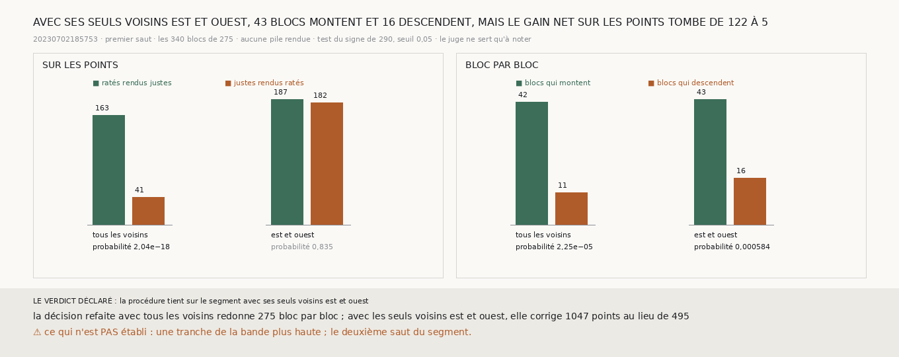

# `291` — Sur le segment, la procédure de `265` tient-elle encore avec ses seuls voisins à l'est et à l'ouest ? Bloc par bloc, oui : 43 blocs montent et 16 descendent. Mais sur les points, son gain net tombe de 122 à 5

*Sur le segment `20230702185753`, la procédure corrige le premier saut au-delà du hasard, bloc par bloc (`275`, `290`). Sur la
bande `w028-037`, rien ne s'en distingue (`290`). La tranche de la bande ne fait que 37 chunks de haut, et tous ses blocs
candidats sont sur une seule rangée de blocs (`281`) : chacun n'a de voisins qu'à l'est et à l'ouest. Sur le segment, 268 des 340
blocs en ont quatre. Cette tranche refait la décision du segment en ne lui laissant que ses voisins est et ouest.*

## 0. Pourquoi cette tranche

C'est `R4-P95`. La décision d'un bloc lit la marche d'un seul tenant sur le bloc et ses voisins, et son ancre est la médiane de
leur différence sur les voisins seuls. Deux voisins au lieu de quatre, c'est une marche plus courte et une ancre prise sur moitié
moins de chunks. Le module est écrit avant le calcul, et il déclare ses issues. Si, bloc par bloc, le test du signe de `290` passe
sous 0,05 avec les seuls voisins est et ouest, la procédure tient sur le segment, et la forme de la tranche de la bande n'explique
pas ce qui y manque ; sinon, elle n'y tient plus, et la forme de la tranche suffit à l'expliquer.

## 1. Ce qui change dans le calcul, et le contrôle

La décision d'un bloc de `275` prend désormais une règle facultative qui choisit ses voisins ; sans elle, rien ne change, et la
batterie de `275` le vérifie. Aucune pile n'est rendue et aucune table de pas n'est refaite. Refaite avec tous ses voisins, la
décision redonne `275` bloc par bloc, sur les 340 blocs. Avec les seuls voisins est et ouest, chacun des 340 blocs en garde au
moins un, et tous restent décidés.

## 2. Tous les voisins, puis l'est et l'ouest seuls

| les voisins | points corrigés | ratés rendus justes | justes rendus ratés | gain net | sur les points | blocs qui montent, qui descendent | bloc par bloc |
|---|---|---|---|---|---|---|---|
| tous | 495 | 163 | 41 | 122 | 2,04e-18 | 42, 11 | 2,25e-05 |
| **l'est et l'ouest** | **1047** | **187** | **182** | **5** | **0,835** | **43, 16** | **0,000584** |

Avec ses seuls voisins est et ouest, la décision corrige deux fois plus de points, 1047 contre 495, et casse presque autant de
justes qu'elle répare de ratés. Sur les blocs, la part des points sur la bonne spire passe de 0,9339 à 0,934, contre 0,9374 avec
tous les voisins.

⭐⭐⭐⭐ **Sur le segment, avec ses seuls voisins est et ouest, la procédure de `265` fait encore monter 43 blocs pour 16 qui
descendent, au-delà du hasard. Mais elle corrige 1047 points au lieu de 495, et son gain net sur les points tombe de 122 à 5**
(`R4-F472`).

## 3. Le verdict

**LA PROCÉDURE TIENT SUR LE SEGMENT AVEC SES SEULS VOISINS EST ET OUEST.**

Le verdict est celui du test déclaré, bloc par bloc. Sur les points, le gain ne se distingue plus du hasard.

## 4. Ce que cette tranche ne dit pas

- ⚠⚠ Si la forme de la tranche de la bande explique ce qui y manque. Le test déclaré dit que non, puisque le sens dans lequel les
  blocs bougent tient ; le compte des points dit qu'avec deux voisins seulement, la décision corrige deux fois plus et ne gagne
  presque plus rien.
- ⚠ Une tranche de la bande plus haute, où les blocs auraient quatre voisins.
- ⚠ Le deuxième saut du segment.

## 5. Les sondes

Une batterie de **4** contrôles et une figure de **9**. Les voisins est et ouest sont ceux de la même rangée de blocs, et eux
seuls ; un bloc sans voisin sur sa rangée n'en a aucun. Le test est celui de `290`. Les issues s'excluent, et la mesure est
indécidable sans son contrôle.

Trois contrôles cassés exprès ont échoué : les voisins pris sur la même colonne, tous les voisins gardés, le verdict pris sur les
points au lieu des blocs. Dans la figure, deux contrôles cassés ont échoué : une barre qui porte un autre compte que le sien, et un
titre qui écrit un gain figé.

La mesure a pris 20,9 s, dans une unité systemd bornée à 7 Go et à six cœurs.

## 6. Ce qui reste

`R4-P95` reste ouverte. Privée de ses voisins au nord et au sud, la procédure garde le sens de sa correction mais en perd presque
tout le gain. Une tranche de la bande assez haute pour donner quatre voisins à ses blocs dirait si c'est ce qui manque à la bande.
