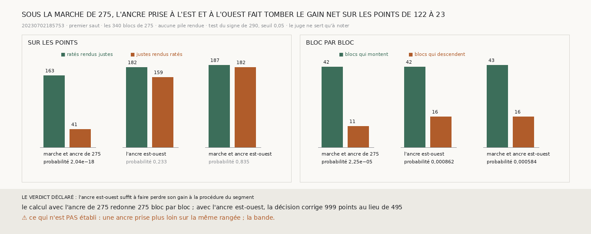

# `292` — Sur le segment, est-ce l'ancre prise à l'est et à l'ouest qui fait perdre son gain à la procédure ? Oui : sous la marche de `275`, elle fait tomber le gain net sur les points de 122 à 23

*Avec ses seuls voisins est et ouest, la procédure du segment `20230702185753` corrige 1047 points au lieu de 495, et son gain
net sur les points tombe de 122 à 5 (`291`). Deux choses changent alors ensemble : la marche, qui ne s'étend plus que sur une
rangée de trois blocs, et l'ancre, prise sur les deux voisins seulement. On ne peut pas prendre une ancre au nord et au sud sans
que la marche y passe. On peut en revanche garder la marche de `275`, sur les quatre voisins, et ne prendre l'ancre qu'à l'est et
à l'ouest.*

## 0. Pourquoi cette tranche

C'est `R4-P95`. Sur la bande, les blocs n'ont que l'est et l'ouest. Si c'est l'ancre qui fait perdre le gain, une ancre prise
autrement sur la même rangée peut s'y substituer sans rien rendre de neuf ; si c'est la marche, il faut une tranche plus haute.
Le module est écrit avant le calcul, et il déclare ses issues. Si le test du signe de `290` passe sous 0,05 sur les points, l'ancre
est-ouest garde le gain et c'est la marche qui le fait perdre ; sinon, l'ancre est-ouest suffit à le perdre. Le test porte sur les
points, parce que `291` a montré que le sens dans lequel les blocs bougent tient, et que c'est le gain sur les points qui
s'effondre.

## 1. Ce qui change dans le calcul, et le contrôle

La décision d'un bloc de `275` prend désormais une règle facultative qui prend son ancre ; sans elle, rien ne change, et la
batterie de `275` le vérifie. Pour chaque bloc, la marche est celle de `275`, sur le bloc et tous ses voisins candidats. L'ancre est
la médiane de la différence des marches sur les seuls blocs voisins à l'est et à l'ouest, le bloc retiré. Avec l'ancre de `275`,
le même calcul redonne `275` bloc par bloc, et tous les blocs restent décidés avec l'ancre est-ouest.

## 2. L'ancre, puis la marche

| la marche, l'ancre | points corrigés | ratés rendus justes | justes rendus ratés | gain net | sur les points | blocs qui montent, qui descendent | bloc par bloc |
|---|---|---|---|---|---|---|---|
| celles de `275` | 495 | 163 | 41 | 122 | 2,04e-18 | 42, 11 | 2,25e-05 |
| **la marche de `275`, l'ancre est-ouest** | **999** | **182** | **159** | **23** | **0,233** | **42, 16** | **0,000862** |
| la marche et l'ancre est-ouest (`291`) | 1047 | 187 | 182 | 5 | 0,835 | 43, 16 | 0,000584 |

⭐⭐⭐⭐ **Sur le segment, sous la marche de `275`, l'ancre prise à l'est et à l'ouest seulement fait corriger 999 points au lieu
de 495, et fait tomber le gain net sur les points de 122 à 23 : l'ancre, plus que la marche, porte la perte de `291`** (`R4-F473`).

Sur les blocs, la part des points sur la bonne spire passe de 0,9339 à 0,9346 avec l'ancre est-ouest, contre 0,9374 avec celle
de `275`.

## 3. Le verdict

**L'ANCRE EST-OUEST SUFFIT À FAIRE PERDRE SON GAIN À LA PROCÉDURE DU SEGMENT.**

## 4. Ce que cette tranche ne dit pas

- ⚠⚠ Pourquoi l'ancre est-ouest est si mauvaise : elle est prise sur moitié moins de chunks, et sur les seuls blocs que la marche
  traverse dans le sens où elle intègre ses pas. Ni l'un ni l'autre n'est isolé ici.
- ⚠ Une ancre prise plus loin sur la même rangée, qui est ce que la bande permettrait.
- ⚠ La bande.

## 5. Les sondes

Une batterie de **4** contrôles et une figure de **9**. L'ancre est-ouest est la médiane de l'ouest et de l'est seuls, sans le
nord, le sud ni le bloc ; l'ancre de `275` lit aussi le nord et le sud ; sans voisin à l'est ni à l'ouest, pas d'ancre. Les issues
s'excluent, et la mesure est indécidable sans son contrôle.

Trois contrôles cassés exprès ont échoué : l'ancre prise sur les colonnes au lieu de la rangée, l'ancre prise sur tout le
voisinage, le verdict pris sur les blocs au lieu des points. Dans la figure, deux contrôles cassés ont échoué : une barre qui porte
un autre compte que le sien, et un titre qui écrit un gain figé.

La mesure a pris 22,6 s, dans une unité systemd bornée à 7 Go et à six cœurs.

## 6. Ce qui reste

`R4-P95` reste ouverte. Sur le segment, c'est l'ancre prise à l'est et à l'ouest qui fait perdre l'essentiel du gain. La bande n'a
que ces voisins-là : il reste à trouver une ancre qui s'en contente.
