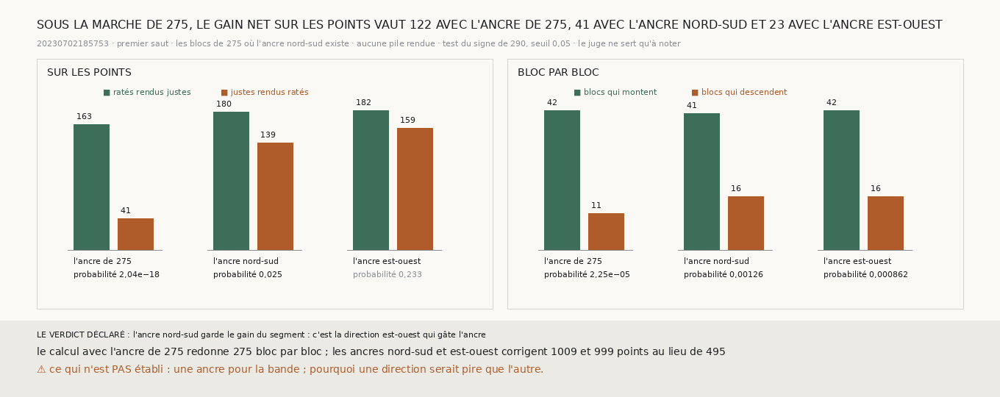

# `293` — Sur le segment, une ancre prise au seul nord et au seul sud garde-t-elle le gain que l'ancre est-ouest perd ? Au seuil déclaré, oui : 41 contre 23. Mais elle en perd elle aussi les deux tiers

*Sous la marche de `275`, l'ancre prise à l'est et à l'ouest seulement fait tomber le gain net du segment `20230702185753` de 122 à
23 (`292`). Cette ancre a deux défauts à la fois : elle est prise sur moitié moins de chunks, et sur les blocs que la marche
traverse dans le sens où elle intègre ses pas. Une ancre prise au nord et au sud a autant de chunks, dans l'autre direction.*

## 0. Pourquoi cette tranche

C'est `R4-P95`. Si l'ancre nord-sud garde le gain, c'est la direction est-ouest qui gâte l'ancre, et la bande, qui n'a que l'est et
l'ouest, demande une autre ancre que la médiane de ses voisins ; si elle le perd aussi, c'est le nombre de chunks. Le module est
écrit avant le calcul, et il déclare ses issues : si le test du signe de `290` passe sous 0,05 sur les points, l'ancre nord-sud
garde le gain et c'est la direction ; sinon, c'est le nombre de chunks.

## 1. Ce qui est fait, et le contrôle

La marche est celle de `275`, sur le bloc et tous ses voisins candidats ; l'ancre est la médiane de la différence des marches sur
les seuls blocs voisins au nord et au sud, le bloc retiré. Avec l'ancre de `275`, le même calcul redonne `275` bloc par bloc. Un
bloc n'a aucun voisin au nord ni au sud, et n'est pas décidé ; les trois ancres sont comparées sur les 339 autres.

## 2. Trois ancres sous la même marche

| l'ancre | points corrigés | ratés rendus justes | justes rendus ratés | gain net | sur les points | blocs qui montent, qui descendent | bloc par bloc |
|---|---|---|---|---|---|---|---|
| celle de `275` | 495 | 163 | 41 | 122 | 2,04e-18 | 42, 11 | 2,25e-05 |
| **au nord et au sud** | **1009** | **180** | **139** | **41** | **0,025** | **41, 16** | **0,00126** |
| à l'est et à l'ouest | 999 | 182 | 159 | 23 | 0,233 | 42, 16 | 0,000862 |

⭐⭐⭐⭐ **Sur le segment, sous la marche de `275`, l'ancre prise au nord et au sud garde un gain net de 41 sur les points, au-delà
du hasard, là où l'ancre est-ouest n'en garde que 23. Mais les deux demi-ancres doublent le nombre de points corrigés, 1009 et 999
au lieu de 495, et perdent chacune plus des deux tiers du gain** (`R4-F474`).

## 3. Le verdict

**L'ANCRE NORD-SUD GARDE LE GAIN DU SEGMENT : C'EST LA DIRECTION EST-OUEST QUI GÂTE L'ANCRE.**

Le verdict est celui du test déclaré. Il ne dit pas que la direction seule compte : avec autant de chunks que l'ancre est-ouest,
l'ancre nord-sud perd elle aussi l'essentiel du gain, et c'est surtout le nombre de chunks qui double les corrections.

## 4. Ce que cette tranche ne dit pas

- ⚠⚠ Une ancre pour la bande, qui n'a que l'est et l'ouest.
- ⚠ Pourquoi une direction serait pire que l'autre.
- ⚠ Si l'écart entre 41 et 23 se distingue du hasard : chaque ancre est testée contre zéro, pas l'une contre l'autre.

## 5. Les sondes

Une batterie de **4** contrôles et une figure de **9**. L'ancre nord-sud est la médiane du nord et du sud seuls, sans l'est,
l'ouest ni le bloc ; elle lit autant de chunks que l'ancre est-ouest ; sans voisin au nord ni au sud, pas d'ancre. Les issues
s'excluent, et la mesure est indécidable sans son contrôle.

Trois contrôles cassés exprès ont échoué : l'ancre prise sur la rangée au lieu de la colonne, l'ancre prise sur tout le voisinage,
le verdict pris sur les blocs au lieu des points. Dans la figure, deux contrôles cassés ont échoué : une barre qui porte un autre
compte que le sien, et un titre qui écrit un gain figé.

La mesure a pris 34,8 s, dans une unité systemd bornée à 7 Go et à six cœurs.

## 6. Ce qui reste

`R4-P95` reste ouverte. Sur le segment, une ancre prise sur deux voisins seulement double les corrections et perd l'essentiel du
gain, quelle que soit sa direction. La bande n'a que deux voisins par bloc : il lui faut une ancre prise sur plus de chunks que
ses deux voisins immédiats.
