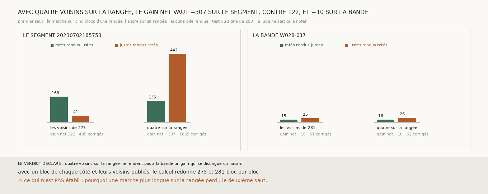

# `294` — Quatre voisins sur la même rangée rendent-ils à la bande `w028-037` le gain que la procédure y perd ? Non : 16 ratés justes pour 26 justes ratés. Et sur le segment, la même façon fait tomber le gain de 122 à −307

*Sur la bande, chaque bloc n'a de voisins qu'à l'est et à l'ouest, et une ancre prise sur deux voisins seulement perd l'essentiel
du gain sur le segment `20230702185753`, quelle que soit sa direction (`292`, `293`). Mais la bande a beaucoup de blocs sur sa
rangée : ses 84 blocs candidats se suivent. Cette tranche étend la marche sur cinq blocs d'une rangée, deux de chaque côté du bloc,
et prend l'ancre sur les quatre voisins de la rangée, soit autant de chunks que l'ancre de `275`. Rien n'est rendu de neuf.*

## 0. Pourquoi cette tranche

C'est `R4-P95`. Le module est écrit avant le calcul, et il déclare ses issues. Sur la bande, si le gain net sur les points est
positif, et si le test du signe de `290` passe sous 0,05 sur les points et sur les blocs, quatre voisins sur la rangée rendent à la
bande un gain qui se distingue du hasard ; sinon, non. Le même calcul est fait sur le segment, pour savoir ce que cette façon rend
là où la procédure marche.

## 1. Ce qui change dans le calcul, et les contrôles

La décision d'un bloc de `275` prend désormais la portée de sa marche, en blocs de chaque côté ; à une portée d'un bloc, rien ne
change, et la batterie de `275` le vérifie. Les voisins d'un bloc sont les blocs candidats de sa rangée, à l'est puis à l'ouest,
jusqu'à deux de chaque côté, arrêtés au premier qui manque : une marche ne se relie pas à travers un trou. L'ancre est la médiane
de la différence des marches sur la rangée du bloc, le bloc retiré.

Avec un bloc de chaque côté et les voisins publiés, le calcul redonne `275` sur le segment et `281` sur la bande, bloc par bloc.
Tous les blocs restent décidés ; sur la bande, 80 des 84 ont leurs quatre voisins sur la rangée, et sur le segment 248 des 340.

## 2. Sur le segment et sur la bande

| | les voisins | points corrigés | ratés rendus justes | justes rendus ratés | gain net | sur les points | blocs qui montent, qui descendent | bloc par bloc |
|---|---|---|---|---|---|---|---|---|
| le segment | ceux de `275` | 495 | 163 | 41 | 122 | 2,04e-18 | 42, 11 | 2,25e-05 |
| le segment | quatre sur la rangée | 1665 | 135 | 442 | −307 | 4,83e-39 | 37, 23 | 0,0925 |
| la bande | ceux de `281` | 61 | 15 | 25 | −10 | 0,154 | 6, 8 | 0,791 |
| **la bande** | **quatre sur la rangée** | **62** | **16** | **26** | **−10** | **0,164** | **7, 10** | **0,629** |

⭐⭐⭐⭐ **Sur la bande, avec quatre voisins sur sa rangée, la procédure rend 16 ratés justes pour 26 justes ratés, comme avec deux.
Sur le segment, la même façon corrige 1665 points et rend 135 ratés justes pour 442 justes ratés : un gain net de −307, contre
122 avec les voisins de `275`** (`R4-F475`).

Sur le segment, une marche qui s'étend sur cinq blocs d'une rangée ne se contente pas de perdre le gain : elle rend le premier
saut moins juste, de 0,9339 à 0,9251 sur les blocs, et au-delà du hasard sur les points.

## 3. Le verdict

**QUATRE VOISINS SUR LA RANGÉE NE RENDENT PAS À LA BANDE UN GAIN QUI SE DISTINGUE DU HASARD.**

## 4. Ce que cette tranche ne dit pas

- ⚠⚠ Pourquoi une marche plus longue sur la rangée perd autant sur le segment. Une marche qui ne s'étend que dans une direction
  intègre ses pas sur cinq blocs de long et un de large ; ce n'est pas mesuré ici.
- ⚠ Pourquoi la bande ne bouge presque pas : elle corrige 62 points, quand le segment passe de 495 à 1665.
- ⚠ Le deuxième saut.

## 5. Les sondes

Une batterie de **4** contrôles et une figure de **9**. Les voisins sont sur la rangée, deux de chaque côté au plus, arrêtés au
premier qui manque ; les blocs au nord et au sud n'en sont pas ; avec une portée d'un bloc, ce sont les voisins est et ouest. Les
issues s'excluent, et la mesure est indécidable sans ses contrôles.

Trois contrôles cassés exprès ont échoué : les voisins repris au-delà d'un trou, les voisins pris sur la colonne, le verdict pris
sans le test par blocs. Dans la figure, deux contrôles cassés ont échoué : une barre qui porte un autre compte que le sien, et un
titre qui écrit un gain figé.

La mesure a pris 30,5 s, dans une unité systemd bornée à 7 Go et à six cœurs.

## 6. Ce qui reste

`R4-P95` reste ouverte. Prendre plus de voisins sur la seule rangée ne rend pas son gain à la bande, et fait perdre le segment. Ce
qui manque à la bande n'est pas seulement le nombre de chunks de l'ancre : c'est une marche qui s'étende dans les deux directions,
et la tranche de la bande n'en a qu'une.
