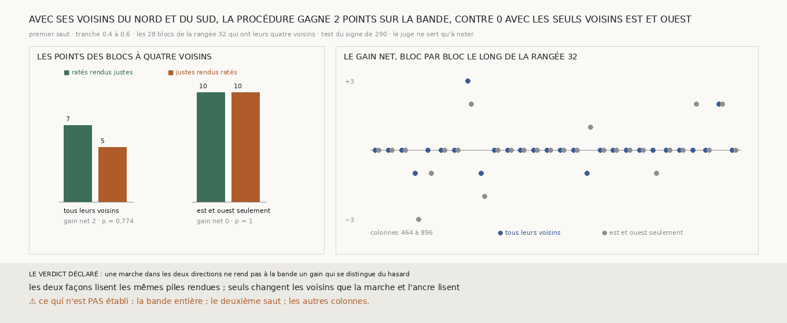

# `295` — Une marche qui s'étend dans les deux directions rend-elle à la bande `w028-037` le gain que la procédure y perd ? Non : 7 ratés justes pour 5 justes ratés sur les blocs à quatre voisins, un gain net de 2, que le hasard explique

*`294` concluait qu'il manque à la bande une marche qui s'étende dans les deux directions, et que la tranche de la bande n'en a
qu'une. Cette tranche prend sur la même bande une tranche deux fois plus haute, de 0,40 à 0,60 de sa hauteur, rend trois
rangées de blocs, 16, 32 et 48, sur les trente colonnes du milieu de la rangée 32, et décide la rangée 32 : ses blocs ont
des voisins au nord et au sud, comme ceux du segment `20230702185753`. La procédure de `275` n'y change pas.*

## 0. Pourquoi cette tranche

C'est `R4-P95`. Le module est écrit avant le premier rendu, et il déclare ses issues. Sur les blocs décidés qui ont leurs
quatre voisins, si le gain net sur les points est positif et si le test du signe de `290` passe sous 0,05 sur les points, une
marche dans les deux directions rend à la bande un gain qui se distingue du hasard ; sinon, non. Le test par blocs est rapporté
à côté. Le même calcul est refait avec les seuls voisins est et ouest, sur les mêmes piles, pour que la comparaison ne tienne
qu'aux voisins.

## 1. Ce qui est rendu, et les contrôles

La chaîne de `248` sur la tranche haute, refaite deux fois, rend deux fois le même premier saut. Le treillis redonne celui de
`257`. Sur les trois rangées candidates, les trente colonnes du milieu de la rangée 32
donnent 90 blocs à rendre, soit 180 piles sur les deux surfaces.
Les 30 blocs de la rangée 32 sont décidés, 28 avec leurs quatre voisins et 2, aux deux bouts, avec trois.

- Le miroir ne contient que les chunks que les piles lisent : 37086 chunks, 47,6 Go projetés. Le bloc de la rangée 32 qui
  porte le plus de points notés, `(32, 912)`, est rendu à distance puis depuis le miroir sur les deux surfaces, et les piles
  sont identiques voxel pour voxel.
- Aucune pile ne manque, et la lecture n'a connu aucune panne.

Si l'un de ces contrôles avait échoué, la mesure était indécidable.

## 2. Sur la bande

| les voisins | blocs | points corrigés | ratés rendus justes | justes rendus ratés | gain net | sur les points | blocs qui montent, qui descendent | bloc par bloc |
|---|---|---|---|---|---|---|---|---|
| **tous leurs voisins** | **28** | **15** | **7** | **5** | **2** | **0,774** | **2, 3** | **1** |
| est et ouest seulement | 28 | 23 | 10 | 10 | 0 | 1 | 4, 4 | 1 |

⭐⭐⭐⭐ **Sur la bande, avec des voisins au nord et au sud, la procédure rend 7 ratés justes pour 5 justes ratés sur les 28
blocs qui ont leurs quatre voisins : un gain net de 2, que le hasard explique (0,774). Avec les seuls voisins est et ouest,
sur les mêmes piles, 10 pour 10** (`R4-F476`).

Sur ces 28 blocs, la part sur la bonne spire passe de 0,9611 à 0,9615. La plupart des points notés étaient déjà justes.

Les deux blocs des bouts, `(32, 448)` et `(32, 912)`, n'ont que trois voisins et sont comptés à part. `(32, 448)` rend 10
ratés justes pour aucun juste raté ; `(32, 912)` ne corrige rien. Un bloc ne fait pas une mesure.

## 3. Le verdict

**UNE MARCHE DANS LES DEUX DIRECTIONS NE REND PAS À LA BANDE UN GAIN QUI SE DISTINGUE DU HASARD.**

Des voisins au nord et au sud sont ce qui sépare le segment de la bande sur la géométrie : sur le segment, sans eux, le gain
tombe de 122 à 5 (`291`). Sur la bande, les ajouter ne suffit pas. Ce qui manque à la bande n'est donc pas seulement la
géométrie du voisinage.

## 4. Ce que cette tranche ne dit pas

- ⚠⚠ Ce qui manque à la bande, s'il ne s'agit pas du voisinage. La bande corrige peu de points : 15 sur 28 blocs, quand le
  segment en corrige 495 sur 340. Sa part juste est déjà haute, 0,9611 ; il y a peu à corriger, et peu à gagner.
- ⚠ Les autres colonnes de la bande, et le deuxième saut.
- ⚠ Si un gain de cette taille se lirait sur plus de blocs. Vingt-huit blocs et douze points qui bougent ne départagent rien.

## 5. Les sondes, et ce que le rendu a coûté

Une batterie de **12** contrôles et une figure de **11**. Les colonnes rendues sont celles du milieu, dans l'ordre ; seuls les
blocs de la rangée 32 sont décidés ; un bloc a quatre voisins s'il en a au nord, au sud, à l'est et à l'ouest parmi les
rendus ; les issues s'excluent, et la mesure est indécidable sans contrôle ; le poids d'un chunk ne compte pas les chunks
absents de la source.

Trois contrôles cassés exprès ont échoué : les colonnes prises au bord au lieu du milieu, un bloc à trois voisins compté parmi
ceux qui en ont quatre, un gain positif retenu sans le seuil. Dans la figure, deux contrôles cassés ont échoué : une barre qui
porte un autre compte que le sien, et un titre qui écrit un gain figé.

⚠ Le contrôle du titre ne pouvait pas échouer dans sa première forme. Il comparait le titre à la mesure publiée, qui vaut
précisément 2 contre 0 : un titre qui écrivait « 0 » en dur le passait. Il est refait sur une mesure dont les deux gains sont
changés, et c'est cette forme-là qui a échoué contre le titre figé.

Le rendu a demandé trois reprises, et chacune a laissé ses bornes mesurées.

- ⚠⚠ **Le disque de WSL s'est rempli pendant le premier rendu, et la machine est tombée.** Au redémarrage, 14 piles de la
  rangée 32 ont échoué : `vc_render_tifxyz` refusait des chunks du miroir dont la taille décodée ne correspondait plus à celle
  d'un chunk. Les chunks écrits pendant la chute étaient tronqués. Les rangées 32 et 48 ont été refaites entièrement, depuis
  des chunks téléchargés à nouveau (48,1 Go en 1608 s). Les anciennes piles sont mises de côté, 29 Go, rien n'est supprimé.
- Les piles de la rangée 16 rendues avant la chute ont été gardées. Pour savoir si la chute en avait abîmé, les quatre écrites
  dans la minute et demie qui la précède sont comparées à quatre écrites huit minutes plus tôt : sur chaque couche, les zéros
  en trop sur la médiane de sa pile. Le plus grand excès vaut 0,035 ‰ d'une couche, et aucune couche n'est toute nulle ;
  4096 voxels effacés en feraient 0,98 ‰.
- Les 123 piles mises de côté ont été comparées le 28 septembre, voxel pour voxel, à celles qui les ont remplacées
  (`--partielles`, `docs/mesures/la_bande_haute_partielles.json`). 106 sont identiques à leur refaite. Les 17 autres n'ont
  aucune couche lisible : 14 sont les rendus que `vc_render_tifxyz` a refusés, et 3 ceux que la chute a coupés, dont les 109
  fichiers étaient créés et jamais remplis. Aucune ne se lit en étant fausse : un miroir abîmé a fait échouer le rendu ou l'a
  laissé vide, il ne l'a pas faussé en silence. Les 29 Go ne portaient donc rien d'unique, et ils ont été supprimés.
- Le rendu tourne maintenant sous une garde de place : il s'arrête, rangée par rangée, dès que `/` ou `/mnt/c` descend sous
  40 Go, et le dit.
- Épingler le rendu sur des cœurs fixes (`taskset`) le rend deux fois plus rapide qu'un quota de processeur seul, qui
  suspend le rendu en pleine période. Sur la dernière reprise, bornée à douze cœurs et à 7 Go, le processeur a fait attendre
  174 ‰ du temps et la mémoire 15 ‰, pour un pic de 7176 Mio.

La mesure a pris 1517,6 s, dont 1515,5 s pour les 180 tables de pas, dans une unité systemd bornée à 7 Go et à six cœurs.

## 6. Ce qui reste

`R4-P95` reste ouverte. Sur le segment, la procédure corrige le premier saut au-delà du hasard ; sur la bande, ni plus de
voisins sur la rangée (`294`), ni des voisins dans les deux directions ne lui rendent un gain qui s'en distingue. La
procédure est validée là où elle a été mesurée, sur un segment ; ce qui la fait tenir ailleurs n'est pas encore trouvé.
