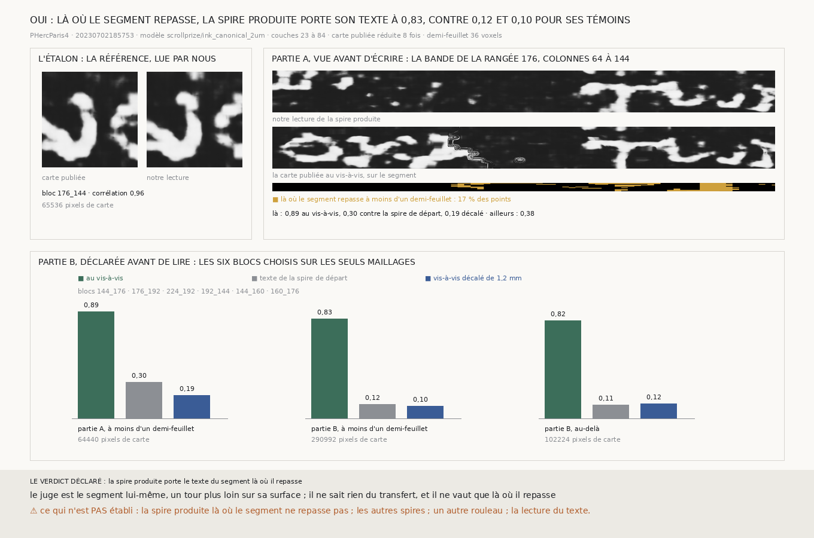

# `296` — La spire que le transfert produit porte-t-elle le texte que le segment porte, là où il repasse sur elle ? Oui : sur six blocs choisis sans l'encre, 0,83 contre 0,12 et 0,10 pour ses deux témoins

*Le segment `20230702185753` fait plus d'un tour : en face de beaucoup de ses points, un tour plus loin, passe un autre morceau
de lui-même. Là où ce morceau est à moins d'un demi-feuillet de la spire que le transfert produit, c'est la même feuille, et la
carte d'encre publiée du segment y dit le texte que la spire produite doit porter. Cette tranche lit l'encre de la spire produite
avec le modèle qui a fait la carte publiée, et la compare à la carte au vis-à-vis. Sur six blocs choisis sur les seuls maillages,
avant toute lecture d'encre, la corrélation vaut 0,83 là où le segment repasse, contre 0,12 pour le texte de la spire de départ
et 0,10 pour le vis-à-vis décalé d'une lettre.*

## 0. Pourquoi cette tranche

Jusqu'ici, la spire produite était jugée sur sa géométrie : sa distance à la couche que le segment porte au tour voisin
(`247`), et ses pas lus de fenêtre en fenêtre (`260` à `295`). Aucune tranche n'avait regardé si elle porte du texte, et si c'est
le bon. L'encre est la règle graduée d'un déroulage (`R1`) : une surface qui tombe sur la bonne feuille doit y lire les lettres
que cette feuille porte.

Le juge vient du segment lui-même (`247` §1, `R4-F411`). Il ne sait rien du transfert, et il ne vaut que là où le segment
repasse.

## 1. Ce qui a été vu avant d'écrire, et c'est dit

Le module est écrit **après** une première mesure. Le 28 septembre au soir, un prototype hors de ce dépôt a lu l'encre de la
spire produite sur six blocs de la rangée 176, colonnes 64 à 144. Ils étaient choisis **à l'œil**, parce que la carte publiée y
montre une ligne de lettres nette. Trois choix ont été faits après avoir vu des résultats :

- la bande de la partie A elle-même ;
- le demi-feuillet comme frontière entre ce qui est jugé et ce qui ne l'est pas, choisi après avoir vu la couture du champ de
  correspondance ;
- le seuil d'étalonnage, 0,8, posé après avoir vu 0,96.

Ce qui est déclaré avant de lire la moindre encre sur ses blocs, c'est la partie B : sa règle de choix, ses deux témoins et ses
issues sont dans le module avant que `--encre` ne la lise.

## 2. Ce qui est fait

- **Le modèle** est celui qui a fait la carte publiée : `scrollprize/ink_canonical_2um` (ResNet-152 3D, licence MIT, SHA-256
  `36dd0de8…`), par le code d'inférence de `villa`, en tuiles de 256 au pas de 128, les réglages que porte le nom de la carte.
  Il lit les 62 couches 23 à 84, placées autour de la surface (couche 54) comme la fenêtre 1 à 62 de l'équipe l'est autour de la
  couche 32 d'un volume de 65. Il tourne sur l'iGPU.
- **Les piles** sont celles que `275` a rendues pour ses tables de pas, sur les deux surfaces. Rien n'est rendu à neuf.
- **Le vis-à-vis** d'un point du maillage de la spire produite est le point du segment le plus proche en 3D parmi ceux qui sont à
  plus de 30 mailles de lui sur la surface. Plus près, ce serait la même feuille, un peu plus loin.
- **La mesure** : la carte publiée, réduite 8 fois, est lue au vis-à-vis de chaque pixel ; notre lecture est réduite à la même
  échelle ; on prend la corrélation de Pearson sur les pixels communs, d'un côté là où le vis-à-vis est à moins d'un
  demi-feuillet (36 voxels), de l'autre au-delà.
- **Deux témoins**, sur les mêmes pixels : la carte publiée sous le bloc lui-même, c'est-à-dire le texte de la spire de départ,
  que la spire produite ne doit pas recopier ; et la carte au vis-à-vis décalé de 64 pixels de carte, soit 1,2 mm, plus qu'une
  lettre.

## 3. L'étalon

Sur le bloc `176_144` de la référence, notre lecture et la carte publiée sont corrélées à **0,9593**, sur 65536 pixels de carte.
La lecture retrouve donc la carte publiée sur nos propres piles.

## 4. Partie A, la bande vue avant d'écrire

Sur la bande, le segment repasse à moins d'un demi-feuillet sur **17 %** des points ; l'écart médian du vis-à-vis est de 74,13
voxels, une feuille entière.

| où | pixels de carte | au vis-à-vis | texte de la spire de départ | vis-à-vis décalé |
|---|---|---|---|---|
| **à moins d'un demi-feuillet** | **64440** | **0,8909** | **0,3019** | **0,1949** |
| au-delà | 328776 | 0,3806 | 0,1304 | 0,0736 |

Le témoin « texte de la spire de départ » vaut 0,3019 et non zéro : d'un tour à l'autre, les lignes d'écriture tombent à peu près
aux mêmes hauteurs, et une corrélation voit cette structure en lignes. Le prototype avait mesuré ce témoin sur toute la bande et
trouvé 0,16 ; sur les mêmes pixels que la mesure, il vaut 0,3019.

## 5. Partie B, déclarée avant de lire

Sur les 340 blocs rendus, la part médiane des points à moins d'un demi-feuillet de leur vis-à-vis est de **0,0222** : le segment
ne repasse sur sa propre spire voisine qu'en peu d'endroits. Les six blocs de la plus grande part, hors de la bande de la partie A,
sont :

| bloc | part proche | écart médian (voxels) | pixels de carte | au vis-à-vis | texte de la spire de départ | vis-à-vis décalé |
|---|---|---|---|---|---|---|
| `144_176` | 0,7511 | 20,66 | 48196 | 0,9244 | 0,0685 | 0,0905 |
| `176_192` | 0,7333 | 27,82 | 51064 | 0,8089 | 0,1391 | 0,0503 |
| `224_192` | 0,7156 | 29,52 | 52136 | 0,6758 | −0,0199 | 0,1013 |
| `192_144` | 0,6889 | 28,76 | 51348 | 0,9045 | 0,1529 | 0,2144 |
| `144_160` | 0,6714 | 26,57 | 44216 | 0,8905 | −0,0206 | 0,0192 |
| `160_176` | 0,6476 | 32,56 | 44032 | 0,8002 | 0,2285 | 0,0406 |

Réunis :

| où | pixels de carte | au vis-à-vis | texte de la spire de départ | vis-à-vis décalé |
|---|---|---|---|---|
| **à moins d'un demi-feuillet** | **290992** | **0,8331** | **0,1166** | **0,1037** |
| au-delà | 102224 | 0,8164 | 0,111 | 0,124 |

⭐⭐⭐⭐ **Sur les six blocs choisis sans l'encre, là où le segment repasse, notre lecture de la spire produite et la carte publiée
au vis-à-vis sont corrélées à 0,8331, contre 0,1166 pour le texte de la spire de départ et 0,1037 pour le vis-à-vis décalé**
(`R4-F477`). Chaque bloc, pris seul, va de 0,6758 à 0,9244, et aucun de ses témoins ne dépasse 0,2285.

Au-delà du demi-feuillet, sur ces mêmes blocs, la corrélation vaut encore 0,8164. Là où la plupart des points d'un bloc sont sur
la bonne feuille, ceux qui en sont un peu plus loin lisent encore le même texte. Le demi-feuillet est donc une frontière prudente,
pas la limite du juge ; cette tranche ne mesure pas où est cette limite.

## 6. Le verdict

**LA SPIRE PRODUITE PORTE LE TEXTE DU SEGMENT LÀ OÙ IL REPASSE.**

C'est la première fois qu'une surface produite par la chaîne, sans main, est jugée sur ce qu'elle porte et non sur sa
géométrie : là où on peut la vérifier, elle tombe sur la feuille qui porte les lettres du segment.

## 7. Ce que cette tranche ne dit pas

- ⚠⚠ La spire produite là où le segment ne repasse pas, c'est-à-dire presque partout : la part médiane est de 0,0222. Le juge
  n'existe qu'en peu d'endroits, et il y est plus probable que la spire produite soit juste, puisque le segment y passe près.
- ⚠ Les autres spires de la chaîne (`248`), un autre segment, un autre rouleau.
- ⚠ La lecture du texte : une corrélation dit que deux cartes dessinent les mêmes formes, pas ce qu'elles disent.
- ⚠ Le modèle d'encre est celui de l'équipe, et il peut inventer des formes. C'est ce que les deux témoins sont là pour attraper ;
  un modèle qui inventerait des lettres sur la spire produite ne les inventerait pas au vis-à-vis.
- ⚠ La spire produite est celle du transfert avant correction (`m7`). Ce que la correction de `275` change à l'encre n'est pas
  mesuré.

## 8. Les sondes

Une batterie de **18** contrôles et une figure de **10**. Quatre règles cassées exprès ont fait échouer la batterie :

- sans l'exclusion des points proches sur la surface, deux contrôles tombent, dont celui qui compte : un transfert raté, retombé
  près de sa propre feuille, serait jugé contre elle, donc contre le texte de la spire de départ. Ce contrôle a été ajouté après
  qu'une première sonde n'en faisait tomber qu'un ;
- à égalité, des blocs départagés à l'envers ;
- le témoin décalé lu dans le mauvais sens ;
- un verdict qui ignore l'un des deux témoins.

## 9. Ce que la mesure a coûté

Les huit lectures d'encre ont pris 306 s pour l'étalon, 1987,2 s pour la bande de six blocs et de 302,8 à 313,2 s pour chaque bloc
de la partie B, soit environ 1 h 15 sur l'iGPU. La mesure elle-même prend quelques secondes. Aucun chunk n'est téléchargé : les
piles sont celles de `275`.

## 10. Ce qui reste

`R4-P96` s'ouvre : le même juge sur les spires suivantes de la chaîne de `248`, là où le segment repasse, dit-il à quel saut la
chaîne perd la feuille ? C'est un juge d'encre sans main, et le premier qui puisse suivre la chaîne au-delà du premier saut.

⚠⚠ Et l'objection de l'auteur tient : tout ceci part d'un segment tracé à la main et publié. Un rouleau scanné sans aucun tracé
n'a ni segment, ni carte d'encre, ni spire qui repasse. Ce juge est un banc d'essai pour la chaîne, pas un point de départ pour un
rouleau vierge.
