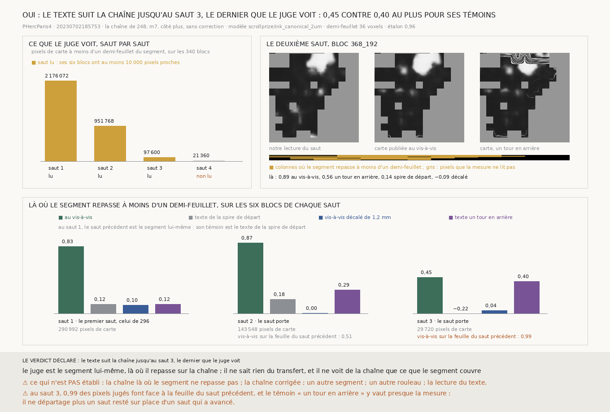

# `297` — Le texte du segment suit-il la chaîne de `248` au-delà du premier saut, là où le segment repasse sur elle ? Au deuxième saut, oui : 0,87 contre 0,29 au plus pour ses trois témoins ; au troisième, le juge ne départage plus

*Le juge de `296` est le segment lui-même, un tour plus loin sur sa surface : là où il repasse à moins d'un demi-feuillet de la
spire produite, sa carte d'encre publiée dit le texte que cette spire doit porter. Cette tranche le porte sur les sauts suivants
de la chaîne de `248`, avec un troisième témoin, le texte un tour en arrière, qui attrape un saut qui n'aurait pas avancé. Au
deuxième saut, sur six blocs choisis sur les seuls maillages, notre lecture et la carte au vis-à-vis sont corrélées à 0,8749,
contre 0,1761, 0,0016 et 0,2914. Au troisième, 0,4459 contre 0,3992 au plus : la règle déclarée dit que le texte suit, mais
0,9888 des pixels jugés y font face à la même feuille du segment que le saut précédent, et le troisième témoin ne départage plus.
Le quatrième saut, le juge ne le voit pas.*

## 0. Pourquoi cette tranche

C'est l'issue #4 et la porte `R4-P96`. Dérouler demande des dizaines de sauts, et un saut raté est définitif. `296` a montré que
la spire que le premier saut produit porte le texte du segment là où il repasse (`R4-F477`). `248` §6 montre que le segment ne
porte presque pas de troisième couche : son juge géométrique ne note le troisième saut que sur 295 points, le quatrième sur 32.
Le juge d'encre, lui, ne sait rien du transfert.

## 1. Ce qui a été vu avant d'écrire

Le module est écrit avant que la moindre encre ne soit lue au-delà du premier saut, et avant que les surfaces des sauts 2 à 4 ne
soient produites. Ce qui était vu : tout ce que `247`, `248`, `276` et `296` publient. Le premier saut n'est pas remesuré : ce
sont les blocs, les lectures et le verdict de `296`.

## 2. Ce qui est fait

- **La chaîne** est celle de `248`, le témoin de `276` : `m7`, côté plus, quatre sauts, chacun parti de la surface que le
  précédent a produite, le long de sa normale recalculée, sans correction. Refaite, elle redonne les quatre sauts de `248` compte
  pour compte (40024, 16635, 295 et 32 points notés ; 0,9177, 0,8875, 0,8305 et 0,3438 sur la bonne spire), et son premier saut
  est la spire produite de `275`, à un écart de 0,0 voxel.
- **Les surfaces** des sauts 2, 3 et 4 sont écrites en maillage, puis rendues en piles depuis le miroir, comme `275`.
- **Le juge** est celui de `296`, sans rien y changer : pour chaque point du maillage du saut, le point du segment le plus proche
  en 3D parmi ceux à plus de 30 mailles sur la surface ; la carte publiée, réduite 8 fois, lue à ce vis-à-vis ; notre lecture de
  la pile, par le même modèle, réduite de même ; la corrélation de Pearson là où le vis-à-vis est à moins d'un demi-feuillet.
- **Trois témoins**, sur exactement les mêmes pixels : la carte sous le bloc, c'est-à-dire le texte de la spire de départ ; la
  carte au vis-à-vis décalé de 1,2 mm ; ⭐ **la carte au vis-à-vis du saut précédent**, le texte un tour en arrière. Un saut qui
  n'a pas avancé est resté sur la feuille du saut d'avant, et ce témoin l'égale.
- **Les blocs**, pour chaque saut, sont les six candidats de `257` où le plus de pixels de carte ont leur vis-à-vis à moins d'un
  demi-feuillet, choisis sur les seuls maillages. Un saut dont les six blocs n'en ont pas 10 000 n'est ni rendu ni lu.

## 3. Les contrôles

- l'étalon : notre lecture de la référence et la carte publiée sur le bloc `176_144`, **0,9593** sur 65536 pixels ;
- `296` se redonne, bloc pour bloc ;
- la chaîne redonne `248`, et son premier saut est la spire produite ;
- le rendu : les deux premiers blocs des sauts 2 et 3, rendus à distance depuis le serveur, sont identiques voxel pour voxel à
  ceux rendus depuis le miroir, et le bloc `144_176` de la spire produite, rendu depuis le miroir, est identique à la pile de
  `275`.

## 4. Ce que le juge voit, saut par saut

| saut | pixels de carte proches du segment, sur les 340 blocs | part proche médiane | blocs à plus de la moitié proche | lu |
|---|---|---|---|---|
| 1 | 2176072 | 0,0222 | 13 | oui |
| 2 | 951768 | 0,0 | 0 | oui |
| 3 | 97600 | 0,0 | 0 | oui |
| 4 | 21360 | 0,0 | 0 | non, 9600 sur ses six blocs |

Le juge voit la chaîne de moins en moins : le segment repasse sur le premier saut, beaucoup moins sur le deuxième, presque plus
sur le troisième.

## 5. Le deuxième saut

| bloc | pixels | au vis-à-vis | spire de départ | décalé | un tour en arrière | sur la feuille du saut précédent |
|---|---|---|---|---|---|---|
| `368_192` | 33596 | 0,8949 | 0,1384 | −0,0881 | 0,5561 | 0,8825 |
| `320_208` | 23796 | 0,7903 | 0,4559 | 0,0556 | 0,3103 | 0,4235 |
| `192_240` | 23540 | 0,9404 | −0,1223 | −0,3692 | −0,0814 | 0,0108 |
| `304_208` | 21940 | 0,8701 | 0,5007 | 0,5226 | 0,5016 | 0,728 |
| `352_192` | 20768 | 0,7471 | 0,0815 | −0,0719 | 0,2708 | 0,8583 |
| `160_192` | 19908 | 0,5462 | −0,1018 | 0,012 | −0,0438 | 0,0 |

Réunis :

| où | pixels de carte | au vis-à-vis | spire de départ | décalé | un tour en arrière |
|---|---|---|---|---|---|
| **à moins d'un demi-feuillet** | **143548** | **0,8749** | **0,1761** | **0,0016** | **0,2914** |
| au-delà | 249668 | 0,5192 | 0,0998 | 0,1289 | 0,1897 |

⭐⭐⭐⭐ **Au deuxième saut, là où le segment repasse, notre lecture de la surface produite et la carte publiée au vis-à-vis sont
corrélées à 0,8749, contre 0,1761 pour le texte de la spire de départ, 0,0016 pour le vis-à-vis décalé et 0,2914 pour le texte un
tour en arrière** (`R4-F478`). Chaque bloc va de 0,5462 à 0,9404. La moitié des pixels jugés (0,514) ont leur vis-à-vis sur la
même feuille du segment que le premier saut, et le troisième témoin y reste pourtant loin sous la mesure : le deuxième saut a
avancé. Là où le juge géométrique de `248` note ces pixels juste, la corrélation vaut 0,88 sur 121800 pixels ; il n'en note raté
que 400, trop peu pour une corrélation.

## 6. Le troisième saut

Ses six blocs (`320_192`, `304_208`, `128_240`, `320_208`, `368_192`, `304_192`) ont de 3780 à 6620 pixels jugés chacun, trop peu
pour une corrélation par bloc ; réunis, **29720**.

| où | pixels de carte | au vis-à-vis | spire de départ | décalé | un tour en arrière |
|---|---|---|---|---|---|
| **à moins d'un demi-feuillet** | **29720** | **0,4459** | **−0,2176** | **0,0355** | **0,3992** |
| au-delà | 363496 | −0,0334 | −0,0391 | −0,1149 | −0,0811 |

La règle déclarée dit que le saut porte le texte : 0,4459 dépasse ses trois témoins. ⚠⚠ Mais **0,9888** des pixels jugés y ont
leur vis-à-vis sur la même feuille du segment (à moins de 30 mailles) que le deuxième saut, et le troisième témoin y vaut
0,3992, à 0,0467 de la mesure. Au deuxième saut, où ce témoin tombe loin sous la mesure, cette part n'était que de 0,514. Un saut
resté sur la feuille du précédent donnerait exactement ce tableau ; un saut qui a avancé, face à un segment qui ne repasse plus
qu'une fois près de lui, pourrait le donner aussi. C'est un raisonnement, pas une mesure, et cette tranche ne départage pas les
deux. Le juge géométrique de `248` n'aide pas : il ne note que 400 de ces pixels.

## 7. Le verdict

**LE TEXTE SUIT LA CHAÎNE JUSQU'AU SAUT 3, LE DERNIER QUE LE JUGE VOIT**, par la règle déclarée.

Ce que la mesure établit, c'est le deuxième saut : il porte le texte du segment là où il repasse, avec ses trois témoins loin
dessous, dont celui qui attrape un saut resté sur place. Au troisième, la règle passe de 0,0467, sur un témoin qui lit là presque
toujours la même feuille du segment que la mesure : ce saut n'est pas établi. Au quatrième, le juge ne voit pas la chaîne.

## 8. Ce que cette tranche ne dit pas

- ⚠⚠ La chaîne là où le segment ne repasse pas, c'est-à-dire presque partout : au deuxième saut, la part proche médiane des 340
  blocs est nulle. Les blocs sont choisis là où le saut passe près du segment, où il est plus probable qu'il soit juste.
- ⚠ Si le troisième saut a avancé : le témoin qui devait le dire fait face à la même feuille du segment que la mesure.
- ⚠ La chaîne corrigée (`275`, `280`), l'autre côté, l'autre prédiction, un autre segment, un autre rouleau.
- ⚠ La lecture du texte : une corrélation dit que deux cartes dessinent les mêmes formes, pas ce qu'elles disent.

## 9. Les sondes

Une batterie de **25** contrôles et une figure de **12**. La batterie est passée au premier essai, ce qui ne prouve rien ; sept
règles cassées exprès l'ont fait échouer :

- un verdict qui ignore le troisième témoin ;
- les pixels où l'une des cartes manque, lus quand même ;
- le vis-à-vis au pixel sans la première ligne du bloc retranchée ;
- à égalité, des blocs départagés à l'envers ;
- l'issue qui garde le dernier saut perdu au lieu du premier ;
- au premier saut, le témoin du saut précédent lu au vis-à-vis au lieu du texte de la spire de départ ;
- le témoin du saut précédent lu au vis-à-vis du saut lui-même.

## 10. Ce que la mesure a coûté

Les surfaces des sauts 2 et 3, six piles chacune : 289,1 s et 294,5 s de rendu depuis le miroir, 11,9 Go téléchargés pour
chacune. Les deux piles de contrôle rendues à distance : 270,7 s et 190,5 s. Les douze lectures d'encre ont pris de 301,3 à
345,3 s chacune sur l'iGPU, 3795,5 s en tout. La mesure prend 4,7 s. Tout sous garde cgroup.

## 11. Ce qui reste

`R4-P96` a sa réponse, en deux moitiés : oui au deuxième saut, indécidable au troisième. `R4-P97` s'ouvre : là où le segment ne
repasse plus qu'une fois, qu'est-ce qui dit qu'un saut a avancé d'une feuille sur le précédent ? L'écart entre les deux surfaces
le peut sans l'encre ; le texte, seulement sur un autre segment qui repasse plus loin.

⚠⚠ Et l'objection de l'auteur tient toujours : tout ceci part d'un segment tracé à la main. C'est un banc d'essai pour la chaîne,
pas un point de départ pour un rouleau vierge ; c'est l'objet de `298`.
