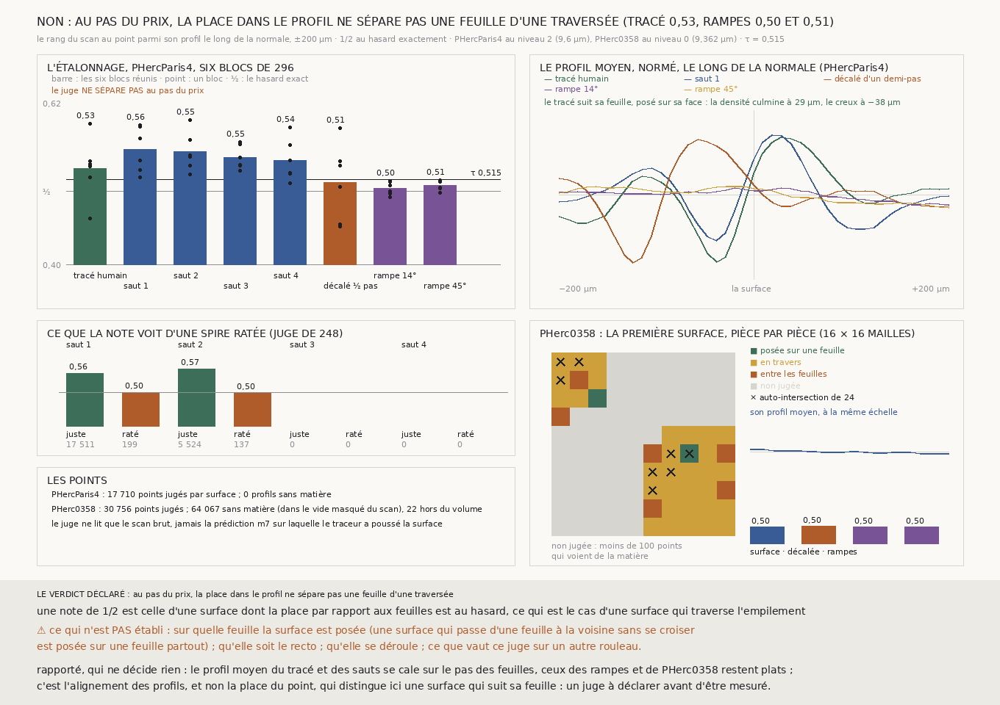

# `298` — Au pas du prix, la place d'une surface dans le profil de la matière dit-elle si elle est posée sur sa feuille ? Non : le tracé humain est noté 0,53, ses deux rampes 0,50 et 0,51 ; il suit bien sa feuille, mais posé sur sa face

*Avant de produire une première surface sur un rouleau que personne n'a tracé, il faut un juge qui dise, sans référent, si elle est
posée sur une feuille ; et un juge sans référent n'est croyable que s'il a été vu séparer, là où la réponse est connue et au pas
où il servira, une surface juste de surfaces fausses fabriquées pour lui. Cette tranche en déclare un, le plus simple : le rang du
scan au point parmi son profil le long de la normale, dont la valeur au hasard vaut exactement 1/2. Sur PHercParis4, réduit au pas
du prix (9,6 µm), il ne sépare pas le tracé humain des rampes plantées qui traversent l'empilement : 0,5308 contre 0,5038 et
0,5077. Le profil moyen dit pourquoi : le tracé suit sa feuille, mais il est posé sur sa face, à 29 µm de ce qu'elle a de plus
dense. Le rouleau du prix n'est donc pas jugé, comme la règle le voulait.*

## 0. Pourquoi cette tranche

C'est l'issue #5 (`R4-P16`, `R4-P17`, `R4-P11`). Tout ce que la chaîne fait part du segment `20230702185753`, qu'une personne a
tracé. Les treize rouleaux du Grand Prize n'ont aucun tracé et ne publient aucun rang de spire (`81`), et l'auteur tient que c'est
le vrai défi. Avant la graine elle-même (#17), l'issue demande de choisir un rouleau par une règle écrite d'avance, d'écrire la
liste des juges qui se passent de référent avec ce qui les ferait échouer, et d'en faire tourner au moins un sur une première
surface automatique.

## 1. Ce qui a été vu avant d'écrire, et c'est dit

Le module est écrit avant qu'un seul voxel ne soit lu. Mais le rouleau choisi a été vu : `24` a compté **240** auto-intersections
sur sa première surface, et `38` a dit des tirages de R3 qu'ils ne convergent pas (α ≈ 1, avec la réserve de `49`). Le verdict
sur ce rouleau était donc attendu défavorable ; l'étalonnage, lui, ne l'était pas.

## 2. Les juges sans référent, et ce qui les ferait échouer

La liste que #5 demande. Aucun de ces juges ne lit un tracé humain.

| juge | ce qu'il lit | ce qui le ferait échouer | où il en est |
|---|---|---|---|
| les auto-intersections (`vc_tifxyz_selfcross`) | la surface seule | une surface qui passe d'une feuille à la voisine sans se croiser | a vu 240 contacts sur la surface de PHerc0358 (`24`) |
| la convergence α (`38`) | la distance à la matière quand la fenêtre s'élargit | un profil sans pic rend α = 1 par construction (`49`) ; une fenêtre trop étroite | 0 série convergente sur 107 en R3 |
| **la place dans le profil** (cette tranche) | le rang du scan au point, le long de la normale | une surface juste posée ailleurs qu'au plus dense de sa feuille | **mesurée ici : ne sépare pas** |
| l'alignement des profils (rapporté ici) | le profil moyen, normé, le long de la normale | une surface parallèle aux feuilles mais entre elles garde le même alignement ; il ne dit pas quelle feuille | rapporté, à déclarer avant d'être mesuré |
| la direction de la matière (tenseur de structure) | l'orientation locale des feuilles contre la normale | des feuilles froissées ou écrasées ; il ne dit pas quelle feuille | non essayé |
| la fermeture des boucles (`R4-F430`) | les pas lus de bande en bande autour d'une boucle | il faut des bandes lisibles ; étalonnée à 2,4 µm seulement | jamais sur une surface automatique |
| la règle d'encre | le contraste d'encre sur la surface | à 9,36 µm, elle ne sépare pas la feuille du vide (`75` §C2) ; le modèle d'encre est à 2 µm | inutilisable au pas du prix |

Tous ces juges, sauf la fermeture des boucles, sont aveugles au rang de spire : ils disent au mieux qu'une surface est posée sur
une feuille, jamais sur laquelle.

## 3. Ce qui est fait

- **Le juge.** Pour chaque point, le profil du scan brut le long de sa normale, de −200 à +200 µm (21 pas de chaque côté à
  9,6 µm comme à 9,362 µm). La note du point est le rang de la valeur au point parmi les 42 autres, ex æquo comptés pour moitié.
  Pour une surface dont la place par rapport aux feuilles est au hasard, ce qui est le cas d'une surface qui traverse
  l'empilement, l'espérance de la note est exactement 1/2, quel que soit le rouleau. Le juge ne lit jamais la prédiction `m7` sur
  laquelle le traceur pousse ses surfaces.
- **L'étalonnage**, sur PHercParis4 au niveau 2 (9,6 µm), sur les six blocs de `296`, suréchantillonnés quatre fois (un point
  tous les 96 µm) : le segment réduit, les quatre sauts de la chaîne de `248`, et trois défauts plantés dans le segment sur ses
  propres points : décalé d'un demi-pas le long de sa normale (36 voxels), et deux rampes en dents de scie d'amplitude deux pas,
  de pente 1/4 (14°) et 1 (45°), qui traversent l'empilement sans s'éloigner de plus de deux pas du segment.
- **Le rouleau**, par une règle déclarée : parmi les treize, celui où une première surface automatique existe déjà dans l'arbre,
  poussée sur les seuls produits publiés et reproductible depuis sa graine. C'est PHerc0358 (`data/artefacts/PHerc0358`, `24`).
  ⚠ C'est une règle de coût, et elle choisit un rouleau déjà vu. Sa surface est jugée au niveau 0 (9,362 µm), par pièces de
  16 × 16 mailles, avec les mêmes trois défauts plantés sur elle-même, au pas de ce rouleau (187,24 µm).
- **Les issues** sont celles du module : le juge sépare si, sur chacun des six blocs, la note du segment dépasse 1/2 et celles
  de ses deux rampes, et celle de son décalé est sous 1/2 ; et si, réunies, les deux rampes sont sous τ = (note du segment + 1/2)/2.
  Sinon, le rouleau n'est pas jugé.

## 4. L'étalonnage

| bloc | tracé humain | saut 1 | saut 2 | saut 3 | saut 4 | décalé ½ pas | rampe 14° | rampe 45° |
|---|---|---|---|---|---|---|---|---|
| `144_176` | 0,4629 | 0,5186 | 0,5469 | 0,5356 | 0,541 | 0,5857 | 0,5126 | 0,5128 |
| `176_192` | 0,5919 | 0,5877 | 0,5969 | 0,5664 | 0,5627 | 0,4546 | 0,5 | 0,5035 |
| `224_192` | 0,5407 | 0,5418 | 0,5482 | 0,5273 | 0,5248 | 0,4516 | 0,5136 | 0,4972 |
| `192_144` | 0,536 | 0,5892 | 0,5222 | 0,5458 | 0,5109 | 0,5342 | 0,4968 | 0,5134 |
| `144_160` | 0,5334 | 0,5713 | 0,57 | 0,5633 | 0,5861 | 0,5409 | 0,5079 | 0,505 |
| `160_176` | 0,519 | 0,5284 | 0,5346 | 0,5343 | 0,5233 | 0,5059 | 0,4913 | 0,5145 |
| **réunis** | **0,5308** | **0,5563** | **0,5532** | **0,5454** | **0,5411** | **0,5119** | **0,5038** | **0,5077** |

Chaque surface a **17710** points jugés, chaque défaut **16430** ; aucun profil n'est sans matière. Le seuil vaut τ = **0,5154**.

⭐⭐⭐ **Le juge ne sépare pas au pas du prix.** Sur le bloc `144_176`, le tracé humain est sous le hasard (0,4629) et sous ses deux
rampes, et son décalé au-dessus (0,5857) ; sur trois autres blocs, le décalé n'est pas sous le hasard. Réunies, les rampes
(0,5038 et 0,5077) sont sous τ, mais le tracé humain n'est lui-même qu'à 0,5308 : la note d'une surface juste et celle d'une
surface qui traverse l'empilement sont à trois centièmes l'une de l'autre (`R4-F479`).

## 5. Ce que montre le profil moyen, rapporté

Chaque profil ramené à moyenne nulle et écart un, puis moyenné sur les points d'une surface. Les pas sont ceux du volume jugé
(9,6 µm), comptés le long de la normale de la grille.

| surface | amplitude | le plus dense | le plus creux | valeur au point |
|---|---|---|---|---|
| tracé humain | 0,74 | +3 | −4 | 0,1239 |
| saut 1 | 0,63 | +2 | −4 | 0,2076 |
| saut 2 | 0,67 | +2 | −4 | 0,1866 |
| saut 3 | 0,55 | +2 | −4 | 0,1618 |
| saut 4 | 0,44 | +2 | −5 | 0,1428 |
| décalé ½ pas | 0,73 | −6 | −13 | 0,0562 |
| rampe 14° | 0,1 | — | — | 0,025 |
| rampe 45° | 0,13 | — | — | 0,0371 |

⭐⭐⭐ **Le tracé suit sa feuille, mais il est posé sur sa face.** Son profil moyen se cale sur l'empilement, avec une amplitude de
0,74 contre 0,10 et 0,13 pour les rampes : là où les profils ne sont pas alignés, leur moyenne s'aplatit. Mais le plus dense est
à 3 pas (29 µm) du point et le plus creux à 4 pas de l'autre côté : le point tombe sur le flanc qui monte, là où son rang vaut à
peu près 1/2. Un tracé humain suit le recto, et la matière culmine un peu plus loin dans la feuille. La note au point présupposait
une surface au plus dense de sa feuille ; c'est cette présupposition qui tombe, pas la visibilité des feuilles au pas du prix.

Le décalé confirme la géométrie : le demi-pas de 9 voxels déplace le pic de +3 à −6 et le creux de −4 à −13, et son amplitude
reste 0,73. L'alignement ne voit pas un décalage d'un demi-pas, seulement une traversée. Et l'amplitude des sauts baisse de 0,63
au premier à 0,44 au quatrième : la chaîne perd en alignement à chaque saut, ce que `248` voit par sa géométrie. Rien de ceci
n'était déclaré comme un juge ; c'est le relevé que le module rapportait à côté.

⚠ Le relevé déclaré du « pas que la matière montre » rend 86,4 µm pour le tracé, et c'est faux : il symétrise le profil autour
du point, donc il suppose, lui aussi, la feuille centrée sur la surface. Lu sur le profil lui-même, le pas va du pic à −12 au
pic à +3, soit 15 pas, 144 µm.

## 6. Ce que la note voit d'une spire ratée, rapporté

| saut | juste (juge de `248`) | points | raté | points |
|---|---|---|---|---|
| 1 | 0,557 | 17511 | 0,5001 | 199 |
| 2 | 0,5707 | 5524 | 0,4983 | 137 |

Sur les six blocs, le juge de `248` ne note que les sauts 1 et 2 ; les points ratés y sont au hasard. Ils sont trop peu, une
douzaine de mailles, pour en dire plus.

## 7. PHerc0358, rapporté, et non jugé

Par la règle, le rouleau n'est pas jugé : le juge n'a pas séparé là où la réponse est connue. Ce que la mesure rapporte à côté :

- **64067** des **94845** points de la surface de `24` ont un profil sans matière : ils sont dans le vide que le scan masque,
  hors du rouleau. La vue d'ensemble de `24` le montre, un grand noir entre deux coins de papyrus. Les morceaux qui les portent
  n'existent pas sur le serveur (**800** des **1265**, réponse 404 vérifiée sur six).
- Sur les **30756** autres, la note vaut **0,5003** et le profil moyen a une amplitude de **0,07**, comme les rampes plantées sur
  la surface elle-même (0,14 et 0,12) : là où elle est dans la matière, la surface ne suit pas les feuilles. C'est ce que `24` et
  `38` disaient, par un autre chemin.
- Les auto-intersections de `24` tombent dans **8** pièces.

## 8. Le verdict

**AU PAS DU PRIX, LA PLACE DANS LE PROFIL NE SÉPARE PAS UNE FEUILLE D'UNE TRAVERSÉE.**

C'est un fait négatif sur un juge, et il ferme une voie : la note au point ne peut pas valider une première surface sur un rouleau
vierge, parce qu'une surface juste, posée comme un humain la pose, est notée comme une surface qui traverse.

## 9. Ce que cette tranche ne dit pas

- ⚠⚠ Que l'alignement des profils sépare : il est rapporté, pas déclaré ; il a été vu avant d'être écrit comme juge, et le
  profil plat de PHerc0358 aussi.
- ⚠ Quelle feuille : aucun juge de cette tranche ne voit le rang de spire.
- ⚠ Ce que vaut le juge sur un autre segment de PHercParis4, ou sur un rouleau moins comprimé ; les six blocs sont ceux où le
  segment repasse sur lui-même.
- ⚠ Que la surface soit le recto, qu'elle se déroule.
- ⚠ Le rouleau a été choisi par une règle de coût, parmi des rouleaux déjà vus.

## 10. Les sondes

Une batterie de **38** contrôles et une figure de **12**. Au premier passage, quatre contrôles tombaient ; trois étaient mes
attentes, fausses (un creux plat dans l'empilement synthétique, un compte d'ex æquo), et le quatrième était un défaut du banc
d'essai : deux volumes synthétiques partageaient les morceaux rangés sur disque sous le même nom.

Dix règles cassées exprès ont fait échouer la batterie :

- les axes lus dans l'ordre (x, y, z) au lieu de (z, y, x) ;
- le facteur de niveau ignoré ;
- les ex æquo ignorés dans le rang ;
- une pièce déclarée posée sur une feuille sans que son décalé tombe sous 1/2 ;
- les rampes réunies ignorées dans l'étalonnage ;
- le décalé ignoré dans l'étalonnage ;
- la dent de scie remplacée par une rampe qui ne redescend pas ;
- les pièces non jugées comptées dans la part posée ;
- un morceau nécessaire mais jamais tiré lu comme du vide : la sonde passait d'abord, et un contrôle a été ajouté ;
- ⚠ le nom des morceaux sur disque : le premier téléchargement réel a échoué parce qu'un suffixe remplacé faisait de `94.28.34` un
  `94.28.part`, partagé avec `94.28.35`. Le même défaut aurait fait d'un morceau absent tous ses voisins de préfixe. Il a été
  corrigé et un contrôle ajouté avant la moindre mesure ; les 53 Mo tirés sous l'ancien nom restent sur disque, ignorés.

## 11. Ce que la mesure a coûté

**371** morceaux de PHercParis4 au niveau 2 (0,78 Go, 47,7 s) et **1265** de PHerc0358 au niveau 0 (dont 800 absents, 97,4 s).
La mesure prend 114 s. Tout sous garde cgroup, quatre cœurs.

## 12. Ce qui reste

`R4-P98` s'ouvre : l'alignement des profils, déclaré avant d'être mesuré et étalonné sur les mêmes défauts, sépare-t-il au pas du
prix une surface qui suit sa feuille d'une surface qui la traverse, et que dit-il d'une première surface qu'on n'a pas encore vue ?

Et #17, la graine elle-même, gagne une exigence mesurée : les deux tiers de la première surface de PHerc0358 sont hors de la
matière. Une graine qui pousse vers le vide masqué se voit avant tout juge, par le seul compte des profils sans matière.
