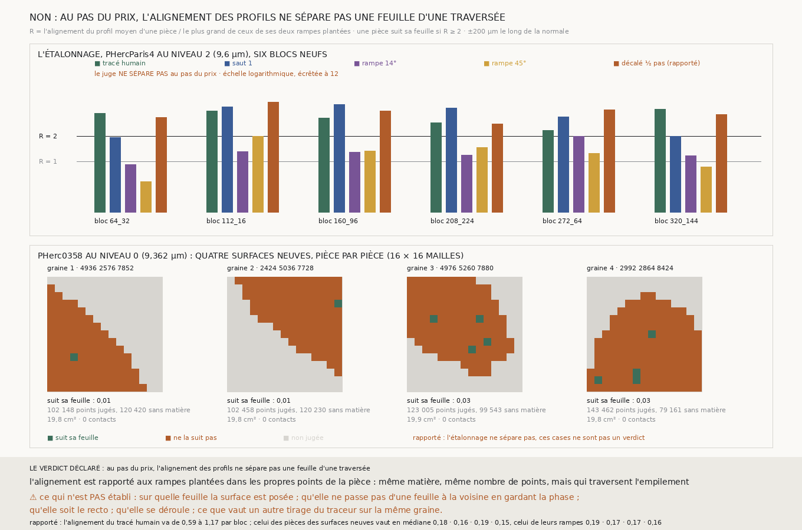

# `299` — L'alignement des profils dit-il, au pas du prix, si une première surface suit sa feuille ? Non, pas par la règle déclarée : trois comparaisons sur trente-six passent le seuil du mauvais côté

*`298` a montré que la note au point ne sépare pas, parce qu'un tracé humain est posé sur la face de sa feuille, et que le profil
moyen du tracé, lui, se cale sur l'empilement. Cette tranche déclare ce second juge avant de le mesurer : l'alignement d'une
pièce, rapporté à celui des deux rampes plantées dans ses propres points, doit valoir au moins 2. Sur six blocs neufs de
PHercParis4, le tracé humain va de 2,321 à 4,179 et les rampes de 0,571 à 2,0 ; mais le premier saut tombe à 1,911 sur un bloc et
deux rampes atteignent 2,0 sur deux autres. La règle ne sépare pas, et le rouleau n'est pas jugé. Sur PHerc0358, quatre surfaces
neuves du traceur, qui ne se croisent nulle part, ont en médiane l'alignement de leurs propres rampes.*

## 0. Pourquoi cette tranche

C'est `R4-P98`, et la suite de #5. Un juge qui se passe de référent doit être vu séparer, au pas où il servira, une surface
juste de surfaces fausses fabriquées pour lui, puis être porté sur une surface qu'on n'a pas vue.

## 1. Ce qui a été vu avant d'écrire, et c'est dit

Tout ce que `298` publie, dont les amplitudes réunies du profil moyen sur les six blocs de `296` : tracé 0,74, rampes 0,1 et
0,13, décalé 0,73, et le profil plat de la surface de `24`. C'est pourquoi l'étalonnage se fait ici sur six autres blocs, choisis
par leur seule position parmi les candidats, et le rouleau sur des surfaces que personne n'avait poussées. Le seuil 2 a été posé
en connaissant le rapport réuni de `298` (0,74 contre 0,13, soit 5,7) ; c'était un seuil prudent, et c'est bloc par bloc qu'il a
été mis en défaut.

## 2. Ce qui est fait

- **Le juge.** L'alignement d'une pièce est l'amplitude de la moyenne de ses profils, chaque profil ramené à moyenne nulle et
  écart un (±200 µm le long de la normale, comme `298`). Il est rapporté au plus grand de ceux des deux rampes de `298` plantées
  dans les propres points de la pièce : R = alignement / témoin. Une pièce suit sa feuille si R ≥ 2.
- **L'étalonnage**, sur PHercParis4 au niveau 2 (9,6 µm) : les blocs `64_32`, `112_16`, `160_96`, `208_224`, `272_64` et
  `320_144`, ceux de rang ⌊k(N − 1)/7⌉ parmi les candidats hors des six de `296`. Le segment réduit et le premier saut de la
  chaîne doivent avoir R ≥ 2 sur chaque bloc ; les deux rampes du segment, jugées chacune contre ses propres rampes, R < 2.
- **Le rouleau.** Les quatre graines que `trouver_graine.py` rend sur la prédiction `m7` publiée de PHerc0358, à mi-hauteur
  (sur les 16 chunks sondés, 12 sont vides) : `4936 2576 7852`, `2424 5036 7728`, `4976 5260 7880` et `2992 2864 8424`. Chacune
  est poussée une fois par `vc_grow_seg_from_seed`, avec les paramètres de `24`, puis jugée par pièces de 16 × 16 mailles au
  niveau 0 (9,362 µm).

## 3. L'étalonnage

| bloc | tracé humain | saut 1 | rampe 14° | rampe 45° | décalé ½ pas (rapporté) |
|---|---|---|---|---|---|
| `64_32` | 3,75 | 1,911 | 0,909 | 0,571 | 3,304 |
| `112_16` | 4,0 | 4,429 | 1,308 | 2,0 | 5,053 |
| `160_96` | 3,278 | 4,727 | 1,286 | 1,333 | 4,0 |
| `208_224` | 2,885 | 4,316 | 1,182 | 1,462 | 2,778 |
| `272_64` | 2,321 | 3,357 | 2,0 | 1,235 | 4,125 |
| `320_144` | 4,179 | 2,0 | 1,167 | 0,857 | 3,625 |

⭐⭐⭐ **La règle déclarée ne sépare pas au pas du prix** (`R4-F480`) : le premier saut est à 1,911 sur `64_32`, la rampe à 45° à
2,0 sur `112_16`, la rampe à 14° à 2,0 sur `272_64`. Les trente-trois autres comparaisons tombent du bon côté, et le tracé humain
passe partout. Le décalé d'un demi-pas reste aligné (2,778 à 5,053), comme prévu : l'alignement ne voit pas un décalage.

Ce qui fait tomber la règle se lit dans les relevés, qui ne décident rien. L'alignement du tracé humain va de **0,59** à **1,17**
par bloc, celui de ses rampes de **0,16** à **0,28** ;
celui du premier saut de **0,47** à **0,86**, mais une de ses rampes atteint **0,45**, et c'est elle qui fait 1,911. Les rampes, jugées comme des surfaces, ont un alignement de **0,16** à **0,28**, et
leurs propres rampes de **0,08** à **0,28** : un rapport de deux quantités de même taille, bruitées, dont on garde la plus grande
des deux au dénominateur, dépasse 2 une fois de temps en temps. Le témoin est trop maigre : deux rampes ne font pas un hasard.

## 4. Les surfaces neuves de PHerc0358, rapportées et non jugées

| graine | aire | contacts transverses | points | part sans matière | pièces jugées | R médian | alignement médian | celui des rampes 14° et 45° |
|---|---|---|---|---|---|---|---|---|
| 1 | 19,824 cm² | 0 | 222784 | 0,5405 | 111 | 0,88 | 0,18 | 0,19 et 0,16 |
| 2 | 19,824 cm² | 0 | 222784 | 0,5397 | 112 | 0,905 | 0,16 | 0,17 et 0,16 |
| 3 | 19,856 cm² | 0 | 222784 | 0,4468 | 135 | 0,905 | 0,19 | 0,17 et 0,17 |
| 4 | 19,828 cm² | 0 | 222784 | 0,3553 | 153 | 0,846 | 0,15 | 0,15 et 0,16 |

⭐⭐ Les quatre surfaces sont propres pour le juge des auto-intersections : zéro contact, là où celle de `24` en avait 240. Mais
**là où elles sont dans la matière, leurs pièces ont l'alignement de leurs propres rampes** : 0,15 à 0,19 en médiane, contre 0,15
à 0,19 pour les rampes, et un R médian de 0,846 à 0,905. Une pièce qui suivrait sa feuille comme le tracé humain aurait un
alignement de l'ordre de 0,6 à 1,2 ; le nombre de points ne devrait pas changer cette valeur-là, seulement le bruit du
témoin, et c'est un raisonnement, pas une mesure.
Ce n'est pas un verdict, puisque la règle n'a pas séparé ; c'est le même constat que `38`, par un autre chemin.

Et de **36 à 54 %** de leurs points sont hors de la matière, dans le vide que le scan masque : les graines sont posées sur la
prédiction, les surfaces en sortent.

Par la règle, les pièces qui suivraient leur feuille seraient 1, 1, 4 et 4 sur 111 à 153 jugées ; ces cases de la figure ne sont
pas un verdict.

## 5. Le verdict

**AU PAS DU PRIX, L'ALIGNEMENT DES PROFILS NE SÉPARE PAS UNE FEUILLE D'UNE TRAVERSÉE**, par la règle déclarée.

Le fait négatif porte sur la règle et pas sur l'idée : sur six blocs, le tracé humain passe partout et les rampes restent en
médiane près de 1, mais un témoin fait de deux rampes est trop bruité pour qu'un seuil tienne bloc par bloc.

## 6. Ce que cette tranche ne dit pas

- ⚠⚠ Qu'un témoin fait de plus de rampes sépare : c'est une idée que la mesure suggère, pas une mesure.
- ⚠ Que les surfaces du traceur ne suivent jamais leur feuille : quatre graines, un tirage chacune (`R3-F05`), une seule hauteur
  du rouleau.
- ⚠ Sur quelle feuille une surface est posée ; qu'elle ne passe pas d'une feuille à la voisine en gardant la phase.
- ⚠ Pourquoi les surfaces sortent de la matière ; la prédiction `m7` y voit peut-être des surfaces que le masque retire.

## 7. Les sondes

Une batterie de **24** contrôles et une figure de **12**. La batterie est passée au premier essai ; huit règles cassées exprès
l'ont fait échouer, deux seulement après qu'un contrôle a été renforcé :

- la plus faible des deux rampes au dénominateur au lieu de la plus forte ;
- le seuil pris strict ;
- le premier saut oublié dans l'étalonnage ;
- la graine de `24` gardée parmi les graines neuves ;
- les blocs déjà vus gardés dans l'étalonnage : la sonde passait, parce que le contrôle ne donnait comme blocs vus que des
  extrêmes que la règle ne choisit jamais ;
- les pièces non jugées comptées dans la part qui suit ;
- la dernière surface qui suit au lieu de la première ;
- les profils moyennés sans être normés : la sonde passait, et un contrôle d'invariance au contraste a été ajouté.

## 8. Ce que la mesure a coûté

La recherche des graines, quelques secondes ; les quatre surfaces, de 27,3 à 40,0 s chacune ;
**375** morceaux de PHercParis4 et **10862** de PHerc0358 demandés, dont beaucoup absents du serveur, parce que dans le vide masqué. La mesure prend 587,1 s. Tout
sous garde cgroup.

## 9. Ce qui reste

`R4-P99` s'ouvre : un témoin de traversée fait de nombreuses rampes, de pentes et de phases différentes, rend-il l'alignement
décidable bloc par bloc au pas du prix ? Et, pour #17, la graine elle-même : les surfaces que le traceur pousse depuis une graine
dans le rouleau en sortent pour un tiers à la moitié de leurs points, et, là où elles restent dans la matière, ne s'alignent pas
plus sur les feuilles que leurs propres traversées.
