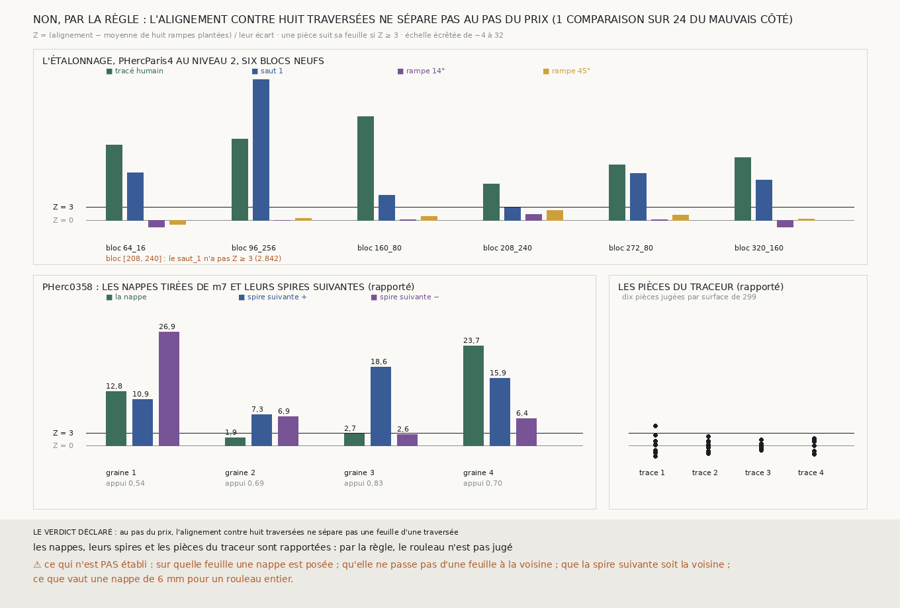

# `300` — Une première surface tirée de la seule prédiction m7 suit-elle sa feuille sur un rouleau du prix, et la spire suivante aussi ? Par la règle, rien n'est jugé : une comparaison sur vingt-quatre tombe du mauvais côté ; rapportées, deux nappes sur quatre et leurs spires suivantes se calent sur l'empilement

*`299` montre qu'un témoin fait de deux rampes est trop maigre, et que les surfaces du traceur ne s'alignent pas plus sur les
feuilles que leurs traversées. Cette tranche refait le juge avec huit rampes (deux pentes, quatre phases) et un Z, et demande la
première surface à `m7` elle-même : un plan posé sur une graine, que chaque point déplace vers la feuille de `m7` la plus proche,
avec le vote entre voisins de `247`, puis la spire suivante de chaque côté. Sur six blocs neufs de PHercParis4, le tracé humain a
Z de 8,294 à 23,476, les rampes de −1,556 à 2,224 ; mais le premier saut tombe à 2,842 sur un bloc, où le juge de `248` le dit
juste à 0,9619. La règle ne sépare pas. Rapportées : sur PHerc0358, deux nappes sur quatre ont Z 12,79 et 23,677, et leurs deux
spires suivantes aussi dépassent 3 ; les pièces du traceur ont Z −0,102 en médiane.*

## 0. Pourquoi cette tranche

C'est `R4-P99` et #17. Un juge sans référent doit avoir un vrai hasard, et une première surface doit venir d'ailleurs que du
traceur, dont les surfaces sortent de la matière et n'y suivent pas les feuilles (`299`). La chaîne de `248` sait passer d'une
spire à la suivante en lisant `m7` le long de la normale ; la même lecture, partie d'un plan, tire une première nappe de `m7` seule.

## 1. Ce qui a été vu avant d'écrire, et c'est dit

Tout ce que `298` et `299` publient, dont les graines, reprises ici, et l'alignement des pièces du traceur. Les blocs d'étalonnage
sont neufs, hors des douze déjà lus. Les nappes n'avaient été tirées par personne.

## 2. Ce qui est fait

- **Le juge.** L'alignement de `299`, comparé à celui de huit rampes plantées dans les propres points de la pièce : pentes 1/4 et
  1, amplitude deux pas, phases décalées d'un quart de période. Z = (alignement − moyenne des huit) / leur écart. Une pièce suit sa
  feuille si Z ≥ 3.
- **L'étalonnage**, sur PHercParis4 au niveau 2 : les blocs `64_16`, `96_256`, `160_80`, `208_240`, `272_80` et `320_160`. Le
  segment et le premier saut doivent avoir Z ≥ 3 sur chacun, les deux rampes plantées dans le segment Z < 3.
- **La nappe**, sur PHerc0358 au niveau 0 : pour chacune des quatre graines de `299`, un plan de 65 × 65 points au pas de 10
  voxels, perpendiculaire à la normale de la graine. Chaque point lit `m7` sur ±30 voxels ; tour après tour, il vise la médiane de
  ses neuf voisins et prend la feuille de `m7` la plus proche à moins d'un demi-pas. **La spire suivante**, de chaque côté : la
  première feuille de `m7` après la sienne, sur trois pas, puis le même vote.

## 3. L'étalonnage

| bloc | tracé humain | saut 1 | rampe 14° | rampe 45° | juge de `248` sur le saut 1 |
|---|---|---|---|---|---|
| `64_16` | 17,07 | 10,741 | −1,556 | −0,899 | — |
| `96_256` | 18,423 | 32,012 | 0,007 | 0,493 | 0,9911 |
| `160_80` | 23,476 | 5,735 | 0,054 | 0,908 | — |
| `208_240` | 8,294 | 2,842 | 1,34 | 2,224 | 0,9619 |
| `272_80` | 12,534 | 10,635 | 0,13 | 1,127 | — |
| `320_160` | 14,192 | 9,063 | −1,515 | 0,277 | 0,9592 |

⭐⭐⭐ **La règle déclarée ne sépare pas** (`R4-F481`) : sur le bloc `208_240`, le premier saut n'a que Z = 2,842. Les onze autres
surfaces justes dépassent 3, et aucune des douze rampes ne l'atteint : la plus haute est à 2,224,
et le tracé humain ne descend jamais sous 8,294. Le premier saut n'est pas un référent, mais là, le juge géométrique de `248` le dit juste à 0,9619 sur ses
mailles notées : c'est le juge d'alignement qui l'a sous-noté, pas le saut qui a raté.

## 4. Les nappes de PHerc0358, rapportées et non jugées

| graine | appui sur `m7` | déchirures | Z de la nappe | Z spire + | Z spire − | pas médian appuyé + / − (voxels) |
|---|---|---|---|---|---|---|
| 1 | 0,5408 | 0,0083 | 12,79 | 10,93 | 26,893 | 29,5 / 20,0 |
| 2 | 0,6949 | 0,0028 | 1,935 | 7,275 | 6,907 | 15,0 / 27,5 |
| 3 | 0,8329 | 0,0357 | 2,739 | 18,552 | 2,58 | 20,0 / 15,5 |
| 4 | 0,6992 | 0,0645 | 23,677 | 15,902 | 6,436 | 19,5 / 22,0 |

Le pas du rouleau vaut 20 voxels. La nappe de la graine 4 a un alignement de 0,4 contre 0,09 pour la moyenne de ses rampes, ce qui
ressemble au tracé humain de PHercParis4 (0,45 à 1,06) ; ses deux spires suivantes, 0,34 et 0,31 contre 0,085 et 0,091, à des pas
médians de 19,5 et 22,0 voxels. Celle de la graine 1 a un alignement de 1,47 contre 0,647 pour ses rampes : un alignement si fort
que ses traversées elles-mêmes en ont une grande part, ce que fait un bord de la matière plutôt qu'une feuille. La graine 2 est dans
le même cas (1,89 contre 1,505), et c'est pourquoi son Z reste sous 3.

Les dix premières pièces jugées de chacune des quatre surfaces du traceur de `299`, jugées de même :
**40** pièces, Z médian **−0,102**, **1** seule au-dessus de 3 (4,731).

⚠ Rien de ceci n'est un verdict : par la règle, le rouleau n'est pas jugé.

## 5. Le verdict

**AU PAS DU PRIX, L'ALIGNEMENT CONTRE HUIT TRAVERSÉES NE SÉPARE PAS UNE FEUILLE D'UNE TRAVERSÉE**, par la règle déclarée.

Le fait porte sur un juge qui manque d'une comparaison sur vingt-quatre : les rampes restent toutes sous 3, le tracé humain
toujours au-dessus de 8, et la surface sous-notée est juste. La règle exigeait tout ou rien ; elle a eu presque tout.

## 6. Ce que cette tranche ne dit pas

- ⚠⚠ Qu'une nappe de `m7` suit sa feuille : c'est rapporté, pas jugé, et le juge n'a pas passé sa règle.
- ⚠ Sur quelle feuille une nappe est posée, ni qu'elle ne passe pas d'une feuille à la voisine : les déchirures en sont un relevé,
  pas un juge. Ni que la spire suivante soit la voisine plutôt qu'une plus lointaine, même si son pas médian est celui du rouleau.
- ⚠ Ce que vaut une nappe de 6 mm pour un rouleau entier ; ce que valent d'autres graines.
- ⚠ Qu'un seuil plus bas séparerait : il serait choisi après avoir vu 2,842 et 2,224.

## 7. Les sondes

Une batterie de **21** contrôles et une figure de **11**. Au premier passage, quatre contrôles tombaient, tous du banc d'essai : une
normale nulle au bord de la grille, un plan plus grand que le volume synthétique, et, ⚠ un vrai défaut, une dispersion de huit
valeurs égales qui ne vaut pas exactement zéro en virgule flottante et faisait un Z immense ; il est gardé par un plancher.

Sept règles cassées exprès ont fait échouer la batterie, deux après qu'un contrôle a été ajouté :

- une feuille prise à plus d'un demi-pas de la cible : la sonde passait, un contrôle a été ajouté ;
- un consensus sans majorité : la sonde passait, un contrôle a été ajouté ;
- sa propre feuille prise pour la suivante ;
- Z mesuré contre la plus faible des rampes au lieu de leur moyenne ;
- le premier saut oublié dans l'étalonnage ;
- une spire suivante comptée sans que sa nappe suive ;
- une seule phase de rampe au lieu de quatre.

⚠ Et un relevé corrigé avant la mesure : le pas médian d'une spire suivante comptait les points sans appui, qui gardent le pas
par défaut de 20 voxels ; il ne compte plus que les points appuyés.

## 8. Ce que la mesure a coûté

Les quatre nappes et leurs spires, de 3,1 à 4,5 s chacune, 411 morceaux de `m7` lus ; **370** morceaux de PHercParis4 et **1051**
de PHerc0358 demandés. La mesure prend quelques minutes. Tout sous garde cgroup.

## 9. Ce qui reste

`R4-P100` s'ouvre : un étalonnage déclaré par taux plutôt que tout ou rien, sur plus de blocs, sépare-t-il au pas du prix, et que
dit-il alors des nappes de `m7` et de leurs spires suivantes, tirées depuis d'autres graines qu'on n'aura pas vues ?

Et pour #17 : une première surface peut être demandée à `m7` sans traceur, en six millimètres et quatre secondes, et, rapportée,
la moitié des quatre se cale sur l'empilement avec ses deux spires suivantes, là où les surfaces du traceur ne le font pas.
