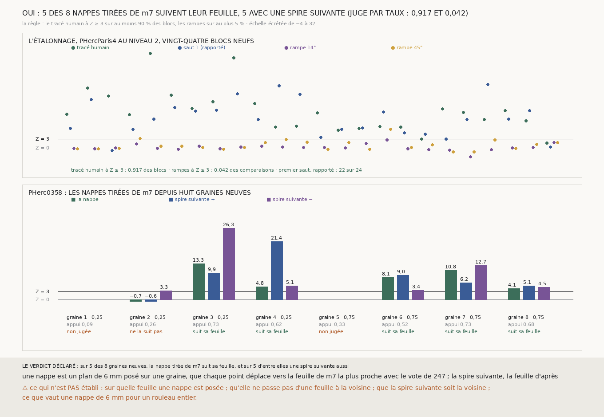

# `301` — Déclaré par taux sur vingt-quatre blocs, le juge sépare-t-il, et les nappes de m7 tirées de graines neuves suivent-elles leur feuille ? Oui, et oui : sur PHerc0358, cinq nappes sur huit suivent leur feuille, et leurs spires suivantes aussi

*C'est le premier fait établi sur un rouleau sans aucun tracé humain. Le juge est celui de `300` : l'alignement des profils du scan
brut le long de la normale, contre huit rampes plantées dans les propres points de la pièce, Z ≥ 3. Déclaré cette fois par taux,
sur vingt-quatre blocs neufs de PHercParis4, il sépare : le tracé humain passe sur 22 blocs sur 24 (0,9167), les rampes sur 2
comparaisons sur 48 (0,0417). Sur PHerc0358, huit graines neuves, cherchées au quart et aux trois quarts de la hauteur du rouleau :
deux nappes tombent entièrement dans le vide masqué, une ne suit pas sa feuille, et **cinq la suivent, chacune avec ses deux spires
suivantes**. Le juge ne dit pas sur quelle feuille ; les marges de l'étalonnage sont minces.*

## 0. Pourquoi cette tranche

C'est `R4-P100`, et l'issue #5, dont la règle veut qu'elle reste ouverte tant que le rouleau sans tracé n'a pas un premier fait
établi. `300` a manqué sa règle tout-ou-rien d'une comparaison sur vingt-quatre, sur une surface qui n'est pas un référent. Un juge
n'est jamais parfait : il se déclare par ses taux, sur assez de blocs, contre le seul référent qu'on ait, le tracé humain. Puis il
se porte sur des nappes que personne n'a vues.

## 1. Ce qui a été vu avant d'écrire, et c'est dit

Tout ce que `298` à `300` publient : les Z de `300` sur six blocs (tracé 8,294 à 23,476, rampes jusqu'à 2,224, premier saut à
2,842 sur un bloc) et ses quatre nappes. ⚠ **La règle par taux (90 % et 5 %) a donc été posée après avoir vu `300`.** Elle est
écrite avant que les vingt-quatre blocs ne soient lus et avant que les graines neuves ne soient cherchées ; ses deux seuils sont des
valeurs rondes, pas des valeurs ajustées sur ce qu'on a vu.

## 2. Ce qui est fait

- **Le juge**, inchangé depuis `300` : Z = (alignement − moyenne de huit rampes) / leur écart ; une pièce suit sa feuille si Z ≥ 3.
- **L'étalonnage** : vingt-quatre blocs parmi les candidats de `257`, hors des dix-huit déjà lus, de rang ⌊k(N − 1)/25⌉. Le juge
  sépare si le tracé humain a Z ≥ 3 sur au moins 90 % des blocs, et si les deux rampes plantées dans le tracé, jugées chacune contre
  ses huit rampes, ont Z ≥ 3 sur au plus 5 % de leurs quarante-huit comparaisons.
- **Les graines** : `trouver_graine.py` sur la prédiction `m7` de PHerc0358, à `--z-fraction 0.25` et `0.75`, jusqu'à quatre par
  hauteur, dans son ordre, sans celles de `299`.
- **La nappe et ses spires**, exactement comme `300` : un plan de 65 × 65 points au pas de 10 voxels (6 mm), chaque point déplacé
  vers la feuille de `m7` la plus proche avec le vote de `247` ; puis, de chaque côté, la feuille d'après.

## 3. L'étalonnage

Le tracé humain a Z ≥ 3 sur **22** des 24 blocs (**0,9167**) : les deux autres sont `368_32` (1,576) et `272_112` (2,991). Les
rampes ont Z ≥ 3 sur **2** des 48 comparaisons (**0,0417**) : la rampe à 45° sur `64_112` (3,161) et sur `240_128` (6,35).

⭐⭐⭐ **Le juge sépare, par sa règle** (`R4-F482`). ⚠ Avec des marges minces : un bloc de moins pour le tracé (87,5 %), ou une
rampe de plus (6,25 %), et la règle tombait. Sur le bloc `368_32`, le tracé humain lui-même n'a pas plus d'alignement que ses
rampes (0,44 contre 0,45 et 0,32) : ce que le juge ne voit pas existe aussi sur une surface juste.

Le premier saut de la chaîne, rapporté, passe sur 22 blocs sur 24.

## 4. Les nappes de PHerc0358

| graine | hauteur | x y z | appui sur `m7` | Z nappe | Z spire + | Z spire − | points jugés | déchirures | pas appuyé + / − |
|---|---|---|---|---|---|---|---|---|---|
| 1 | 0,25 | 748 2348 3884 | 0,093 | — | — | — | 0 | 0,0 | 40,0 / — |
| 2 | 0,25 | 4908 2572 3916 | 0,2632 | −0,696 | −0,643 | 3,288 | 375 | 0,0001 | 17,5 / 19,0 |
| 3 | 0,25 | 2744 5252 4524 | 0,7283 | 13,273 | 9,88 | 26,325 | 3968 | 0,0017 | 30,25 / 15,0 |
| 4 | 0,25 | 4692 5268 4144 | 0,6201 | 4,767 | 21,422 | 5,149 | 3969 | 0,0542 | 22,5 / 22,0 |
| 5 | 0,75 | 4940 2540 10892 | 0,3335 | — | — | — | 0 | 0,0 | 25,5 / 26,5 |
| 6 | 0,75 | 2844 5016 10960 | 0,5183 | 8,115 | 9,028 | 3,398 | 3969 | 0,0107 | 39,0 / 17,0 |
| 7 | 0,75 | 2416 2888 11368 | 0,7269 | 10,784 | 6,166 | 12,657 | 3969 | 0,0575 | 19,0 / 20,0 |
| 8 | 0,75 | 5164 4816 11404 | 0,6772 | 4,095 | 5,069 | 4,511 | 3969 | 0,0577 | 20,0 / 21,0 |

Le pas du rouleau vaut 20 voxels.

⭐⭐⭐⭐⭐ **Sur cinq des huit graines neuves, la nappe tirée de `m7` suit sa feuille, et ses deux spires suivantes aussi.** Les
graines 1 et 5 posent leur nappe entièrement dans le vide masqué du scan : aucun point n'y voit de matière. La graine 2 n'en a que
375 points dans la matière, et sa nappe ne suit pas sa feuille.

Pour trois des cinq (graines 4, 7 et 8), l'alignement est de l'ordre de celui du tracé humain de PHercParis4 et loin au-dessus de
leurs rampes (0,26 contre 0,114 ; 0,39 contre 0,126 ; 0,18 contre 0,091), et le pas médian de leurs spires suivantes vaut 19 à
22,5 voxels, le pas du rouleau. Pour les deux autres (graines 3 et 6), l'alignement est très fort et leurs rampes en ont aussi une
grande part (2,0 contre 0,485 ; 1,18 contre 0,365) : c'est ce que fait un bord de la matière, et leurs pas médians (15 à 39
voxels) sont moins réguliers.

## 5. Le verdict

**SUR 5 DES 8 GRAINES NEUVES, LA NAPPE TIRÉE DE m7 SUIT SA FEUILLE, ET SUR 5 D'ENTRE ELLES UNE SPIRE SUIVANTE AUSSI.**

C'est le premier fait établi sur un rouleau du prix qui n'a aucun tracé humain : une première surface et la spire suivante,
produites sans main, depuis la seule prédiction publiée, et jugées par un juge sans référent qui a d'abord été vu séparer, là où la
réponse est connue, le tracé humain de traversées fabriquées.

## 6. Ce que cette tranche ne dit pas

- ⚠⚠ **Sur quelle feuille une nappe est posée.** L'alignement voit qu'une surface est parallèle à l'empilement et calée sur lui,
  pas qu'elle reste sur une seule feuille. Or les nappes des graines 4, 7 et 8 ont de 5,4 à 5,8 % de paires de voisins dont le
  décalage diffère de plus d'un demi-pas : des lignes où le vote a pu passer d'une feuille à la voisine.
- ⚠⚠ Que la spire suivante soit la voisine plutôt qu'une plus lointaine, même si son pas médian est celui du rouleau.
- ⚠ Que les marges tiennent : l'étalonnage passe à une comparaison près de chaque côté.
- ⚠ Ce que vaut une nappe de 6 mm pour un rouleau entier ; ce que valent d'autres graines, d'autres hauteurs, d'autres rouleaux.
- ⚠ Que la surface soit le recto ; qu'elle se déroule ; qu'elle porte de l'encre.

## 7. Les sondes

Une batterie de **11** contrôles et une figure de **11**. Cinq règles cassées exprès ont fait échouer la batterie, une seulement
après qu'un contrôle a été ajouté :

- les rampes ignorées dans la règle par taux ;
- le taux du tracé abaissé à 80 % ;
- les graines de `299` gardées parmi les neuves ;
- une seule des deux rampes comptée : la sonde passait, parce que les contrôles mettaient toujours une rampe de chaque sorte ; un
  contrôle à trois rampes à 45° a été ajouté ;
- le premier saut compté comme un référent.

## 8. Ce que la mesure a coûté

La recherche des graines, quelques secondes par hauteur ; les huit nappes et leurs spires, quelques secondes chacune, 726 morceaux
de `m7` lus ; **1402** morceaux de PHercParis4 et **672** de PHerc0358 demandés. La mesure prend 474,9 s. Tout sous garde cgroup.

## 9. Ce qui reste

`R4-P101` s'ouvre : les nappes de `m7` qui suivent leur feuille sur PHerc0358 restent-elles sur une seule feuille, et leur spire
suivante est-elle la voisine ? Ce sont les juges qui voient le rang qu'il faut maintenant : la fermeture des boucles (`R4-F430`) sur
la nappe et ses spires, au pas du prix, ou la continuité de la phase `lasagna` publiée.

Et #17 a sa première réponse : une graine de `trouver_graine.py`, un plan de 6 mm et le vote de `247` sur `m7` donnent, en
quelques secondes, une surface qui suit sa feuille cinq fois sur huit, et les deux spires qui l'entourent.
