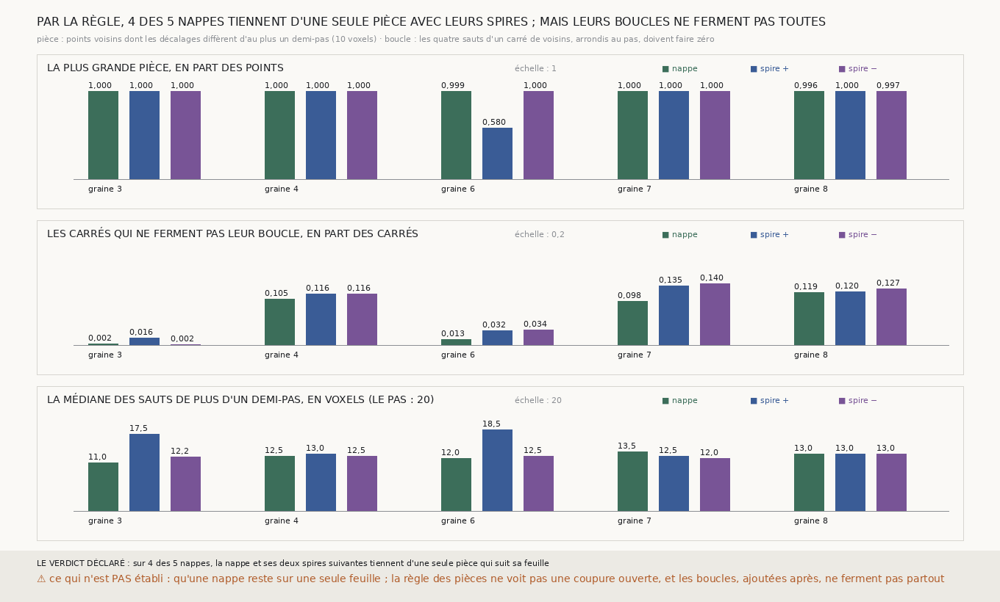

# `302` — Les nappes de m7 qui suivent leur feuille tiennent-elles d'une seule pièce ? Par la règle, quatre sur cinq ; mais la règle ne voit pas une coupure ouverte, et un carré de voisins sur dix ne ferme pas sa boucle sur trois d'entre elles

*`301` établit que cinq nappes tirées de `m7` sur PHerc0358 suivent leur feuille, avec leurs spires suivantes ; l'alignement ne
voit pas le rang. Cette tranche coupe chaque surface le long de ses déchirures, là où deux voisins s'écartent de plus d'un demi-pas,
et demande si la plus grande pièce tient 90 % des points et suit toujours sa feuille. Pour quatre nappes sur cinq, la nappe et ses
deux spires suivantes tiennent d'une seule pièce qui suit sa feuille. Mais une coupure qui s'arrête dans la nappe ne sépare rien :
le relevé des boucles, ajouté après le premier compte, trouve que 10 à 14 % des carrés de voisins des graines 4, 7 et 8 ne ferment
pas, et que les sauts qui les font valent 12 à 13,5 voxels, un peu plus d'un demi-pas, pas un pas.*

## 0. Pourquoi cette tranche

C'est `R4-P101`. Une surface alignée sur l'empilement peut être posée pour moitié sur une feuille et pour moitié sur la voisine.
Là où le vote passe d'une feuille à l'autre, deux voisins de la grille s'écartent d'un pas le long de la normale.

## 1. Ce qui a été vu avant d'écrire, et c'est dit

Tout ce que `301` publie, dont la part des paires de voisins déchirées de chaque nappe. ⚠ Le relevé des boucles a été ajouté après
le premier compte des pièces, qui disait les nappes d'une seule pièce, et avant d'en voir le résultat. Il ne décide rien.

## 2. Ce qui est fait

- **Les nappes** qui suivent leur feuille dans `301` (graines 3, 4, 6, 7 et 8) sont retirées de `m7` à l'identique, et redonnent
  point pour point celles que `301` a rangées.
- **Les pièces** : deux voisins de la grille sont liés si leurs décalages le long de la normale diffèrent d'au plus 10 voxels. Une
  surface est d'une seule pièce si sa plus grande pièce tient au moins 90 % de ses points.
- **Le juge** de `301`, sans rien changer, sur la plus grande pièce.
- **Les boucles**, rapportées : autour de chaque carré de quatre voisins, la somme des sauts de décalage arrondis au pas (20
  voxels). Une surface qui reste sur une seule feuille ferme toutes ses boucles.

## 3. Les pièces

| graine | nappe | spire + | spire − | Z des trois plus grandes pièces |
|---|---|---|---|---|
| 3 | 1,0 | 1,0 | 1,0 | 13,273 · 9,88 · 26,325 |
| 4 | 0,9998 | 1,0 | 1,0 | 4,767 · 21,422 · 5,149 |
| 6 | 0,9986 | 0,5797 | 1,0 | 8,027 · 21,152 · 3,398 |
| 7 | 1,0 | 1,0 | 1,0 | 10,784 · 6,166 · 12,657 |
| 8 | 0,9962 | 1,0 | 0,9967 | 4,262 · 5,069 · 4,511 |

⭐⭐⭐ **Par la règle, pour quatre nappes sur cinq, la nappe et ses deux spires suivantes tiennent d'une seule pièce qui suit sa
feuille** (`R4-F483`). La spire + de la graine 6 se coupe en deux pièces, dont la plus grande tient 0,5797 des points.

## 4. Les boucles, rapportées

| graine | carrés qui ne ferment pas : nappe · spire + · spire − | sauts de plus d'un demi-pas, médiane (voxels) |
|---|---|---|
| 3 | 0,0022 · 0,01587 · 0,00156 | 11,0 · 17,5 · 12,25 |
| 4 | 0,10498 · 0,11629 · 0,11602 | 12,5 · 13,0 · 12,5 |
| 6 | 0,01318 · 0,03226 · 0,03408 | 12,0 · 18,5 · 12,5 |
| 7 | 0,09839 · 0,1345 · 0,13996 | 13,5 · 12,5 · 12,0 |
| 8 | 0,11865 · 0,12045 · 0,12721 | 13,0 · 13,0 · 13,0 |

⚠⚠ **La règle des pièces ne voit pas une coupure ouverte**, et c'était une erreur de la déclaration : le module disait qu'une pièce
sans déchirure ne change de feuille nulle part. Une coupure qui s'arrête dans la nappe ne sépare rien, et la nappe passe d'une
feuille à la voisine en tournant autour de son bout. Les boucles le voient : sur les graines 4, 7 et 8, de 10 à 14 % des carrés
ne ferment pas.

Mais les sauts qui font ces boucles valent en médiane 12 à 13,5 voxels, un peu plus d'un demi-pas, et de 0,6632 à 0,8293
d'entre eux restent sous trois quarts de pas. Arrondi au pas, un saut de 12 voxels compte pour un pas entier ;
le relevé confond donc un vrai passage à la feuille voisine et un saut d'un peu plus d'un demi-pas, dont on ne sait pas ce qu'il
est. Deux lectures, que cette tranche ne départage pas :

- `m7` voit les deux faces d'une même feuille, à 110 à 125 µm l'une de l'autre, et le vote passe de l'une à l'autre : la nappe
  reste alors sur sa feuille ;
- là où les feuilles sont serrées (le pas descend à 150 µm, 16 voxels, pour un dixième des mesures de
  `espacement_PHerc0358_L1.json`), le vote passe réellement à la feuille voisine.

Les graines 3 et 6, dont l'alignement est dominé par un bord de la matière (`301`), ferment presque toutes leurs boucles.

## 5. Le verdict

**SUR 4 DES 5 NAPPES, LA NAPPE ET SES DEUX SPIRES SUIVANTES TIENNENT D'UNE SEULE PIÈCE QUI SUIT SA FEUILLE**, par la règle
déclarée.

Ce que la tranche établit est plus étroit que ce qu'elle demandait : aucune de ces nappes ne se coupe en îlots, mais trois d'entre
elles sautent, sur un carré de voisins sur dix, d'un peu plus d'un demi-pas. Qu'elles restent sur une seule feuille n'est pas
établi.

## 6. Ce que cette tranche ne dit pas

- ⚠⚠ Si les sauts d'un demi-pas passent d'une face à l'autre d'une même feuille, ou d'une feuille à la voisine.
- ⚠ Que la spire suivante soit la voisine.
- ⚠ Ce que le relevé des boucles vaudrait arrondi autrement ; il a été ajouté après le premier compte.

## 7. Les sondes

Une batterie de **13** contrôles et une figure de **9**. Cinq règles cassées exprès ont fait échouer la batterie : les déchirures
horizontales ignorées, les liens verticaux oubliés, les spires ignorées dans l'issue, la reproduction de `301` ignorée, et les
boucles jamais comptées ouvertes. Deux contrôles montrent ce que les pièces ne voient pas : une vis, qui passe d'une feuille à la
voisine en tournant autour d'un point, laisse exactement une boucle ouverte et reste d'une seule pièce.

## 8. Ce qui reste

`R4-P102` s'ouvre : là où une nappe de `m7` saute d'un peu plus d'un demi-pas, le scan montre-t-il entre les deux côtés du saut un
creux, qui sépare deux feuilles, ou la même matière, qui fait une seule feuille vue par ses deux faces ?
