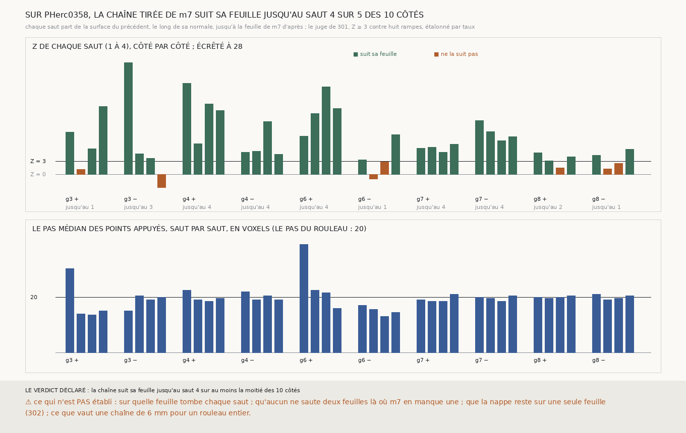

# `303` — Sur PHerc0358, la chaîne tirée de m7 suit-elle sa feuille au-delà du premier saut ? Oui, jusqu'au quatrième saut, sur cinq des dix côtés, à un pas du rouleau par saut

*Depuis les cinq nappes de `m7` qui suivent leur feuille (`301`), la même chaîne que sur le segment de PHercParis4 : chaque saut
part de la surface que le précédent a produite, le long de sa normale recalculée, jusqu'à la feuille de `m7` d'après, avec le vote
de `247`. Quatre sauts de chaque côté, dix côtés. Par le juge sans référent de `301`, la chaîne suit sa feuille jusqu'au quatrième
saut sur cinq côtés, et, pour les graines 4 et 7, chaque saut avance de 18,5 à 22,5 voxels pour un pas du rouleau de 20. Le juge
ne dit pas sur quelle feuille tombe chaque saut.*

## 0. Pourquoi cette tranche

Dérouler demande des dizaines de sauts. Sur le segment de PHercParis4, `297` suit le texte de la chaîne de `248` jusqu'au deuxième
saut. Sur un rouleau sans tracé il n'y a ni segment ni texte, mais il y a le juge de `301`, sans référent et étalonné par taux, et
cinq nappes qui suivent leur feuille.

## 1. Ce qui a été vu avant d'écrire

Tout ce que `301` et `302` publient, dont les premiers sauts, qui suivent leur feuille. Aucun saut au-delà du premier n'avait été
tiré.

## 2. Ce qui est fait

- **Les départs** : les nappes des graines 3, 4, 6, 7 et 8, retirées de `m7` à l'identique ; leurs premiers sauts redonnent ceux de
  `301` point pour point.
- **La chaîne** : de chaque côté, quatre sauts, chacun parti de la surface du précédent, le long de sa normale recalculée, jusqu'à
  la première feuille de `m7` après la sienne, avec le vote de `247`. C'est le premier saut de `300`, répété.
- **Le juge** de `301`, sans rien changer : Z ≥ 3 contre huit rampes.
- **L'issue par côté** : le dernier saut h tel que les sauts 1 à h suivent tous leur feuille.

## 3. Les côtés

| côté | jusqu'au saut | Z des sauts 1 à 4 | pas médian appuyé des sauts 1 à 4 (voxels) |
|---|---|---|---|
| graine 3 + | 1 | 9,88 · 1,161 · 6,068 · 16,027 | 30,25 · 14,0 · 13,5 · 15,0 |
| graine 3 − | 3 | 26,325 · 4,802 · 3,759 · −3,095 | 15,0 · 20,5 · 19,0 · 20,0 |
| graine 4 + | 4 | 21,422 · 7,247 · 16,579 · 15,068 | 22,5 · 19,0 · 18,5 · 19,5 |
| graine 4 − | 4 | 5,149 · 5,442 · 12,416 · 4,704 | 22,0 · 19,0 · 20,5 · 19,0 |
| graine 6 + | 4 | 9,028 · 14,302 · 20,601 · 15,513 | 39,0 · 22,5 · 21,5 · 16,0 |
| graine 6 − | 1 | 3,398 · −1,097 · 2,884 · 9,354 | 17,0 · 15,5 · 13,0 · 14,5 |
| graine 7 + | 4 | 6,166 · 6,352 · 5,238 · 7,112 | 19,0 · 18,5 · 18,5 · 21,0 |
| graine 7 − | 4 | 12,657 · 9,991 · 7,948 · 8,881 | 20,0 · 19,5 · 18,5 · 20,5 |
| graine 8 + | 2 | 5,069 · 3,219 · 1,543 · 4,112 | 20,0 · 19,5 · 20,0 · 20,5 |
| graine 8 − | 1 | 4,511 · 1,248 · 2,602 · 5,924 | 21,0 · 19,0 · 19,5 · 20,5 |

⭐⭐⭐⭐⭐ **La chaîne tirée de `m7` suit sa feuille jusqu'au quatrième saut sur cinq des dix côtés** (`R4-F484`) : les deux côtés
des graines 4 et 7, et le côté + de la graine 6. Sur les quatre côtés des graines 4 et 7, chaque saut avance de 18,5 à 22,5 voxels :
le pas du rouleau, saut après saut. Sur la graine 3, côté −, la chaîne sort de la matière : 1208 points sans matière au troisième
saut, 2537 au quatrième, et le quatrième ne suit plus.

La part des points appuyés sur `m7` baisse d'un saut à l'autre (de 0,6383 à 0,4956 sur la graine 4, côté +), et les boucles qui ne
ferment pas restent autour d'un carré sur huit sur les graines 4, 7 et 8, comme dans `302`.

## 4. Le verdict

**LA CHAÎNE SUIT SA FEUILLE JUSQU'AU SAUT 4 SUR AU MOINS LA MOITIÉ DES 10 CÔTÉS.**

Sur un rouleau du prix que personne n'a tracé, depuis la seule prédiction publiée, une première surface et quatre spires de chaque
côté, chacune jugée sans référent, et, sur deux graines, au pas du rouleau à chaque saut.

## 5. Ce que cette tranche ne dit pas

- ⚠⚠ Sur quelle feuille tombe chaque saut, ni qu'aucun ne saute deux feuilles là où `m7` en manque une : un pas médian de 20 voxels
  le rend peu probable sur les graines 4 et 7, pas impossible point par point.
- ⚠⚠ Que les nappes restent sur une seule feuille (`302`).
- ⚠ Ce que vaut une chaîne de 6 mm pour un rouleau entier, ou d'autres graines.

## 6. Les sondes

Une batterie de **6** contrôles et une figure de **9**. Quatre règles cassées exprès ont fait échouer la batterie : un saut raté
sauté dans le décompte, chaque saut reparti de la nappe au lieu du saut précédent, un seul côté suffisant pour l'issue, et la
reproduction de `301` ignorée. Le premier saut a été sorti de `300` en une fonction pour être répété ; la batterie de `300` passe
toujours, et les nappes redonnent point pour point celles de `301`.

## 7. Ce que la mesure a coûté

Les quarante sauts, quelques secondes par graine ; **628** morceaux de PHerc0358 demandés, presque tous déjà sur disque. Tout sous
garde cgroup.

## 8. Ce qui reste

`R4-P103` s'ouvre : les quatre spires tirées d'une nappe de `m7` sont-elles quatre spires consécutives ? L'alignement ne voit ni le
rang ni un saut de deux feuilles ; la fermeture des boucles à l'échelle d'une spire (`R4-F430`), ou la phase `lasagna` publiée, le
peuvent. Et `R4-P102` reste ouverte : les sauts d'un demi-pas de `302`.
