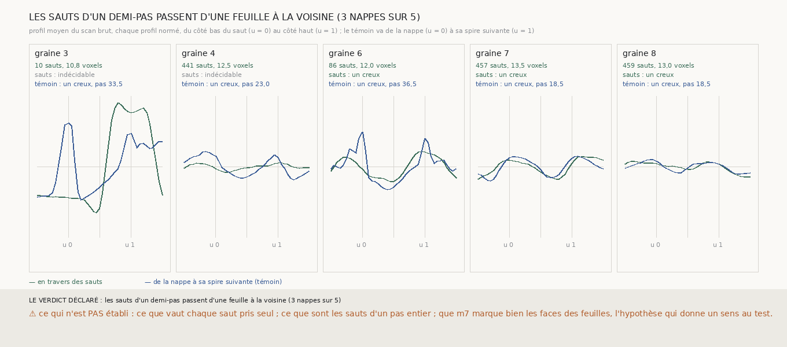

# `304` — Là où une nappe de m7 saute d'un peu plus d'un demi-pas, le scan montre-t-il un creux ou de la matière ? Un creux : sur trois nappes sur cinq, le saut a la forme exacte du passage à la spire suivante

*`302` trouve que les nappes de `m7` qui suivent leur feuille sautent, sur un carré de voisins sur dix, de 12 à 13,5 voxels, et ne
sait pas lire ces sauts : les deux faces d'une même feuille, ou deux feuilles voisines ? Le scan brut, lu en travers de chaque saut,
du côté bas au côté haut et moyenné par nappe, répond. Sur les graines 6, 7 et 8, il y a un creux au milieu : le profil en travers
des sauts a la même forme, deux feuilles et le vide entre elles, que le profil entre la nappe et sa spire suivante. Ces nappes
passent donc d'une feuille à la voisine sur un carré de voisins sur dix : elles suivent l'empilement, pas une seule feuille.*

## 0. Pourquoi cette tranche

C'est `R4-P102`. Un saut de 12 voxels relie deux surfaces que `m7` voit face à face : soit les deux faces d'une même feuille, et
le papyrus est entre elles ; soit les faces de deux feuilles voisines qui se regardent, et c'est le vide entre elles.

## 1. Ce qui a été vu avant d'écrire

Tout ce que `301` à `303` publient, dont la taille des sauts. Aucun profil du scan n'avait été lu en travers d'un saut.

## 2. Ce qui est fait

- **Les sauts** : les paires de voisins des cinq nappes, appuyés tous deux sur `m7`, dont les décalages diffèrent de plus d'un
  demi-pas.
- **Le profil en travers** : au milieu des deux points, le long de la normale de la graine, du côté bas moins la moitié du saut
  au côté haut plus la moitié (u = −0,5 à 1,5), chaque profil normé, puis moyenné par nappe.
- **Le témoin**, rapporté : le même profil entre la nappe et sa spire suivante (côté +).
- **L'issue** : un creux si le profil moyen est au milieu (u = 0,5) sous ses deux côtés, de la matière s'il est au-dessus des
  deux ; au moins 30 sauts.

## 3. Ce que dit le scan

| graine | sauts lus | taille médiane (voxels) | en travers des sauts | témoin | pas du témoin (voxels) |
|---|---|---|---|---|---|
| 3 | 10 | 10,75 | indécidable | un creux | 33,5 |
| 4 | 441 | 12,5 | indécidable | un creux | 23,0 |
| 6 | 86 | 12,0 | un creux | un creux | 36,5 |
| 7 | 457 | 13,5 | un creux | un creux | 18,5 |
| 8 | 459 | 13,0 | un creux | un creux | 18,5 |

⭐⭐⭐⭐ **Les sauts d'un demi-pas passent d'une feuille à la voisine** (`R4-F485`) : trois nappes sur cinq montrent un creux au
milieu, aucune de la matière. Sur les graines 7 et 8, le profil en travers des sauts et celui du témoin se superposent presque : un
sommet au côté bas, le vide, un sommet au côté haut. Les feuilles y sont serrées, à 12 ou 13 voxels, 112 à 126 µm, sous le pas
médian du rouleau. Sur la graine 3, dix sauts seulement ; sur la graine 4, un profil presque plat.

## 4. Le verdict

**LES SAUTS D'UN DEMI-PAS PASSENT D'UNE FEUILLE À LA VOISINE (3 NAPPES SUR 5).**

C'est un fait négatif sur les nappes de `301` : celles des graines 6, 7 et 8 suivent l'empilement, et passent d'une feuille à la
voisine sur un carré de voisins sur dix. L'alignement, qui les jugeait posées sur une feuille, ne pouvait pas le voir ; `302` en
avait vu la trace, cette tranche en donne la nature. La chaîne de `303`, partie d'elles, en hérite.

## 5. Ce que cette tranche ne dit pas

- ⚠⚠ Ce que vaut chaque saut pris seul : une moyenne tranche pour la plupart.
- ⚠ Ce que sont les sauts d'un pas entier, plus rares.
- ⚠ Que `m7` marque bien les faces des feuilles, l'hypothèse qui donne un sens au test.
- ⚠ Où, dans la nappe, sont les sauts, et si une région sans saut est assez grande pour partir d'elle.

## 6. Les sondes

Une batterie de **8** contrôles et une figure de **9**. Quatre règles cassées exprès ont fait échouer la batterie, une seulement
après qu'un contrôle a été ajouté : un saut compté sans appui sur `m7`, les côtés non ordonnés, deux creux suffisant à l'issue, et un
seul côté comparé au milieu, que la batterie ne voyait pas avant qu'un profil qui descend d'un bout à l'autre soit ajouté.

## 7. Ce qui reste

`R4-P104` s'ouvre : un vote qui refuse de passer d'une feuille à la voisine, ou une nappe réduite à la région qu'aucun saut ne
traverse, donne-t-il une nappe d'une seule feuille qui suit encore sa feuille ? C'est la condition pour que la chaîne parte d'une
seule spire.
