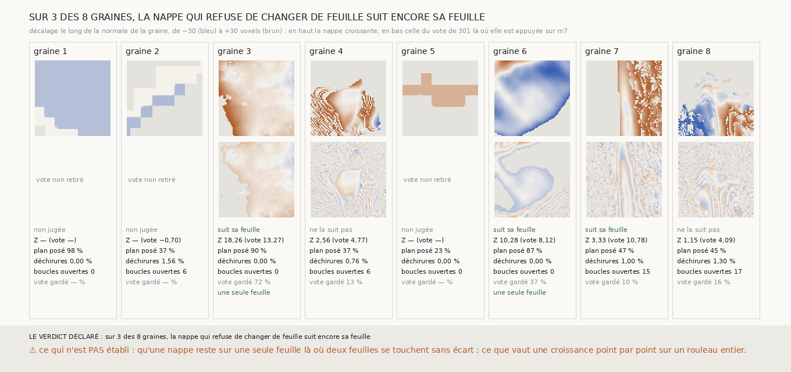

# `305` — Une nappe de m7 qui croît depuis sa graine en refusant de changer de feuille suit-elle encore sa feuille ? Oui sur trois graines sur huit, et sur deux d'entre elles, d'une seule feuille

*`304` montre que les nappes du vote de `247` passent à la feuille voisine là où les feuilles de PHerc0358 sont serrées. Une nappe
qui croît depuis sa graine, point par point, et qui ne prend jamais une feuille à plus d'un quart de pas de celle de ses voisins
déjà posés, ne peut plus y passer en un pas de grille. Sur les graines 3 et 6, cette nappe couvre 90 et 87 % du plan de 6 mm, n'a
aucune déchirure, ferme toutes ses boucles, et suit sa feuille mieux que la nappe du vote (Z 18,258 et 10,281 contre 13,273 et
8,115) : une surface d'une seule feuille, tirée de `m7` seule, sur un rouleau sans tracé. Sur les graines 4, 7 et 8, la croissance
ne couvre que 37 à 47 % du plan et ne tient pas.*

## 0. Pourquoi cette tranche

C'est `R4-P104`. Le vote de `247` fait viser à chaque point la médiane de ses neuf voisins, partout à la fois, et prend la feuille
de `m7` la plus proche à moins d'un demi-pas, 10 voxels : là où les feuilles sont à 12 voxels, un point peut passer à la voisine
et entraîner les siens. Une croissance qui n'avance qu'au bord de ce qu'elle a déjà posé, avec une tolérance d'un quart de pas,
laisse un trou là où il faudrait sauter.

## 1. Ce qui a été vu avant d'écrire

Tout ce que `300` à `304` publient. Aucune nappe croissante n'avait été tirée.

## 2. Ce qui est fait

- **Les graines** : les huit de `301`, avec leur plan de 65 × 65 points au pas de 10 voxels et les feuilles de `m7` que chaque
  point voit sur ±30 voxels, exactement comme `300`.
- **La croissance** : le point central prend la feuille de `m7` la plus proche du plan ; puis, en largeur d'abord, chaque voisin
  (huit voisins) d'un point posé vise la médiane des décalages de ses voisins déjà posés et prend la feuille de `m7` la plus proche
  de cette cible à au plus 5 voxels ; sinon il attend, réévalué à chaque voisin de plus. Aucun point n'est posé sans `m7`.
- **Le juge** : celui de `301`, sans rien y changer (Z ≥ 3 contre huit rampes, au moins 100 points jugés).
- **Rapporté à côté** : la part du plan posée, les déchirures et les boucles de `302`, la part des points de la nappe du vote que
  la croissance garde à moins d'un quart de pas, et, ajouté après avoir vu la figure, la part des paires de voisins de la nappe
  du vote qui changent de plus d'un quart de pas sans déchirer.

## 3. Ce que dit le scan

| graine | nappe croissante | Z | Z du vote | part du plan | déchirures | boucles ouvertes | vote gardé | vote au-delà du quart de pas |
|---|---|---|---|---|---|---|---|---|
| 1 | non jugée | — | — | 0,9801 | 0,0 | 0 | — | — |
| 2 | non jugée | — | −0,696 | 0,3671 | 0,0156 | 6 | — | — |
| 3 | suit sa feuille | 18,258 | 13,273 | 0,8973 | 0,0 | 0 | 0,7191 | 0,0015 |
| 4 | ne la suit pas | 2,558 | 4,767 | 0,3735 | 0,0076 | 6 | 0,133 | 0,3448 |
| 5 | non jugée | — | — | 0,2279 | 0,0 | 0 | — | — |
| 6 | suit sa feuille | 10,281 | 8,115 | 0,8653 | 0,0 | 0 | 0,3685 | 0,0822 |
| 7 | suit sa feuille | 3,335 | 10,784 | 0,4736 | 0,01 | 15 | 0,102 | 0,1781 |
| 8 | ne la suit pas | 1,153 | 4,095 | 0,4518 | 0,013 | 17 | 0,1619 | 0,2559 |

⭐⭐⭐⭐⭐ **Sur les graines 3 et 6, une nappe d'une seule feuille suit sa feuille** (`R4-F486`) : aucune déchirure, aucune
boucle ouverte sur 3488 et 3524 carrés de voisins, 90 et 87 % du plan, et un Z plus haut que celui de la nappe du vote. Sur la
graine 6, la croissance ne garde que 37 % des points du vote : là où `304` lisait 86 sauts vers la feuille voisine, elle est
restée sur la sienne. Sa carte descend jusqu'à −30 voxels, le bord de la recherche : la feuille s'y éloigne du plan.

Sur les graines 4, 7 et 8, la nappe du vote change de plus d'un quart de pas d'un point au suivant, sans déchirer, sur 18 à
34 % de ses paires, contre 0,15 et 8 % aux graines 3 et 6. Une croissance qui ne tolère qu'un quart de pas par pas de grille ne
peut pas suivre une feuille qui coupe le plan à plus de 27° environ : elle s'arrête à 37 à 47 % du plan, et ses fronts se
rejoignent en déchirant. La graine 7 passe le juge, sans être d'une seule feuille. Les graines 1, 2 et 5 sont entièrement dans le
vide masqué du scan.

## 4. Le verdict

**SUR 3 DES 8 GRAINES, LA NAPPE QUI REFUSE DE CHANGER DE FEUILLE SUIT ENCORE SA FEUILLE.**

Et sur deux d'entre elles, 3 et 6, d'une seule feuille, sans déchirure ni boucle ouverte. C'est ce que `R4-P104` demandait : une
surface d'une seule feuille, tirée de `m7` seule sur un rouleau du prix sans tracé, qui suit sa feuille par un juge sans
référent. La chaîne de `303` peut partir d'elle.

## 5. Ce que cette tranche ne dit pas

- ⚠⚠ Qu'une nappe reste sur une seule feuille là où deux feuilles se touchent sans écart : `m7` les confond alors en une seule
  plage, et la croissance avec lui.
- ⚠⚠ Que la cause de l'arrêt aux graines 4, 7 et 8 soit la pente de la feuille plutôt que le bruit du vote : le relevé de pente
  a été ajouté après la figure, et il ne tranche pas entre les deux.
- ⚠ Ce que vaut une croissance d'un point à la fois sur un rouleau entier, ni sur un plan qui ne se réoriente pas.
- ⚠ Deux graines sur huit. Six millimètres.

## 6. Les sondes

Une batterie de **12** contrôles et une figure de **9**. Huit règles cassées exprès ont fait échouer la batterie, dont deux
seulement après qu'un contrôle a été ajouté : une tolérance d'un demi-pas, une cible prise sur la graine plutôt que sur les
voisins, un point refusé une fois pour toutes, une graine sans borne de portée, une graine posée sur la feuille la plus lointaine,
la pente comptée avec ses déchirures, un point sans feuille posé sur sa cible, et la part gardée comptée sans tolérance, ces deux
dernières passant avant qu'un plan percé et une part gardée sur des points posés hors tolérance soient ajoutés. Une première version refusait un point
une fois pour toutes ; une petite grille où le réessai comble un trou a fait préférer le réessai, avant toute mesure.

## 7. Ce qui reste

`R4-P105` s'ouvre : la chaîne de `303`, partie des nappes d'une seule feuille des graines 3 et 6, et dont chaque saut croît à son
tour sans changer de feuille, suit-elle sa feuille sur quatre spires d'une seule feuille chacune ? Et `R4-P106` : une croissance
dont le plan se réoriente sur la normale de ce qu'elle a déjà posé tient-elle aux graines 4, 7 et 8, où la feuille coupe le plan ?
