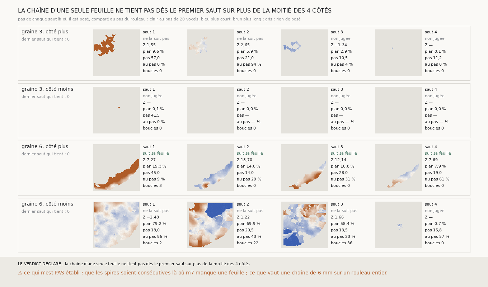

# `306` — La chaîne partie d'une nappe de m7 d'une seule feuille, dont chaque saut croît sans changer de feuille, suit-elle sa feuille sur quatre spires ? Non : `m7` ne voit pas assez la spire suivante pour qu'un saut croisse dessus

*`305` tire de `m7`, sur les graines 3 et 6 de PHerc0358, deux nappes d'une seule feuille qui suivent leur feuille. Cette tranche
en part et fait croître chaque saut comme la nappe : depuis un point, sans jamais poser un point que `m7` ne voit pas, ni prendre
une feuille à plus d'un quart de pas de ses voisins. Aucun des quatre côtés ne tient dès le premier saut. Sur la graine 3, le
saut ne trouve la feuille suivante que sur 10 % du plan d'un côté et 0,1 % de l'autre ; sur la graine 6, un côté suit sa feuille
pendant quatre sauts, mais sur 8 à 19 % du plan seulement, et l'autre couvre 79 % du plan au pas du rouleau sans que le juge l'y
voie posé. Au passage : la spire − de la graine 3, que `301` disait sur sa feuille à Z 26,325, n'était appuyée sur `m7` que sur
4 % de ses points.*

## 0. Pourquoi cette tranche

C'est `R4-P105`. Chaque saut de la chaîne de `303` est un vote, qui passe à la feuille voisine là où les feuilles sont serrées
(`304`). Une chaîne dont chaque saut croît sans changer de feuille ne peut pas le faire.

## 1. Ce qui a été vu avant d'écrire

Tout ce que `300` à `305` publient. Aucun saut croissant n'avait été tiré.

## 2. Ce qui est fait

- **Les départs** : les nappes croissantes de `305` qui suivent leur feuille sans déchirure ni boucle ouverte, les graines 3 et 6,
  retirées de `m7` à l'identique (leur carte redonne celle que `305` publie).
- **Le saut croissant** : de chaque point posé de la surface précédente, le long de sa normale recalculée, les feuilles de `m7`
  sur trois pas ; le point le plus proche du centre de la grille qui voit une feuille après la sienne part de celle-là, puis la
  croissance de `305`, à 5 voxels au plus de la médiane des voisins posés. La fonction de croissance de `305` gagne pour cela un
  départ donné, sans rien changer à ce qu'elle faisait (un contrôle de plus dans sa batterie).
- **La chaîne** : quatre sauts de chaque côté, chacun parti de la surface que le précédent a posée.
- **Le juge** : celui de `301`, sans rien y changer. Un saut **tient** s'il suit sa feuille et ferme toutes ses boucles.

## 3. Ce que dit le scan

| graine | côté | saut | le juge | Z | part du plan | boucles ouvertes | pas médian (voxels) | au pas du rouleau |
|---|---|---|---|---|---|---|---|---|
| 3 | plus | 1 | ne la suit pas | 1,549 | 0,0963 | 0 | 57,0 | 0,0 |
| 3 | plus | 2 | ne la suit pas | 2,645 | 0,0585 | 0 | 21,0 | 0,9352 |
| 3 | plus | 3 | non jugée | −1,336 | 0,0293 | 0 | 10,5 | 0,0403 |
| 3 | plus | 4 | non jugée | — | 0,0005 | 0 | 11,25 | 0,0 |
| 3 | moins | 1 | non jugée | — | 0,0009 | 0 | 41,5 | 0,0 |
| 3 | moins | 2 | non jugée | — | 0,0 | 0 | — | — |
| 3 | moins | 3 | non jugée | — | 0,0 | 0 | — | — |
| 3 | moins | 4 | non jugée | — | 0,0 | 0 | — | — |
| 6 | plus | 1 | suit sa feuille | 7,268 | 0,1931 | 3 | 45,0 | 0,0882 |
| 6 | plus | 2 | suit sa feuille | 13,695 | 0,1396 | 0 | 14,0 | 0,2949 |
| 6 | plus | 3 | suit sa feuille | 12,138 | 0,1075 | 0 | 28,0 | 0,3062 |
| 6 | plus | 4 | suit sa feuille | 7,688 | 0,0791 | 0 | 19,0 | 0,6138 |
| 6 | moins | 1 | ne la suit pas | −2,483 | 0,7924 | 2 | 18,0 | 0,8599 |
| 6 | moins | 2 | ne la suit pas | 1,217 | 0,6987 | 22 | 20,5 | 0,4312 |
| 6 | moins | 3 | ne la suit pas | 1,656 | 0,5844 | 36 | 13,5 | 0,2341 |
| 6 | moins | 4 | non jugée | — | 0,0066 | 0 | 15,75 | 0,5714 |

⭐⭐⭐⭐ **La chaîne d'une seule feuille ne tient pas** (`R4-F487`). Trois raisons différentes, et c'est ce qu'elle apprend :

- **`m7` ne voit pas la spire suivante partout.** Sur la graine 3, le premier saut ne se pose que sur 9,6 % du plan d'un côté et
  0,09 % de l'autre, et le premier avec un pas médian de 57 voxels, soit presque trois pas : `m7` n'y voit pas la feuille d'après
  la sienne, et le saut prend celle d'après. Une croissance qui ne pose que ce que `m7` voit s'arrête à ses trous.
- **Là où il se pose peu, il peut suivre.** Sur la graine 6, côté plus, les quatre sauts suivent leur feuille (Z 7,268 à 13,695),
  sur 19 % puis 8 % du plan ; le premier a trois boucles ouvertes et un pas médian de 45 voxels, le quatrième un pas de 19.
- **Là où il se pose beaucoup, le juge ne l'y voit pas.** Sur la graine 6, côté moins, le premier saut couvre 79 % du plan, à
  18 voxels en médiane et au pas du rouleau pour 86 % de ses points, et son Z vaut −2,483.

⚠⚠ **Et un constat sur les tranches précédentes, lu dans ce que `301` et `303` publiaient déjà** : leurs spires − de la graine 3
ne sont appuyées sur `m7` que sur 4,28 %, puis 1,59 %, 1,02 % et 0,99 % de leurs points. Le vote de `247` garde sa cible là où
`m7` ne voit rien : ces spires sont presque entièrement la surface précédente décalée du pas par défaut, 20 voxels, ou de la
médiane de leurs voisins. Le juge les dit
pourtant sur leur feuille, à Z 26,325 au premier saut. Une surface posée au pas du rouleau sans rien lire de `m7` peut donc passer
ce juge : ce qu'il mesure, c'est l'alignement sur l'empilement, et un empilement régulier se retrouve à un pas de n'importe quelle
feuille.

## 4. Le verdict

**LA CHAÎNE D'UNE SEULE FEUILLE NE TIENT PAS DÈS LE PREMIER SAUT SUR PLUS DE LA MOITIÉ DES 4 CÔTÉS.**

C'est un fait négatif sur `R4-P105`, et il porte sur `m7` autant que sur la chaîne : la prédiction publiée ne voit la spire
suivante des nappes d'une seule feuille que par morceaux. Et le constat du vote porte sur le juge : `R4-P107` s'ouvre.

## 5. Ce que cette tranche ne dit pas

- ⚠⚠ Pourquoi le juge ne voit pas posé le premier saut − de la graine 6, au pas du rouleau sur 79 % du plan.
- ⚠ Que les spires soient consécutives là où `m7` manque une feuille : le pas de 57 voxels dit qu'une au moins ne l'est pas.
- ⚠ Ce que vaudrait un saut qui croît depuis chaque région où `m7` voit la feuille suivante, et non depuis une seule.
- ⚠ Deux graines, six millimètres.

## 6. Les sondes

Une batterie de **11** contrôles et une figure de **10**. Neuf règles cassées exprès ont fait échouer la batterie ou la figure,
dont trois seulement après qu'un contrôle a été ajouté : un départ pris sur sa propre feuille, une tolérance de 12,5 voxels, une
chaîne qui repart toujours de la nappe, un saut qui tient sans fermer ses boucles, la part au pas comptée sans tolérance, un dernier
saut qui compte ceux d'après un saut lâché, un point sans normale qui lit quand même son rayon immobile (vu seulement quand une
feuille à 30 voxels a été ajoutée), un départ pris au premier point de la grille (vu seulement quand deux points éligibles l'ont
départagé), et un cadre de la figure passé sous la bande du verdict, qu'aucun contrôle ne voyait sur le premier rendu.

## 7. Ce qui reste

`R4-P107` s'ouvre : le juge de `301` note-t-il la nappe décalée d'un pas entier comme sur sa feuille, et décalée d'un demi-pas
comme hors de sa feuille ? S'il dit oui aux deux, il juge l'alignement sur l'empilement et non la feuille, et tout ce que `300` à
`306` établissent par lui est à relire ainsi.
