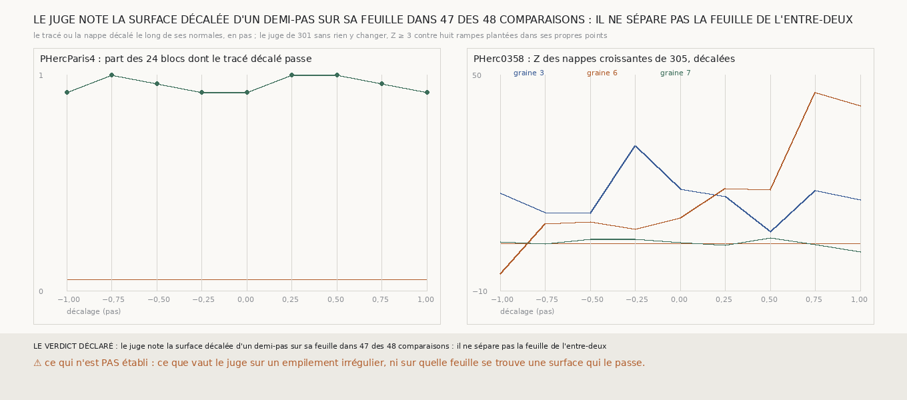

# `307` — Le juge sans référent de 301 note-t-il une surface décalée d'un demi-pas comme hors de sa feuille ? Non : il la note sur sa feuille 47 fois sur 48, parce qu'il juge l'alignement sur l'empilement et pas la feuille

*`306` a trouvé des spires, sur PHerc0358, appuyées sur `m7` sur 1 à 4 % de leurs points et notées pourtant sur leur feuille. Cette
tranche pose au juge de `301` la question qu'on ne lui avait jamais posée, là où la réponse est connue : sur PHercParis4, le tracé
humain des vingt-quatre blocs de son étalonnage, décalé le long de ses normales d'un pas entier en arrière à un pas entier en avant.
Décalé d'un demi-pas, entre deux feuilles, le tracé passe le juge dans 47 comparaisons sur 48 ; à aucun des neuf décalages la part
des blocs qui passent ne descend sous 91,67 %. Le juge de `301` dit si une surface est parallèle à l'empilement, pas si elle est
posée sur une feuille. Tout ce que `300` à `306` établissent par lui est à relire ainsi.*

## 0. Pourquoi cette tranche

C'est `R4-P107`. L'étalonnage de `301` opposait le tracé humain à des rampes, qui traversent l'empilement. Une surface parallèle à
sa feuille mais posée entre deux feuilles n'y figurait pas. `298` avait planté ce défaut-là, le tracé décalé d'un demi-pas, pour le
juge du rang ; les juges suivants ne l'ont pas repris.

## 1. Ce qui a été vu avant d'écrire

Tout ce que `298` à `306` publient, dont le constat de `306` sur les spires − de la graine 3. Aucune surface décalée n'avait été
jugée par l'alignement.

## 2. Ce qui est fait

- **PHercParis4** : les vingt-quatre blocs de l'étalonnage de `301`, le tracé humain décalé le long de ses normales de −1 à +1 pas,
  par quarts de pas. Le décalage nul redonne le Z de `301` bloc pour bloc.
- **PHerc0358, rapporté** : les nappes croissantes de `305` qui suivent leur feuille (graines 3, 6 et 7), aux mêmes décalages, au
  pas du rouleau.
- **Le juge** : celui de `301`, sans rien y changer.
- **L'issue** : le juge sépare la feuille de l'entre-deux si le tracé passe sur au moins 90 % des blocs et le tracé décalé d'un
  demi-pas sur au plus 5 % des 48 comparaisons, sans aucun Z absent.

## 3. Ce que dit le scan

| décalage (pas) | part des 24 blocs à Z ≥ 3 |
|---|---|
| −1,0 | 0,9167 |
| −0,75 | 1,0 |
| −0,5 | 0,9583 |
| −0,25 | 0,9167 |
| 0,0 | 0,9167 |
| 0,25 | 1,0 |
| 0,5 | 1,0 |
| 0,75 | 0,9583 |
| 1,0 | 0,9167 |

⭐⭐⭐⭐⭐ **Le juge ne sépare pas la feuille de l'entre-deux** (`R4-F488`) : décalé d'un demi-pas, le tracé passe dans 47 des
48 comparaisons, plus souvent qu'à sa place. La courbe est plate : elle ne tombe pas au demi-pas et ne remonte pas au pas entier.

C'est ce que la construction du juge laissait attendre, et que je n'avais pas vu : l'alignement compare les profils d'une surface
entre eux, et un décalage uniforme le long des normales déplace tous les profils de la même quantité, donc les laisse alignés. Une
rampe, elle, coupe l'empilement et désaligne ses profils. Le juge sépare une surface **parallèle** à l'empilement d'une surface qui
le **traverse**, et c'est tout ce qu'il sépare.

Sur PHerc0358, le Z des nappes décalées dit la même chose :

| graine | −1 | −0,75 | −0,5 | −0,25 | 0 | 0,25 | 0,5 | 0,75 | 1 |
|---|---|---|---|---|---|---|---|---|---|
| 3 | 17,039 | 11,819 | 11,541 | 30,366 | 18,258 | 16,165 | 6,37 | 17,878 | 15,284 |
| 6 | −5,358 | 8,614 | 9,219 | 7,077 | 10,281 | 18,488 | 18,094 | 45,156 | 41,412 |
| 7 | 3,7 | 3,003 | 4,352 | 4,35 | 3,335 | 2,774 | 4,655 | 2,93 | 0,85 |

La nappe de la graine 3 passe à tous les décalages, celle de la graine 6 à tous sauf −1 pas, et son Z le plus haut, 45,156, est à
trois quarts de pas de sa place.

## 4. Le verdict

**LE JUGE NOTE LA SURFACE DÉCALÉE D'UN DEMI-PAS SUR SA FEUILLE DANS 47 DES 48 COMPARAISONS : IL NE SÉPARE PAS LA FEUILLE DE L'ENTRE-DEUX.**

C'est un fait négatif sur l'outil de mesure de toute la série. Ce que `300` à `306` disent « suit sa feuille » se lit désormais
« est parallèle à l'empilement » :

- `R4-F482` (`301`) : une nappe tirée de `m7` seule est parallèle à l'empilement pour 5 graines sur 8, et ses spires suivantes
  aussi. Qu'elle soit posée sur une feuille n'est pas établi.
- `R4-F484` (`303`) : la chaîne reste parallèle à l'empilement pendant quatre sauts.
- `R4-F486` (`305`) : les nappes d'une seule feuille des graines 3 et 6 sont parallèles à l'empilement ; qu'elles soient d'une
  seule feuille de `m7` reste vrai, c'est un fait sur `m7` et non sur le scan.
- `R4-F485` (`304`) ne dépend pas de ce juge : il lit le scan brut en travers des sauts, et tient.

Les réserves sont ajoutées, datées, dans le registre.

## 5. Ce que cette tranche ne dit pas

- ⚠⚠ Si les nappes de `m7` sont posées sur une feuille ou entre deux : il faut pour cela un juge qui voie la position, et ce n'est
  pas celui-ci.
- ⚠ Ce que vaut le juge sur un empilement irrégulier, où un décalage uniforme ne laisse pas la surface parallèle aux feuilles.
- ⚠ Que ce juge soit inutile : il sépare toujours l'orientation, et une surface qui traverse l'empilement est un défaut réel.

## 6. Les sondes

Une batterie de **11** contrôles et une figure de **11**. Neuf règles cassées exprès ont fait échouer la batterie ou la figure,
dont une seulement après qu'un contrôle a été ajouté : un décalage qui oublie le pas, un Z absent compté comme un succès, un seul
côté du demi-pas compté, un seuil de l'entre-deux à 10 %, un tracé qui passe sans taux, les Z absents ignorés, deux décalages sous le
même nom, un cadre sous la bande du verdict, et un axe qui écrête les Z mesurés, que la figure ne voyait pas avant qu'elle compte
les valeurs hors de ses bornes. La première version de la figure écrêtait la nappe de la graine 6 à 25.

## 7. Ce qui reste

`R4-P108` s'ouvre : un juge de position, qui compare le scan à la place de la surface au scan à un demi-pas de part et d'autre,
sépare-t-il sur PHercParis4 le tracé humain du même tracé décalé d'un demi-pas ? C'est lui, et non l'alignement, qui dira si une
nappe de `m7` est posée sur une feuille.
