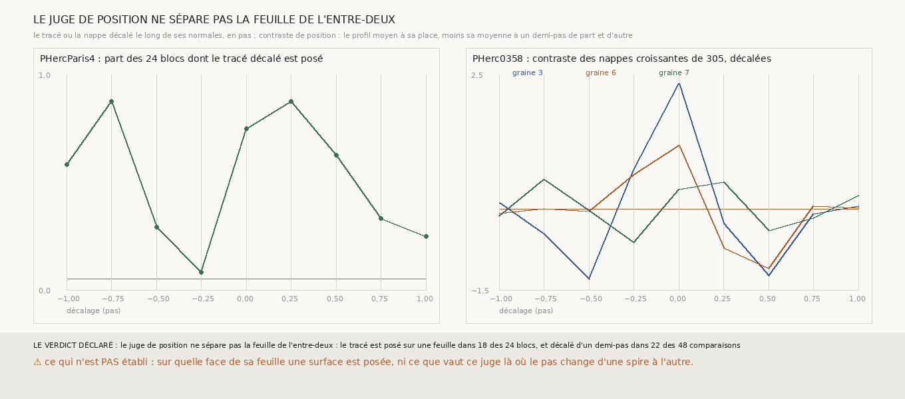

# `308` — Un juge de position, qui compare le scan à la place d'une surface au scan à un demi-pas de part et d'autre, sépare-t-il la feuille de l'entre-deux ? Non par sa règle, parce que le tracé humain n'est pas au cœur de sa feuille ; les nappes de m7, elles, y sont

*`307` a montré que le juge de `301` ne voit que l'orientation : l'alignement est l'amplitude du profil moyen, et un décalage
uniforme le translate sans la changer. Ce qu'il jette, c'est l'endroit où tombe la surface. Le contraste de position le reprend :
la valeur du profil moyen à la place de la surface, moins sa moyenne à un demi-pas de part et d'autre. Sur PHercParis4, il ne
sépare pas par sa règle : le tracé humain est posé sur une feuille dans 18 des 24 blocs, et décalé d'un demi-pas dans 22 des 48
comparaisons. Mais sa courbe, elle, oscille au pas du rouleau, avec un sommet à un quart de pas du tracé : le tracé est posé sur la
face de sa feuille, à 3 voxels de ce qu'elle a de plus dense. Sur PHerc0358, les nappes de `m7` des graines 3 et 6 ont leur
contraste le plus haut à leur place exacte, et négatif à un demi-pas : elles sont au cœur de leur feuille.*

## 0. Pourquoi cette tranche

C'est `R4-P108`. Sans un juge de position, rien ne dit si une nappe de `m7` est posée sur une feuille ou entre deux.

## 1. Ce qui a été vu avant d'écrire

Tout ce que `298` à `307` publient, dont `R4-F479` : le profil moyen du tracé humain de PHercParis4 est le plus dense à +3 voxels
et le plus creux à −4, sur six blocs. Aucun contraste de position n'avait été calculé.

## 2. Ce qui est fait

- **Les surfaces** : celles que `307` a préparées, sans en changer une.
- **Le profil moyen** : celui du juge de `301`, par bloc ou par nappe ; le juge de `299` rend désormais ce profil à côté de son
  amplitude, sans rien changer à ce qu'il rendait.
- **Le contraste de position** : le profil moyen à la place de la surface, moins sa moyenne à un demi-pas de part et d'autre, 9
  voxels sur PHercParis4, 10 sur PHerc0358. Posée sur une feuille si le contraste est positif.
- **L'issue** : la règle de `301` et `307`, au moins 90 % des blocs posés à leur place, au plus 5 % des 48 comparaisons au
  demi-pas.

## 3. Ce que dit le scan

| décalage (pas) | part des 24 blocs posés sur une feuille |
|---|---|
| −1,0 | 0,5833 |
| −0,75 | 0,875 |
| −0,5 | 0,2917 |
| −0,25 | 0,0833 |
| 0,0 | 0,75 |
| 0,25 | 0,875 |
| 0,5 | 0,625 |
| 0,75 | 0,3333 |
| 1,0 | 0,25 |

⭐⭐⭐⭐ **Le juge de position ne sépare pas la feuille de l'entre-deux par sa règle** (`R4-F489`). Mais il voit la position, et
c'est ce que l'alignement ne faisait pas : sa courbe n'est pas plate, elle oscille à peu près au pas du rouleau, du creux à −0,25
pas (8 % des blocs) au sommet à +0,25 (87,5 %), et de nouveau au sommet à −0,75.

Le sommet n'est pas à la place du tracé mais à un quart de pas de lui, et le profil moyen des vingt-quatre blocs dit pourquoi : il
est le plus dense à +3 voxels et le plus creux à −5. **Le tracé humain est posé sur la face de sa feuille, pas en son cœur** : c'est
ce que `298` voyait sur six blocs, et c'est ce qui empêche un juge qui attend le cœur de la feuille de s'étalonner sur lui. Décalé
d'un demi-pas vers le côté dense, le tracé est encore dit posé dans 62,5 % des blocs, contre 29,17 % de l'autre côté.

Sur PHerc0358, rapporté :

| graine | −1 | −0,75 | −0,5 | −0,25 | 0 | 0,25 | 0,5 | 0,75 | 1 | le plus dense (voxels) |
|---|---|---|---|---|---|---|---|---|---|---|
| 3 | 0,1197 | −0,4566 | −1,3017 | 0,7281 | 2,3314 | −0,2542 | −1,23 | −0,0885 | 0,0635 | −2 |
| 6 | −0,0752 | 0,0143 | −0,0391 | 0,6371 | 1,1841 | −0,7119 | −1,1047 | 0,0649 | 0,0232 | 0 |
| 7 | −0,1232 | 0,5553 | −0,0231 | −0,6136 | 0,3722 | 0,5088 | −0,3937 | −0,1573 | 0,2561 | 1 |

⭐⭐⭐⭐ **Les nappes de `m7` des graines 3 et 6 sont au cœur de leur feuille** : leur contraste est le plus haut à leur place exacte
(2,3314 et 1,1841), et négatif aux deux demi-pas ; leur profil moyen est le plus dense à −2 et 0 voxel d'elles. La nappe de la graine
7 a un contraste positif à sa place, mais plus haut à −0,75 et +0,25 pas. `m7` pose ses surfaces au milieu de la feuille, là où la
main humaine les pose sur sa face.

## 4. Le verdict

**LE JUGE DE POSITION NE SÉPARE PAS LA FEUILLE DE L'ENTRE-DEUX : LE TRACÉ EST POSÉ SUR UNE FEUILLE DANS 18 DES 24 BLOCS, ET DÉCALÉ D'UN DEMI-PAS DANS 22 DES 48 COMPARAISONS.**

C'est un fait négatif sur la règle, et un fait positif sur ce que le contraste voit : il dépend de la position, où l'alignement n'en
dépendait pas. Et la raison de l'échec est un fait sur le référent : un tracé humain n'est pas au cœur de sa feuille. Un juge de
position doit donc demander où est le plus dense par rapport à la surface, et non si la surface est ce plus dense.

## 5. Ce que cette tranche ne dit pas

- ⚠⚠ Que les nappes des graines 3 et 6 soient posées sur une feuille au sens d'un juge étalonné : le contraste qui le dit n'a pas
  passé sa règle, et ce qui est lu sur PHerc0358 est rapporté.
- ⚠ Sur quelle face de sa feuille le tracé humain est posé, bloc par bloc : la moyenne des vingt-quatre le met du côté du creux.
- ⚠ Ce que vaut ce juge là où le pas change d'une spire à l'autre.

## 6. Les sondes

Une batterie de **11** contrôles et une figure de **11**. Sept règles cassées exprès ont fait échouer la batterie : un contraste
d'un seul côté, le signe inversé, un contraste absent compté posé, un seul côté du demi-pas compté, les absents ignorés, le demi-pas
compté au voxel plein de PHercParis4, une fenêtre non bornée. La figure a échoué d'elle-même au premier rendu, sur un titre trop
long pour la toile, réduit depuis à la première moitié du verdict. Une sonde était mal posée : compter le demi-pas de PHerc0358 au voxel de PHercParis4 donne le même arrondi,
10, et la batterie ne pouvait pas le voir ; elle a été remplacée par le voxel plein.

## 7. Ce qui reste

`R4-P109` s'ouvre : un juge qui demande si le plus dense du profil moyen est à moins d'un quart de pas de la surface, déclaré
avant d'être mesuré et étalonné sur vingt-quatre blocs neufs de PHercParis4, sépare-t-il le tracé de son décalage d'un demi-pas ?
S'il le fait, il dira si les nappes de `m7` sont posées sur leur feuille.
