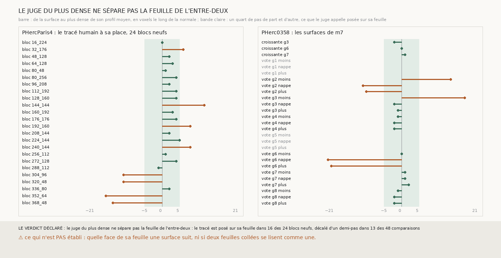

# `309` — Le plus dense du profil moyen, à moins d'un quart de pas d'une surface, dit-il si elle est posée sur sa feuille ? Non sur le tracé humain, qui n'est pas à une place constante dans sa feuille ; les surfaces de m7, elles, sont à 0 à 2 voxels de leur plus dense

*`308` a vu que le tracé humain de PHercParis4 est posé sur la face de sa feuille, à un quart de pas de son plus dense. Cette
tranche demande donc où est le plus dense par rapport à la surface, et accepte une surface dont le plus dense est à au plus 5
voxels d'elle. Étalonné sur vingt-quatre blocs neufs, ce juge échoue aussi : le tracé est posé sur sa feuille dans 16 blocs sur
24, et décalé d'un demi-pas dans 13 comparaisons sur 48. La raison n'est plus un décalage constant : bloc par bloc, le plus dense
du tracé est de −16 à +12 voxels de lui. La main humaine ne pose pas sa surface à une place fixe dans la feuille, et aucun juge de
position ne peut s'étalonner sur une place qui varie. Sur PHerc0358, rapporté, les surfaces de `m7` appuyées sur la prédiction
ont leur plus dense à 0, 1 ou 2 voxels d'elles, les nappes croissantes de `305` comprises, et les trois exceptions sont celles que
les tranches précédentes avaient déjà désignées.*

## 0. Pourquoi cette tranche

C'est `R4-P109`. La forme du juge vient de la courbe de `308`, lue sur les blocs de `301` : d'où les blocs neufs, qu'aucune tranche
n'avait regardés.

## 1. Ce qui a été vu avant d'écrire

Tout ce que `298` à `308` publient, dont le profil moyen des vingt-quatre blocs de `301`, le plus dense à +3 voxels du tracé, et
celui des nappes des graines 3, 6 et 7, à −2, 0 et +1.

## 2. Ce qui est fait

- **L'étalonnage** : vingt-quatre blocs neufs du segment de PHercParis4, hors de ceux de `296`, `299`, `300` et `301` ; le tracé
  humain de chaque bloc, décalé de −1, −0,5, −0,25, 0, +0,25, +0,5 et +1 pas.
- **Le juge** : une surface est posée sur sa feuille si le plus dense de son profil moyen est à au plus un quart de pas d'elle,
  5 voxels.
- **L'issue** : la règle de `301`, `307` et `308`.
- **Rapporté, PHerc0358** : les nappes et spires suivantes de `301` telles qu'elles sont rangées, et les nappes croissantes de
  `305`.

## 3. Ce que dit le scan

| décalage (pas) | part des 24 blocs neufs posés sur leur feuille |
|---|---|
| −1,0 | 0,0833 |
| −0,5 | 0,125 |
| −0,25 | 0,0833 |
| 0,0 | 0,6667 |
| 0,25 | 0,7917 |
| 0,5 | 0,4167 |
| 1,0 | 0,0 |

⭐⭐⭐⭐ **Le juge du plus dense ne sépare pas la feuille de l'entre-deux** (`R4-F490`), et la figure dit pourquoi : à sa place, le
plus dense du tracé humain est à une médiane de 2,5 voxels de lui, mais de −16 à +12 selon le bloc, et du côté négatif dans 5 blocs
sur 24. Sur quatre blocs, il est à plus de 10 voxels de l'autre côté : le tracé y suit la face opposée de sa feuille, ou une feuille
mince collée à une plus dense. Le décalage, lui, se lit comme il doit : décalé d'un demi-pas, le plus dense se déplace de 9
voxels, à un voxel près, dans tous les blocs où il ne sort pas de la fenêtre de ±21 voxels, la preuve que le profil lu est bien celui
de la surface.

Sur PHerc0358, rapporté :

| surface | le plus dense (voxels) | posée | points jugés |
|---|---|---|---|
| croissante g3 | −2 | oui | 3322 |
| croissante g6 | 0 | oui | 3428 |
| croissante g7 | 1 | oui | 1253 |
| vote g1 moins | — | — | 0 |
| vote g1 nappe | — | — | 0 |
| vote g1 plus | — | — | 0 |
| vote g2 moins | 14 | non | 312 |
| vote g2 nappe | −11 | non | 375 |
| vote g2 plus | −10 | non | 326 |
| vote g3 moins | 18 | non | 3649 |
| vote g3 nappe | −2 | oui | 3968 |
| vote g3 plus | −1 | oui | 3721 |
| vote g4 moins | −1 | oui | 3721 |
| vote g4 nappe | −2 | oui | 3969 |
| vote g4 plus | −2 | oui | 3721 |
| vote g5 moins | — | — | 0 |
| vote g5 nappe | — | — | 0 |
| vote g5 plus | — | — | 0 |
| vote g6 moins | 0 | oui | 3721 |
| vote g6 nappe | −21 | non | 3969 |
| vote g6 plus | −20 | non | 3721 |
| vote g7 moins | 1 | oui | 3721 |
| vote g7 nappe | 1 | oui | 3969 |
| vote g7 plus | 2 | oui | 3721 |
| vote g8 moins | −1 | oui | 3721 |
| vote g8 nappe | −2 | oui | 3969 |
| vote g8 plus | −2 | oui | 3721 |

⭐⭐⭐⭐ **Toutes les surfaces de `m7` qui ont de la matière sous elles sont à 0 à 2 voxels de leur plus dense, sauf trois, et ces
trois sont celles que `304` et `306` désignaient** : la spire − de la graine 3 (plus dense à +18), appuyée sur `m7` sur 4 % de ses
points seulement, et la nappe et la spire + de la graine 6 (−21 et −20), dont `304` a vu les sauts vers la feuille voisine. La nappe
croissante de la graine 6, elle, est à 0 voxel. Les surfaces de la graine 2 n'ont de la matière que sous 312 à 375 points.

## 4. Le verdict

**LE JUGE DU PLUS DENSE NE SÉPARE PAS LA FEUILLE DE L'ENTRE-DEUX : LE TRACÉ EST POSÉ SUR SA FEUILLE DANS 16 DES 24 BLOCS NEUFS, DÉCALÉ D'UN DEMI-PAS DANS 13 DES 48 COMPARAISONS.**

Trois juges de suite échouent sur le même référent, et la raison est maintenant établie : le tracé humain de PHercParis4 est
parallèle à sa feuille (`307`) mais n'est pas à une place fixe en elle. Il ne peut pas étalonner un juge de position. Ce qui reste
vrai, et qui se lit sans juge : une surface de `m7` appuyée sur la prédiction est à 0 à 2 voxels du plus dense du scan le long de
sa normale ; les surfaces du vote qui ne le sont pas sont exactement celles qui ont quitté leur feuille.

## 5. Ce que cette tranche ne dit pas

- ⚠⚠ Que « au plus dense du scan » veuille dire « sur une feuille » sans autre preuve : c'est l'hypothèse la plus simple, et `304`
  montre des creux entre ces plus denses, mais aucun référent indépendant ne l'établit sur PHerc0358.
- ⚠ Quelle face de sa feuille le tracé humain suit, bloc par bloc.
- ⚠ Si deux feuilles collées se lisent comme une seule.

## 6. Les sondes

Une batterie de **12** contrôles et une figure de **10**. Sept règles cassées exprès ont fait échouer la batterie : un quart de pas
exclu de la bande, un plus dense compté depuis le bord du profil, un absent compté posé, un seul côté du demi-pas, les blocs de
`301` oubliés parmi les blocs déjà vus, le quart de pas compté au voxel plein de PHercParis4, et les absents ignorés.

## 7. Ce qui reste

`R4-P110` s'ouvre : les spires de la chaîne de `303`, relues au plus dense, sont-elles chacune au cœur d'une feuille et à un pas de
la précédente ? C'est la lecture qui reste possible sans référent, et elle dit, spire par spire, où la chaîne quitte sa feuille.
