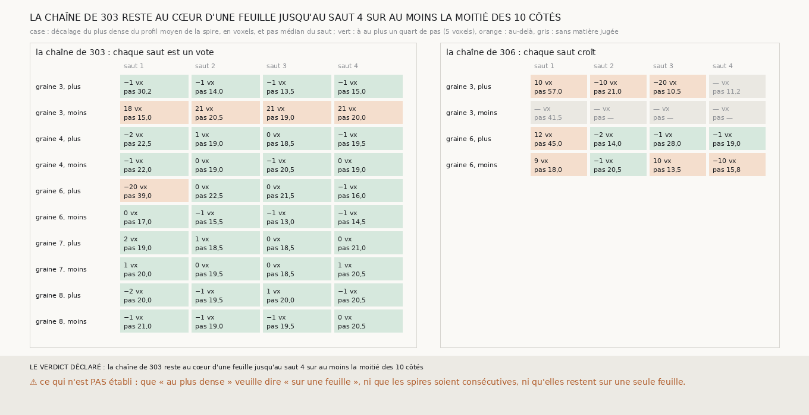

# `310` — Les spires des chaînes de m7, relues au plus dense du scan, restent-elles chacune au cœur d'une feuille ? Oui pour la chaîne du vote, sur huit côtés sur dix et quatre sauts, à un pas du rouleau par saut

*`307` a retiré au juge de `301` le droit de dire « sur sa feuille », et `309` a montré qu'aucun tracé humain ne peut étalonner un
juge de position. Ce qui reste se lit sans juge : où est le plus dense du scan par rapport à une surface, et de combien chaque saut
avance. Relue ainsi, la chaîne de `303` reste au cœur d'une feuille, à au plus 2 voxels du plus dense, pendant ses quatre sauts sur
huit côtés sur dix, et ses sauts avancent de 13 à 22,5 voxels, autour du pas de 20, sauf le premier de la graine 3 côté plus, de
30,25. Sur les graines 4, 7 et 8, les deux
côtés tiennent : neuf surfaces empilées, la nappe et quatre spires de chaque côté, chacune au cœur d'une feuille, à un pas de la
précédente. Les deux côtés qui sortent sont ceux que `306` et `309` désignaient déjà. La chaîne de `306`, dont les sauts croissent,
sort du cœur dès le premier saut sur ses quatre côtés.*

## 0. Pourquoi cette tranche

C'est `R4-P110`. Sans référent de position, la place du plus dense et le pas se lisent directement. Relire les chaînes déjà tirées
dit, spire par spire, où elles quittent le cœur d'une feuille.

## 1. Ce qui a été vu avant d'écrire

Tout ce que `303` à `309` publient, dont les pas des sauts de `303` et `306`, et la place du plus dense des nappes et des premières
spires de `301`. Les spires 2 à 4 n'avaient pas été relues au plus dense.

## 2. Ce qui est fait

- **Les chaînes** : celle de `303` (le vote, dix côtés, quatre sauts) et celle de `306` (les sauts croissants, quatre côtés),
  telles que ces tranches les ont préparées, sans en changer un point.
- **La lecture** : le profil moyen du juge de `301`, et le décalage de son plus dense par rapport à la spire. Au cœur d'une feuille
  si ce plus dense est à au plus un quart de pas, 5 voxels.
- **L'issue, sur la chaîne de `303`** : le plus grand saut H jusqu'auquel au moins la moitié des dix côtés restent au cœur.

## 3. Ce que dit le scan

Chaque case : le décalage du plus dense, en voxels, et entre parenthèses le pas médian du saut que `303` ou `306` publie (sur les
points appuyés sur `m7` pour `303`).

| chaîne | graine | côté | saut 1 | saut 2 | saut 3 | saut 4 | dernier saut au cœur |
|---|---|---|---|---|---|---|---|
| vote | 3 | plus | −1 (30,25) | −1 (14,0) | −1 (13,5) | −1 (15,0) | 4 |
| vote | 3 | moins | 18 (15,0) | 21 (20,5) | 21 (19,0) | 21 (20,0) | 0 |
| vote | 4 | plus | −2 (22,5) | 1 (19,0) | 0 (18,5) | −1 (19,5) | 4 |
| vote | 4 | moins | −1 (22,0) | 0 (19,0) | −1 (20,5) | 0 (19,0) | 4 |
| vote | 6 | plus | −20 (39,0) | 0 (22,5) | 0 (21,5) | −1 (16,0) | 0 |
| vote | 6 | moins | 0 (17,0) | −1 (15,5) | −1 (13,0) | −1 (14,5) | 4 |
| vote | 7 | plus | 2 (19,0) | 1 (18,5) | 0 (18,5) | 0 (21,0) | 4 |
| vote | 7 | moins | 1 (20,0) | 0 (19,5) | 0 (18,5) | 1 (20,5) | 4 |
| vote | 8 | plus | −2 (20,0) | −1 (19,5) | 1 (20,0) | −1 (20,5) | 4 |
| vote | 8 | moins | −1 (21,0) | −1 (19,0) | −1 (19,5) | 0 (20,5) | 4 |
| croissante | 3 | plus | 10 (57,0) | −10 (21,0) | −20 (10,5) | — (11,25) | 0 |
| croissante | 3 | moins | — (41,5) | — (—) | — (—) | — (—) | 0 |
| croissante | 6 | plus | 12 (45,0) | −2 (14,0) | −1 (28,0) | −1 (19,0) | 0 |
| croissante | 6 | moins | 9 (18,0) | −1 (20,5) | 10 (13,5) | −10 (15,75) | 0 |

⭐⭐⭐⭐⭐ **La chaîne du vote reste au cœur d'une feuille pendant quatre sauts sur huit côtés sur dix** (`R4-F491`) : chacune de
ses 32 spires y est à au plus 2 voxels du plus dense du scan. Sur les graines 4, 7 et 8, les deux côtés tiennent, et leurs sauts
avancent de 18,5 à 22,5 voxels : neuf surfaces au cœur d'une feuille, empilées à un pas les unes des autres, sur près de huit pas du
rouleau. Les deux côtés qui sortent : la graine 3 côté moins, dont les spires sont appuyées sur `m7` sur 1 à 4 % de leurs points
et restent à 18 à 21 voxels du plus dense, et la graine 6 côté plus, dont le premier saut avance de 39 voxels et tombe à −20 du plus
dense, puis dont les trois sauts suivants retrouvent le cœur d'une feuille.

La chaîne de `306`, dont les sauts croissent sans poser ce que `m7` ne voit pas, sort du cœur dès le premier saut sur ses quatre
côtés : ses premiers sauts sont à 9 à 12 voxels du plus dense. Poser ce que `m7` voit ne suffit pas à poser au cœur de la feuille.

## 4. Le verdict

**LA CHAÎNE DE 303 RESTE AU CŒUR D'UNE FEUILLE JUSQU'AU SAUT 4 SUR AU MOINS LA MOITIÉ DES 10 CÔTÉS.**

C'est le fait positif que la série cherchait depuis `301`, sous la forme qu'une mesure sans référent peut porter : sur un rouleau
du prix sans tracé humain, depuis la seule prédiction publiée, une chaîne de neuf surfaces empilées, chacune au plus dense du scan,
chacune à un pas de la précédente. Ce qu'elle ne porte pas est écrit ci-dessous.

## 5. Ce que cette tranche ne dit pas

- ⚠⚠ Que chaque spire reste sur une seule feuille : `304` a vu les nappes des graines 7 et 8 passer à la feuille voisine sur un
  carré de voisins sur dix, et une surface qui change de feuille reste au plus dense, celui de l'autre feuille.
- ⚠⚠ Que les spires soient consécutives : un pas de 20 voxels le rend probable, et `R4-P103` reste ouverte.
- ⚠ Que « au plus dense » veuille dire « sur une feuille » : c'est l'hypothèse la plus simple, que rien d'indépendant n'établit.
- ⚠ Six millimètres de large, huit pas de profondeur.

## 6. Les sondes

Une batterie de **6** contrôles et une figure de **9**. Trois règles cassées exprès ont fait échouer la batterie, dont une
seulement après qu'un contrôle a été ajouté : un dernier saut qui compte ceux d'après un saut sorti, les deux chaînes mêlées dans
l'issue, et « au moins la moitié » lue comme « plus de la moitié », que la batterie ne voyait pas avant qu'un cas à la moitié exacte
soit ajouté. La figure a échoué d'elle-même au premier rendu, sur des cases trop étroites pour leur texte.

## 7. Ce qui reste

`R4-P111` s'ouvre : les spires de la chaîne du vote des graines 4, 7 et 8, découpées en pièces d'une seule feuille par les sauts de
`302`, restent-elles au cœur d'une feuille pièce par pièce, et la plus grande pièce de chaque spire est-elle en face de la plus
grande pièce de la précédente ? C'est la question qui sépare une chaîne de spires d'un empilement de morceaux.
