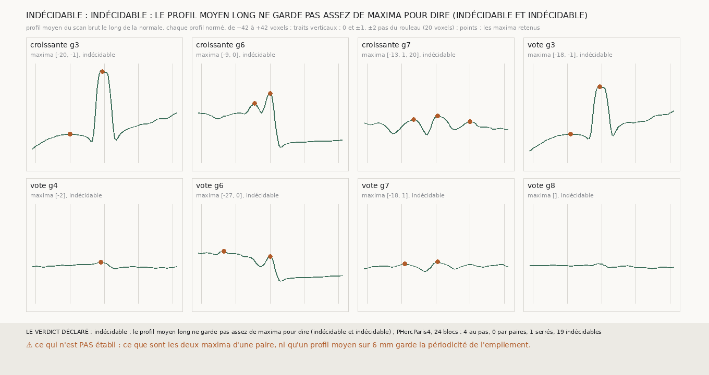

# `311` — Le long de la normale d'une nappe de m7 d'une seule feuille, les maxima du scan sont-ils espacés du pas du rouleau, ou par paires ? Indécidable : le profil moyen sur deux pas ne garde que la feuille de la nappe et une voisine

*Les sauts de 12 à 13,5 voxels de `304` ont deux lectures : deux spires écrasées l'une contre l'autre, ou les deux couches de
fibres d'une même feuille de papyrus. Elles diffèrent par ce qui suit : des spires écrasées se suivent à 12,5 voxels, deux couches
viennent par paires dont la somme vaut le pas. Cette tranche lit le profil moyen du scan sur deux pas de part et d'autre des nappes
de `m7`, et ne peut pas trancher : sur les deux nappes d'une seule feuille, il ne garde que deux maxima, celui de la nappe et un
voisin, à 19 voxels pour la graine 3 et à 9 pour la graine 6. Au-delà, le profil moyen sur 6 mm est une pente sans maximum. Sur
PHercParis4, le même profil moyen, bloc par bloc, est indécidable dans 19 blocs sur 24. La périodicité de l'empilement ne survit pas
à une moyenne sur une surface entière.*

## 0. Pourquoi cette tranche

`304` lit le creux en travers des sauts comme le passage à la feuille voisine, mais un pas de 20 voxels et des sauts de 12,5 ne
vont ensemble que si le pas est écrasé là, ou si ces sauts relient les deux couches d'une même feuille. Dans ce second cas, les
nappes qui sautent resteraient sur une seule feuille.

## 1. Ce qui a été vu avant d'écrire

Tout ce que `300` à `310` publient, dont le profil moyen de la nappe croissante de la graine 6 sur ±21 voxels, avec un second
maximum à −9. Aucun profil au-delà de ±21 voxels n'avait été lu.

## 2. Ce qui est fait

- **Les surfaces** : les nappes croissantes de `305` des graines 3, 6 et 7, les nappes du vote de `301` des graines 3, 4, 6, 7 et
  8, et le tracé humain des vingt-quatre blocs neufs de `309`.
- **Le profil long** : le scan brut sur deux pas et deux voxels de part et d'autre, ±42 voxels sur PHerc0358, ±38 sur
  PHercParis4, chaque profil normé, moyenné par surface.
- **Les maxima** : ceux du profil lissé sur trois voxels, de proéminence au moins 0,1.
- **La forme** : au pas, par paires, serrés, ou indécidable avec moins de deux écarts entre maxima.
- ⚠ **Une correction avant publication** : la règle déclarée disait « les deux nappes ne s'accordent pas » dès que leurs formes
  différaient ou étaient indécidables. Deux nappes indécidables toutes deux ne se contredisent pas : la tranche est indécidable.

## 3. Ce que dit le scan

| surface | points | maxima (voxels) | écarts (voxels) | forme |
|---|---|---|---|---|
| croissante g3 | 3322 | −20, −1 | 19 | indécidable |
| croissante g6 | 3428 | −9, 0 | 9 | indécidable |
| croissante g7 | 1253 | −13, 1, 20 | 14, 19 | indécidable |
| vote g3 | 3969 | −18, −1 | 17 | indécidable |
| vote g4 | 3969 | −2 | — | indécidable |
| vote g6 | 3969 | −27, 0 | 27 | indécidable |
| vote g7 | 3969 | −18, 1 | 19 | indécidable |
| vote g8 | 3969 | — | — | indécidable |

⭐⭐⭐ **Le profil moyen long ne décide pas** (`R4-F492`). Sur la graine 3, un cœur de feuille net et dense, et un voisin faible à
19 voxels, au pas. Sur la graine 6, deux maxima à 9 voxels l'un de l'autre, puis un plateau dense sans creux d'un côté et le vide
de l'autre : c'est la forme qu'auraient deux couches d'une même feuille, et aussi celle d'une feuille collée à sa voisine. Sur la
graine 7, trois maxima à 14 puis 19 voxels. Les nappes du vote des graines 4 et 8, qui passent à la feuille voisine sur un carré de
voisins sur dix, ont des profils moyens presque plats : ce que la moyenne mêle, elle l'efface.

Sur PHercParis4, le tracé humain bloc par bloc donne 4 blocs au pas, 0 par paires, 1 serrés et 19 indécidables : même là où la
réponse est connue, un profil moyen par bloc ne garde en général que la feuille du tracé et une voisine.

## 4. Le verdict

**INDÉCIDABLE : LE PROFIL MOYEN LONG NE GARDE PAS ASSEZ DE MAXIMA POUR DIRE.**

C'est un fait négatif sur la méthode : une moyenne sur une surface de 6 mm mêle des endroits où l'empilement n'a pas le même pas,
et sa périodicité s'y perd au-delà du premier voisin. La question de `304`, feuille voisine ou couche de la même feuille, reste
ouverte, et elle demande des profils lus point par point.

## 5. Ce que cette tranche ne dit pas

- ⚠⚠ Ce que sont les deux maxima à 9 voxels de la graine 6.
- ⚠ Si un profil lu point par point, ou sur une petite pièce, garde la périodicité que la moyenne efface.

## 6. Les sondes

Une batterie de **15** contrôles et une figure de **10**. Sept règles cassées exprès ont fait échouer la batterie, dont trois
seulement après qu'un contrôle a été ajouté : des paires jugées sur une bande de ±25 %, une seule phase de regroupement (vue quand
un cas où seule la première marche a été ajouté), un profil non lissé (vu quand une encoche d'un voxel a été ajoutée), une
proéminence nulle, des maxima comptés depuis le bord, des écarts courts et longs acceptés au pas, et l'issue lue sur les deux
premières surfaces plutôt que sur les deux nappes d'une seule feuille (vue quand l'ordre du cas a changé). La première règle des
paires était fausse, et c'est la batterie qui l'a dit : dans une paire, les deux écarts sont courts.

## 7. Ce qui reste

`R4-P112` s'ouvre : point par point, sur la nappe croissante de la graine 6 et sur celles du vote des graines 4, 7 et 8, l'écart
entre le plus dense du profil et le maximum voisin le plus proche se répartit-il autour du pas, ou en deux modes, un court et un
long, dont la somme vaut le pas ?
