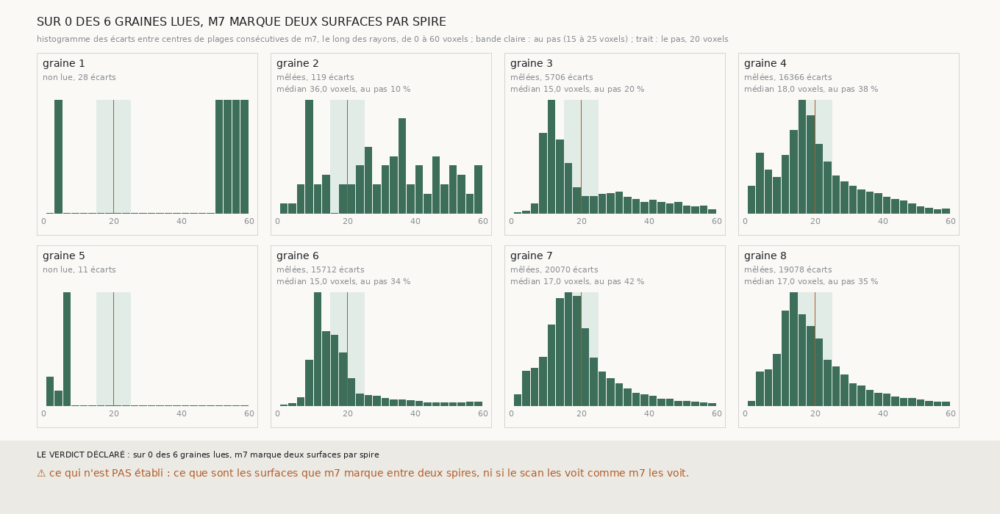

# `312` — Le long des rayons des plans de 301, m7 marque-t-il une surface par spire, ou deux ? Ni l'un ni l'autre : ses plages se suivent en un seul mode large, de 10 à 17,5 voxels, sous le pas de 20

*`311` n'a pas pu lire la périodicité dans le scan moyenné. `m7`, lui, est binaire : le long d'un rayon, ses plages se comptent sans
moyenne. Sur les six graines de PHerc0358 qui en ont assez, les écarts entre plages consécutives ne sont ni au pas du rouleau pour
la majorité, ni par paires dont la somme vaut le pas : ils forment un seul mode large, autour de 10 à 12,5 voxels pour les graines 3
et 6, de 15 à 17,5 pour les graines 4, 7 et 8, avec un écart médian de 15 à 18 voxels. Seuls 11 à 30 % des écarts courts font paire.
`m7` marque ses surfaces plus serrées que le pas médian du rouleau, et régulièrement, pas deux par deux.*

## 0. Pourquoi cette tranche

C'est une lecture de `R4-P112` par `m7`. Deux lectures des sauts de 12 à 13,5 voxels de `304` s'opposent, deux spires écrasées ou
deux couches d'une même feuille, et elles diffèrent par ce qui suit un écart court.

## 1. Ce qui a été vu avant d'écrire

Tout ce que `300` à `311` publient. Aucun écart entre plages de `m7` n'avait été compté au-delà de celles qui entourent une nappe.

## 2. Ce qui est fait

- **Les rayons** : ceux des plans de `300` sur les huit graines de `301`, de −60 à +60 voxels le long de la normale de la graine.
- **Les écarts** : entre centres consécutifs des plages de `m7` sur un même rayon ; au pas de 15 à 25 voxels, courts en dessous,
  longs au-dessus ; un court fait paire avec le suivant si leur somme est de 17 à 23 voxels.
- **La lecture** : une surface par spire si la moitié au moins sont au pas ; deux par spire si la moitié au moins sont courts et font
  paire à moitié au moins ; serrées si courts sans paire ; mêlées sinon ; non lue sous 100 écarts.

## 3. Ce que dit m7

| graine | écarts | au pas | courts | longs | courts qui font paire | écart médian (voxels) | lecture |
|---|---|---|---|---|---|---|---|
| 1 | 28 | — | — | — | — | — | non lue |
| 2 | 119 | 0,1008 | 0,2017 | 0,6975 | 0,125 | 36,0 | mêlées |
| 3 | 5706 | 0,1996 | 0,4972 | 0,3032 | 0,2281 | 15,0 | mêlées |
| 4 | 16366 | 0,3837 | 0,3458 | 0,2705 | 0,1143 | 18,0 | mêlées |
| 5 | 11 | — | — | — | — | — | non lue |
| 6 | 15712 | 0,3352 | 0,4979 | 0,1669 | 0,3028 | 15,0 | mêlées |
| 7 | 20070 | 0,4247 | 0,3806 | 0,1947 | 0,1683 | 17,0 | mêlées |
| 8 | 19078 | 0,3548 | 0,4055 | 0,2397 | 0,1706 | 17,0 | mêlées |

⭐⭐⭐⭐ **`m7` ne marque pas deux surfaces par spire** (`R4-F493`) : sur aucune des six graines lues les écarts courts ne font paire
à moitié, et sur aucune la moitié des écarts n'est au pas. L'histogramme a un seul mode, étroit pour les graines 3 et 6, à 10 à
12,5 voxels, plus large pour les graines 4, 7 et 8, à 15 à 17,5. Le long d'un rayon oblique, un écart ne peut qu'être plus grand que
l'écart vrai entre deux surfaces parallèles : les surfaces de `m7` sont donc au plus à 10 à 17,5 voxels l'une de l'autre, 94 à 164 µm,
sous le pas médian du rouleau, 187 µm.

Deux lectures restent : là, l'empilement est plus serré que le pas médian ; ou `m7` y marque les deux faces de chaque feuille, que
l'épaisseur de la feuille et celle de l'espace entre deux feuilles espacent presque également, à un demi-pas, sans paire visible.

## 4. Le verdict

**SUR 0 DES 6 GRAINES LUES, M7 MARQUE DEUX SURFACES PAR SPIRE.**

C'est un fait négatif sur la lecture en couches des sauts de `304`, tel que `m7` peut le dire, et un fait sur le pas : la chaîne de
`303` avance le plus souvent de 18,5 à 22,5 voxels par saut, le long de la normale de sa surface, là où `m7` a des surfaces tous les
10 à 17,5 voxels au plus. Elle peut en sauter.

## 5. Ce que cette tranche ne dit pas

- ⚠⚠ Si la chaîne de `303` saute une surface de `m7` à chaque saut.
- ⚠ Ce que sont les surfaces que `m7` marque, feuilles ou faces.
- ⚠ Si le scan les voit comme `m7` les voit.

## 6. Les sondes

Une batterie de **9** contrôles et une figure de **9**. Cinq règles cassées exprès ont fait échouer la batterie, dont une seulement
après qu'un contrôle a été ajouté : des paires jugées sur une bande trop large, des écarts pris sans trier les centres, l'écart
suivant décalé d'un rang, la lecture au pas prise à partir d'un tiers des écarts (vue quand un cas à un tiers a été ajouté), et une
lecture sans minimum d'écarts.

## 7. Ce qui reste

`R4-P113` s'ouvre : entre chaque surface de la chaîne de `303` et sa spire suivante, combien de plages de `m7` le rayon traverse-t-il ?
Si c'est une, la chaîne saute une surface de `m7` à chaque saut ; si c'est zéro, ses spires sont les surfaces consécutives de `m7`.
