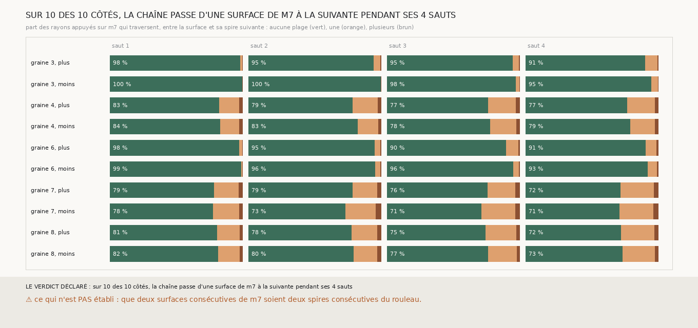

# `313` — Entre chaque surface de la chaîne de 303 et sa spire suivante, combien de plages de m7 le rayon traverse-t-il ? Aucune, sur 71 à 100 % des rayons : la chaîne passe d'une surface de m7 à la suivante sur ses dix côtés

*`312` a trouvé les surfaces de `m7` à 10 à 17,5 voxels l'une de l'autre au plus, et la chaîne de `303` avance de 18,5 à 22,5 voxels
par saut : elle aurait pu en sauter une. Elle ne le fait pas. Sur les rayons appuyés sur `m7`, entre chaque surface de la chaîne et
sa spire suivante, aucune plage de `m7` ne s'intercale pour 71 à 100 % des rayons, sur les dix côtés et à chacun des quatre sauts.
Les graines 3 et 6 passent à la surface suivante sur 90 à 100 % des rayons ; les graines 4, 7 et 8 en sautent une sur 14 à 26 %
d'entre eux, la même proportion que les sauts d'un demi-pas que `302` et `304` lisent dans leurs nappes.*

## 0. Pourquoi cette tranche

C'est `R4-P113`. Un saut de `303` part de la première plage de `m7` après la sienne, puis le vote de `247` peut le déplacer vers la
plage d'après.

## 1. Ce qui a été vu avant d'écrire

Tout ce que `303` à `312` publient, dont les pas des sauts et l'écart entre plages de `m7` le long des rayons des plans.

## 2. Ce qui est fait

- **La chaîne** : celle de `303`, retirée de `m7` à l'identique.
- **Les rayons** : pour chaque point où le saut est appuyé sur `m7`, le long de la normale que le saut a suivie, de la surface de
  départ jusqu'au pas qu'il a pris.
- **Les plages intermédiaires** : celles de `m7` dont le centre est à plus de 3 voxels du départ et de l'arrivée.
- **Les issues** : un saut passe à la surface suivante si la moitié au moins de ses rayons n'en traversent aucune ; en saute une si
  la moitié au moins en traversent exactement une ; mêlé sinon.

## 3. Ce que dit m7

Chaque case : la part des rayons qui ne traversent aucune plage, puis celle qui en traversent une, et entre parenthèses le nombre
de rayons appuyés.

| graine | côté | saut 1 | saut 2 | saut 3 | saut 4 | dernier saut qui passe |
|---|---|---|---|---|---|---|
| 3 | plus | 0,9846 / 0,0154 (2662) | 0,9461 / 0,0508 (1947) | 0,9511 / 0,0484 (2106) | 0,9069 / 0,0899 (2202) | 4 |
| 3 | moins | 1,0 / 0,0 (181) | 1,0 / 0,0 (67) | 0,9767 / 0,0233 (43) | 0,9524 / 0,0476 (42) | 4 |
| 4 | plus | 0,8266 / 0,1527 (2659) | 0,7894 / 0,1899 (2564) | 0,7655 / 0,2081 (2230) | 0,7708 / 0,2087 (2094) | 4 |
| 4 | moins | 0,8371 / 0,1412 (2634) | 0,8258 / 0,1552 (2423) | 0,7798 / 0,2005 (2189) | 0,7932 / 0,1851 (2021) | 4 |
| 6 | plus | 0,9796 / 0,0204 (1614) | 0,9544 / 0,0445 (1931) | 0,9029 / 0,0902 (2318) | 0,9094 / 0,0807 (2119) | 4 |
| 6 | moins | 0,9926 / 0,0074 (3798) | 0,9578 / 0,0407 (3438) | 0,9568 / 0,0418 (3059) | 0,9251 / 0,0697 (2696) | 4 |
| 7 | plus | 0,7895 / 0,187 (3064) | 0,7894 / 0,1868 (2692) | 0,7603 / 0,2107 (2311) | 0,7193 / 0,2512 (2098) | 4 |
| 7 | moins | 0,7819 / 0,198 (3045) | 0,7331 / 0,2314 (2675) | 0,7147 / 0,258 (2345) | 0,7101 / 0,2572 (2166) | 4 |
| 8 | plus | 0,8117 / 0,1695 (2814) | 0,7816 / 0,1946 (2610) | 0,7453 / 0,2318 (2265) | 0,7233 / 0,2508 (2085) | 4 |
| 8 | moins | 0,8195 / 0,1635 (2948) | 0,7959 / 0,1775 (2631) | 0,7674 / 0,2138 (2339) | 0,7341 / 0,2439 (2095) | 4 |

⭐⭐⭐⭐⭐ **La chaîne de `303` passe d'une surface de `m7` à la suivante** (`R4-F494`), sur les dix côtés et à chaque saut. Elle
ne saute pas une surface sur deux : ses spires sont les surfaces consécutives de `m7`, le long de la normale. Là où elle en saute
une, sur 14 à 26 % des rayons des graines 4, 7 et 8, la part grandit de saut en saut, de 14 à 20 % au premier saut à 19 à 26 % au
quatrième : c'est le même phénomène que les sauts d'un demi-pas dans les nappes de ces graines, que la chaîne hérite et accumule.
La graine 3 côté moins n'a que 42 à 181 rayons appuyés, parce que `m7` n'y voit presque rien (`306`).

## 4. Le verdict

**SUR 10 DES 10 CÔTÉS, LA CHAÎNE PASSE D'UNE SURFACE DE M7 À LA SUIVANTE PENDANT SES 4 SAUTS.**

Avec `R4-F491`, cela fait de la chaîne de `303` une suite de surfaces de `m7` consécutives, chacune au plus dense du scan, et avec
le témoin de `304`, séparées chacune de la suivante par un creux du scan. Le pas qui les sépare est celui du rouleau. Qu'elles
soient les spires consécutives du rouleau est la lecture la plus simple de ces trois faits ; ce n'est pas un fait de plus.

## 5. Ce que cette tranche ne dit pas

- ⚠⚠ Que deux surfaces consécutives de `m7` soient deux spires consécutives du rouleau.
- ⚠ Ce qui se passe sur les rayons que `m7` n'appuie pas, où le vote a posé le pas par défaut.

## 6. Les sondes

Une batterie de **9** contrôles et une figure de **9**. Cinq règles cassées exprès ont fait échouer la batterie, dont une seulement
après qu'un contrôle a été ajouté : la plage d'arrivée comptée comme intermédiaire, la plage de départ aussi, les distances prises
avec leur signe du côté moins, une majorité prise à un tiers (vue quand un cas à un tiers a été ajouté), et un dernier saut qui
compte ceux d'après un saut qui saute.

## 7. Ce qui reste

`R4-P103` : les spires de la chaîne sont-elles les spires consécutives du rouleau ? Trois faits le rendent probable. Un quatrième, qui
ne dépende pas de `m7`, le dirait : suivre la chaîne assez loin pour qu'elle revienne, après un tour, en face d'elle-même.
