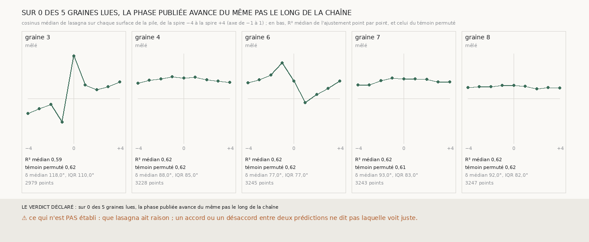

# `314` — Le long de la chaîne de 303, la phase d'enroulement publiée (lasagna) avance-t-elle du même pas à chaque saut ? Non lisible : point par point, la pile ne s'ajuste pas mieux à une sinusoïde que sa propre permutation

*Tout ce qui établit la chaîne de `303` vient de `m7` et du scan. `lasagna`, une autre prédiction publiée, donne en chaque voxel le
cosinus d'une phase d'enroulement. Si les neuf surfaces d'une pile sont neuf spires consécutives, ce cosinus suit une sinusoïde de
rang en rang. Sur les cinq graines, l'ajustement point par point a un R² médian de 0,59 à 0,62, et le même ajustement sur la pile
permutée au hasard donne 0,61 à 0,62 : neuf valeurs et trois paramètres s'ajustent aussi bien à du désordre. Le cosinus médian, rang
par rang, est presque plat sur les graines 4, 7 et 8, et saute d'un seul coup de part et d'autre de la nappe sur les graines 3 et
6. `lasagna` ne dit ni oui ni non à `R4-P103`.*

## 0. Pourquoi cette tranche

C'est `R4-P103` : un fait qui ne dépende pas de `m7` dirait si les spires de la chaîne sont les spires consécutives du rouleau.

## 1. Ce qui a été vu avant d'écrire

Tout ce que `300` à `313` publient, et `saut_de_spire.py`, qui lit `lasagna` sur d'autres rouleaux et lui trouve une période de 3
à 7 pas. Aucune valeur de `lasagna` n'avait été lue sur PHerc0358.

## 2. Ce qui est fait

- **La pile** : pour chaque graine, les neuf surfaces de la chaîne de `303`, de la spire −4 à la spire +4.
- **La phase** : le canal `cos` de `lasagna` au niveau 1 (18,7 µm), le plus fin publié, au voxel de chaque point.
- **L'ajustement** : en chaque point de la grille où les neuf surfaces sont lues, m + a·cos(kδ) + b·sin(kδ) sur les neuf rangs, δ
  de 1 à 180 degrés ; le terme constant, ajouté avant la mesure, rend l'ajustement indifférent à l'encodage du cosinus.
- **Le témoin** : la même pile, ses rangs permutés au hasard.
- **L'issue** : la phase avance du même pas si le R² médian dépasse 0,8, celui du témoin reste sous 0,5 et les δ tiennent dans 20
  degrés d'écart interquartile.

## 3. Ce que dit lasagna

| graine | points | R² médian | R² du témoin permuté | δ médian (degrés) | écart interquartile (degrés) | lecture |
|---|---|---|---|---|---|---|
| 3 | 2979 | 0,5856 | 0,6158 | 118,0 | 110,0 | mêlé |
| 4 | 3228 | 0,6245 | 0,6154 | 88,0 | 85,0 | mêlé |
| 6 | 3245 | 0,625 | 0,6238 | 77,0 | 77,0 | mêlé |
| 7 | 3243 | 0,6198 | 0,6122 | 93,0 | 83,0 | mêlé |
| 8 | 3247 | 0,6211 | 0,6155 | 92,0 | 82,0 | mêlé |

Le cosinus médian de `lasagna`, rang par rang, de la spire −4 à la spire +4 :

| graine | −4 | −3 | −2 | −1 | 0 | +1 | +2 | +3 | +4 |
|---|---|---|---|---|---|---|---|---|---|
| 3 | −0,3307 | −0,2283 | −0,126 | −0,5197 | 0,9449 | 0,2992 | 0,1969 | 0,2677 | 0,3701 |
| 4 | 0,3386 | 0,4094 | 0,4409 | 0,4882 | 0,4567 | 0,4803 | 0,4173 | 0,3858 | 0,3622 |
| 6 | 0,3543 | 0,4173 | 0,5197 | 0,7953 | 0,3898 | −0,0945 | 0,0866 | 0,2283 | 0,3858 |
| 7 | 0,3071 | 0,3071 | 0,4016 | 0,4567 | 0,4409 | 0,4409 | 0,4252 | 0,3701 | 0,3701 |
| 8 | 0,2441 | 0,2598 | 0,2598 | 0,2913 | 0,2913 | 0,2756 | 0,2205 | 0,2441 | 0,2362 |

⭐⭐⭐ **La phase publiée ne se lit pas le long de la chaîne** (`R4-F495`) : sur aucune graine la pile ne s'ajuste mieux que sa
permutation, et les δ retenus s'étalent sur 77 à 110 degrés d'écart interquartile. C'est le témoin qui le dit : sans lui, un R² de
0,62 et un δ médian de 88 à 93 degrés, soit une période de quatre spires, dans la fourchette de `saut_de_spire.py`, se liraient comme
un accord.

Sur les graines 4, 7 et 8, le cosinus médian varie de moins de 0,2 sur les neuf rangs : sur 1,5 mm, `lasagna` n'y avance presque
pas. Sur les graines 3 et 6, il saute d'un coup de part et d'autre de la nappe, de −0,52 à 0,94 puis 0,30 sur la graine 3, de 0,80 à
0,39 puis −0,09 sur la graine 6 : une marche de `lasagna` là où `m7` et le scan voient une nappe ordinaire, ou une nappe de `m7` posée
sur une marche de `lasagna`. Rien ici ne dit laquelle des deux prédictions a tort.

## 4. Le verdict

**SUR 0 DES 5 GRAINES LUES, LA PHASE PUBLIÉE AVANCE DU MÊME PAS LE LONG DE LA CHAÎNE.**

Un fait négatif sur `lasagna` comme juge de `R4-P103`, pas sur la chaîne : la phase publiée varie trop peu, ou trop brusquement, sur
neuf spires pour qu'une sinusoïde s'y lise mieux qu'au hasard.

## 5. Ce que cette tranche ne dit pas

- ⚠⚠ Si la chaîne est faite de spires consécutives : `lasagna` ne tranche pas.
- ⚠ D'où viennent les marches de `lasagna` des graines 3 et 6.
- ⚠ Ce que vaudrait `lasagna` sur une pile plus longue que neuf spires.

## 6. Les sondes

Une batterie de **12** contrôles et une figure de **9**. Cinq règles cassées exprès ont fait échouer la batterie, dont une seulement
après qu'un contrôle a été ajouté : un ajustement sans terme constant, le témoin ignoré, la dispersion des δ ignorée, le zéro de fond
lu comme un cosinus de −1, et un balayage des angles arrêté à 90 degrés (vu quand une pile à 120 degrés a été ajoutée).

## 7. Ce qui reste

`R4-P103` reste ouverte. Ce qui la trancherait sans `m7` ni `lasagna` est géométrique : une chaîne assez longue pour faire un tour du
rouleau et revenir en face d'elle-même.
