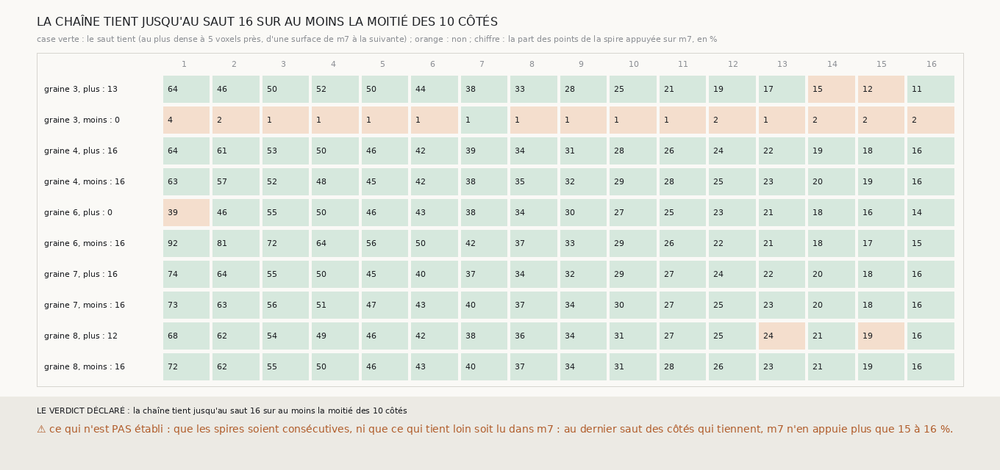

# `315` — La chaîne de m7 de 303 tient-elle au-delà de quatre sauts ? Oui, jusqu'au seizième sur six côtés sur dix, mais ce qui tient loin est de moins en moins lu dans m7

*Prolongée à seize sauts de chaque côté, la chaîne de `303` tient, au cœur d'une feuille et d'une surface de `m7` à la suivante,
jusqu'au seizième saut sur six côtés sur dix : les deux côtés des graines 4 et 7, et un côté des graines 6 et 8. Sur les graines 4
et 7, c'est une pile de trente-trois surfaces, trente-deux pas du rouleau, 6 mm de profondeur. Mais la part des points de chaque
spire que `m7` appuie tombe de 63 à 92 % au premier saut à 15 à 16 % au seizième : le reste, le vote de `247` le pose à la médiane
de ses voisins ou au pas par défaut, et le pas médian converge sur 20 à 21 voxels. Que ces spires extrapolées tombent encore au plus
dense du scan dit que l'empilement y est régulier au pas de 20 voxels sur trente-deux spires ; cela ne dit pas que `m7` les voit.*

## 0. Pourquoi cette tranche

C'est un pas vers `R4-P103`. Une chaîne qui fait un tour du rouleau trancherait la question des spires consécutives, et elle
demande des centaines de sauts : il fallait savoir combien la chaîne en tient, et ce qui la fait lâcher.

## 1. Ce qui a été vu avant d'écrire

Tout ce que `303` à `314` publient ; aucun saut au-delà du quatrième n'avait été tiré.

## 2. Ce qui est fait

- **La chaîne** : celle de `303`, prolongée à seize sauts de chaque côté, sur les cinq graines qui suivent l'empilement.
- **Un saut tient** s'il est au cœur d'une feuille (le plus dense à au plus 5 voxels, `310`), passe d'une surface de `m7` à la
  suivante sur au moins la moitié de ses rayons appuyés (`313`), et a au moins 100 points jugés.
- **L'issue** : le plus grand saut H jusqu'auquel au moins la moitié des dix côtés tiennent.

## 3. Ce que dit le scan

| graine | côté | dernier saut qui tient | appui au saut 1 | au saut 8 | au saut 16 | pas médian au saut 16 | plus dense au saut 16 | rayons sans plage intermédiaire au saut 16 |
|---|---|---|---|---|---|---|---|---|
| 3 | plus | 13 | 0,6443 | 0,3254 | 0,1148 | 20,0 | −1 | 0,7876 |
| 3 | moins | 0 | 0,0428 | 0,0099 | 0,0161 | 19,0 | −19 | 0,6029 |
| 4 | plus | 16 | 0,6383 | 0,3449 | 0,1553 | 20,5 | 1 | 0,7896 |
| 4 | moins | 16 | 0,6343 | 0,3548 | 0,1633 | 20,5 | 0 | 0,8 |
| 6 | plus | 0 | 0,3884 | 0,3375 | 0,1392 | 20,0 | −1 | 0,801 |
| 6 | moins | 16 | 0,9186 | 0,373 | 0,1451 | 20,5 | 0 | 0,7896 |
| 7 | plus | 16 | 0,7378 | 0,3415 | 0,1614 | 21,0 | 0 | 0,7405 |
| 7 | moins | 16 | 0,734 | 0,3688 | 0,1574 | 20,0 | 0 | 0,7308 |
| 8 | plus | 12 | 0,6798 | 0,3598 | 0,164 | 20,5 | 1 | 0,7229 |
| 8 | moins | 16 | 0,7157 | 0,3664 | 0,164 | 21,0 | −1 | 0,7359 |

⭐⭐⭐⭐⭐ **La chaîne tient jusqu'au seizième saut sur six côtés sur dix** (`R4-F496`). Sur les graines 4 et 7, les deux côtés
tiennent : trente-trois surfaces empilées, chacune au plus dense du scan à 2 voxels près, chacune passant à la surface de `m7`
suivante sur 69 à 84 % de ses rayons appuyés. La graine 3 côté plus lâche au quatorzième saut, où le plus dense passe à −21 ; la
graine 8 côté plus au treizième, où il passe à 21.

⚠⚠ **Ce qui tient loin n'est plus lu dans `m7`.** La part des points appuyés baisse à chaque saut, de 63 à 92 % au premier à 15 à
16 % au seizième sur les côtés qui tiennent ; le reste est posé par le vote à la médiane de ses voisins, ou au pas par défaut de 20
voxels, et le pas médian converge sur 20 à 21. La chaîne se prolonge alors par ce qu'elle suppose, et le scan le confirme : une
surface extrapolée au pas de 20 voxels tombe encore au plus dense, ce qui ne peut arriver que si l'empilement est régulier à ce pas.
C'est un fait sur PHerc0358 autour des graines 4 et 7, trente-deux spires régulières ; ce n'est pas un fait sur `m7`.

## 4. Le verdict

**LA CHAÎNE TIENT JUSQU'AU SAUT 16 SUR AU MOINS LA MOITIÉ DES 10 CÔTÉS.**

## 5. Ce que cette tranche ne dit pas

- ⚠⚠ Que les spires soient consécutives : `R4-P103` reste ouverte.
- ⚠⚠ Ce que la chaîne vaudrait si elle ne posait que ce que `m7` voit : `306` montre que la croissance, qui refuse ce que `m7` ne voit
  pas, ne tient pas dès le premier saut.
- ⚠ Pourquoi la part appuyée baisse : la grille perd ses bords à chaque saut (de 3721 à 961 points jugés), et `m7` voit moins loin.

## 6. Les sondes

Une batterie de **9** contrôles et une figure de **10**. Quatre règles cassées exprès ont fait échouer la batterie : le quart de pas
exclu de la bande, le minimum de points jugés retiré, « au moins la moitié des côtés » lue comme « plus de la moitié », et le saut de
surfaces de `m7` ignoré. La première version de la figure écrivait les parts appuyées de sa mise en garde à la main ; elle les lit
désormais dans la mesure.

## 7. Ce qui reste

Un tour du rouleau, pour `R4-P103`, demande que la chaîne s'étende aussi le long des spires et pas seulement à travers elles, et
qu'elle ne s'appuie pas sur le pas par défaut.
