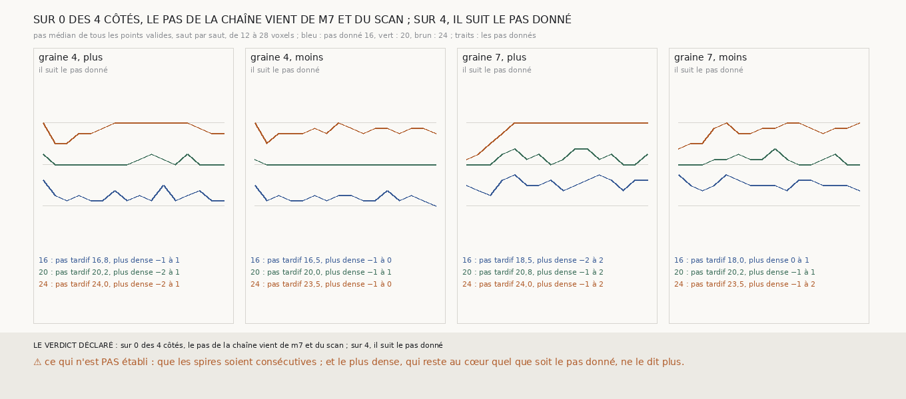

# `316` — Le pas de la chaîne de m7 vient-il de m7 et du scan, ou du pas par défaut que le vote lui donne ? Du pas donné, et le plus dense du scan ne s'en aperçoit pas

*`315` a prolongé la chaîne à seize sauts, avec un pas médian qui converge sur 20 à 21 voxels, le pas par défaut du vote, et des
spires que `m7` n'appuie plus qu'à 15 ou 16 %. Cette tranche donne au vote un autre pas par défaut, 16 ou 24 voxels, et regarde si la
chaîne le suit. Elle le suit, sur les quatre côtés : de 16,5 à 18,5 voxels au pas donné de 16, de 23,5 à 24 au pas donné de 24. Et le
plus dense du profil moyen reste à 0 à 2 voxels de chaque spire, quel que soit le pas donné. Le juge du plus dense, qui disait
« au cœur d'une feuille », ne distingue donc pas une chaîne au pas de 16 d'une chaîne au pas de 24 : il lit les points que `m7`
appuie, et les autres, placés au hasard de l'empilement, ne pèsent pas dans la moyenne.*

## 0. Pourquoi cette tranche

`315` ne pouvait pas dire si la chaîne avançait de 20 voxels parce que l'empilement le veut ou parce qu'on le dit au vote. Le seul
moyen de le savoir était de lui dire autre chose.

## 1. Ce qui a été vu avant d'écrire

Tout ce que `303` à `315` publient ; aucune chaîne n'avait été tirée avec un autre pas par défaut.

## 2. Ce qui est fait

- **Les côtés** : les quatre qui tiennent seize sauts sur les graines 4 et 7.
- **Trois pas par défaut** : 16, 20 et 24 voxels, donnés au saut de `300` partout où il s'en sert ; rien d'autre ne change.
- **La lecture** : le pas médian de tous les points valides à chaque saut, et le plus dense du profil moyen du scan.
- **L'issue** : le pas vient de `m7` et du scan si, aux pas donnés de 16 et 24, le pas médian des sauts 9 à 16 reste à 2 voxels de
  celui obtenu à 20 ; il suit le pas donné s'il s'en écarte de plus de 2 voxels des deux côtés.

## 3. Ce que dit le scan

| graine | côté | pas tardif, pas donné 16 | pas donné 20 | pas donné 24 | lecture |
|---|---|---|---|---|---|
| 4 | plus | 16,75 | 20,25 | 24,0 | il suit le pas donné |
| 4 | moins | 16,5 | 20,0 | 23,5 | il suit le pas donné |
| 7 | plus | 18,5 | 20,75 | 24,0 | il suit le pas donné |
| 7 | moins | 18,0 | 20,25 | 23,5 | il suit le pas donné |

⭐⭐⭐⭐⭐ **Le pas de la chaîne suit le pas donné** (`R4-F497`), sur les quatre côtés. Au pas donné de 16, la graine 7 résiste un
peu, à 18 ou 18,5 voxels : `m7` la tire vers un pas plus long. Au pas donné de 24, les quatre côtés s'y collent.

⚠⚠ **Et le plus dense du scan ne s'en aperçoit pas.** À chaque saut et pour les trois pas donnés, le plus dense du profil moyen est
à −2 à +2 voxels de la spire. Une chaîne au pas de 16 et une chaîne au pas de 24 ne peuvent pas être toutes deux au cœur des mêmes
feuilles sur seize sauts. Ce que le plus dense mesure, c'est la part de la spire que `m7` appuie, 13 à 18 % au seizième saut, qui
est posée sur les plages de `m7`, elles-mêmes au plus dense ; le reste, posé à la médiane de ses voisins ou au pas donné, tombe à des
places qui varient, et ses profils se moyennent sans maximum.

## 4. Le verdict

**SUR 0 DES 4 CÔTÉS, LE PAS DE LA CHAÎNE VIENT DE M7 ET DU SCAN ; SUR 4, IL SUIT LE PAS DONNÉ.**

C'est un fait négatif sur `310` et `315`, et il faut le reporter sur eux : « au cœur d'une feuille » y veut dire que les points
appuyés sur `m7` le sont, pas que la spire entière l'est ; et la pile de trente-trois surfaces de `315` est au pas de 20 voxels parce
qu'on le lui a donné. Ce qui reste de ces tranches : les points que `m7` appuie sont au plus dense du scan, et d'une surface de `m7`
à la suivante (`313`).

## 5. Ce que cette tranche ne dit pas

- ⚠⚠ Où tombent les points que `m7` n'appuie pas, au pas de 20 : au cœur des feuilles ou entre elles. C'est la question que le plus
  dense, moyenné sur toute la spire, ne peut pas trancher.
- ⚠ Que les spires soient consécutives.

## 6. Les sondes

Une batterie de **9** contrôles et une figure de **9**. Trois règles cassées exprès ont fait échouer la batterie : un pas donné jamais
rendu au module du saut, un « suit le pas donné » sans tolérance, et un pas tardif lu sur tous les sauts.

## 7. Ce qui reste

`R4-P114` s'ouvre : le plus dense lu à part sur les points que `m7` n'appuie pas est-il au cœur d'une feuille au pas donné de 20, et
hors du cœur aux pas de 16 et de 24 ?
