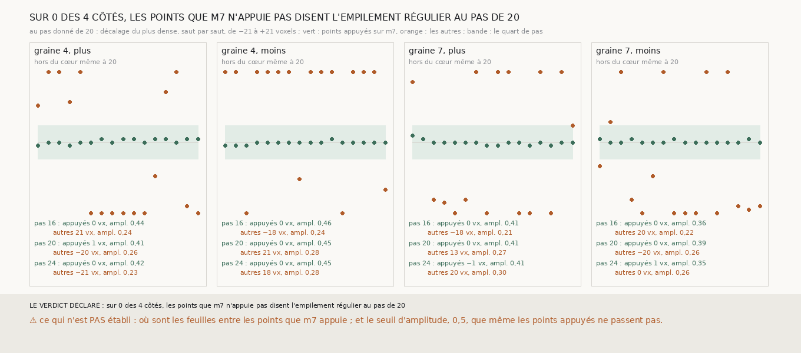

# `317` — Les points d'une spire de la chaîne que m7 n'appuie pas sont-ils au cœur d'une feuille ? Non, à aucun pas donné : la chaîne n'est une pile de feuilles que là où m7 la porte

*`316` a montré que le plus dense, moyenné sur une spire entière, reste au cœur quel que soit le pas donné au vote, parce que les
points appuyés sur `m7` y dominent. Lus à part, les deux groupes se séparent nettement. Les points appuyés ont leur plus dense à
0 ou 1 voxel de la spire, à tous les pas donnés. Les autres, posés par le vote à la médiane de leurs voisins ou au pas donné, ont un
profil moyen presque plat, d'amplitude 0,26 à 0,28, dont le maximum part aux bords de la fenêtre, à 13 à 21 voxels, et cela au pas
de 20 comme à 16 et à 24. La pile de trente-trois surfaces de `315` n'est une pile de feuilles que sur ses points appuyés, 15 à 16 %
au seizième saut ; entre eux, le vote ne suit pas l'empilement.*

## 0. Pourquoi cette tranche

C'est `R4-P114`. Seuls les points que `m7` n'appuie pas pouvaient dire si l'empilement est régulier au pas de 20, comme `315`
l'affirmait.

## 1. Ce qui a été vu avant d'écrire

Tout ce que `303` à `316` publient ; le plus dense n'avait jamais été lu par groupe de points.

## 2. Ce qui est fait

- **Les chaînes** : celles de `316`, graines 4 et 7, deux côtés, seize sauts, aux pas donnés de 16, 20 et 24.
- **Deux groupes par spire** : les points appuyés sur `m7`, et les autres.
- **Au cœur** : le plus dense médian des sauts 9 à 16 à au plus 5 voxels, et une amplitude médiane d'au moins 0,5.
- **L'issue** : l'empilement est régulier au pas de 20 si les points non appuyés sont au cœur au pas de 20 et hors du cœur à 16 et
  à 24.

## 3. Ce que dit le scan

Chaque case : le plus dense médian des sauts 9 à 16, en voxels, des points appuyés puis des autres ; l'amplitude est celle du pas
donné de 20.

| graine | côté | pas donné 16 | pas donné 20 | pas donné 24 | amplitude à 20 | lecture |
|---|---|---|---|---|---|---|
| 4 | plus | 0,5 / 21,0 | 1,0 / −20,0 | 0,5 / −21,0 | 0,41 / 0,26 | hors du cœur même à 20 |
| 4 | moins | 0,0 / −18,0 | 0,0 / 21,0 | 0,0 / 18,0 | 0,45 / 0,28 | hors du cœur même à 20 |
| 7 | plus | −0,5 / −18,5 | 0,0 / 13,0 | −1,0 / 19,5 | 0,41 / 0,27 | hors du cœur même à 20 |
| 7 | moins | 0,0 / 20,0 | 0,0 / −19,5 | 1,0 / 0,0 | 0,39 / 0,26 | hors du cœur même à 20 |

⭐⭐⭐⭐⭐ **Les points que `m7` n'appuie pas ne sont au cœur d'une feuille à aucun pas donné** (`R4-F498`) : leur plus dense médian
part à 13 à 21 voxels, aux bords de la fenêtre de ±21, et leur profil moyen est presque plat. Le seul zéro, sur la graine 7 côté moins
au pas de 24, a une amplitude de 0,26 : un maximum qui n'en est pas un. Les points appuyés, eux, restent à 0 ou 1 voxel aux trois pas.

⚠ **Une règle qui dit moins que la mesure.** Le seuil d'amplitude de 0,5, posé avant la mesure, est plus haut que celle des points
appuyés eux-mêmes, 0,39 à 0,45 : par la règle, aucun groupe n'est « au cœur ». La lecture « hors du cœur même à 20 » ne repose pas sur
ce seuil, puisque le plus dense des points non appuyés est à plus de 5 voxels ; celle des points appuyés, oui, et elle est donc
rapportée par leur plus dense, pas par la règle.

## 4. Le verdict

**SUR 0 DES 4 CÔTÉS, LES POINTS QUE M7 N'APPUIE PAS DISENT L'EMPILEMENT RÉGULIER AU PAS DE 20.**

C'est un fait négatif sur `315` : la chaîne n'est une pile de feuilles que là où `m7` la porte. Au premier saut, `m7` en appuie 63 à
92 % ; au seizième, 15 à 16 %. Ce qui fait tenir la chaîne loin, ce sont des morceaux appuyés sur `m7`, reliés par un vote qui ne suit
pas l'empilement entre eux.

## 5. Ce que cette tranche ne dit pas

- ⚠⚠ Où sont les feuilles entre les points que `m7` appuie : le vote ne les y met pas, et rien ici ne dit où elles sont.
- ⚠ Si les morceaux appuyés d'une même spire sont sur une même spire du rouleau.

## 6. Les sondes

Une batterie de **10** contrôles et une figure de **9**. Trois règles cassées exprès ont fait échouer la batterie, dont une seulement
après qu'un contrôle a été ajouté : l'amplitude ignorée, les sauts précoces lus à la place des sauts 9 à 16, et un empilement dit
régulier sans regarder le pas de 24 (vu quand ce cas a été ajouté).

## 7. Ce qui reste

`R4-P115` s'ouvre : une chaîne dont chaque saut ne garde que ses points appuyés sur `m7`, et les étend d'un pas de grille à la fois
le long de la feuille qu'ils portent, comme `305` fait croître une nappe, tient-elle plus loin que la chaîne croissante de `306` ?
C'est la chaîne qui ne se prolonge que par ce qu'elle voit.
