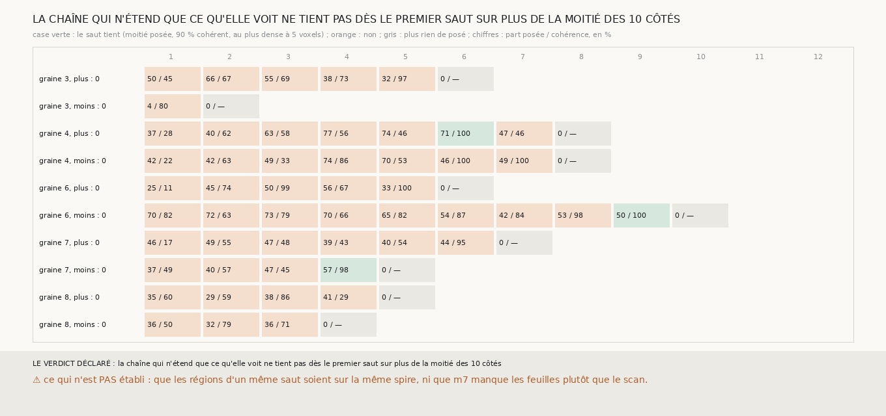

# `318` — Une chaîne de m7 qui ne pose que ce que m7 voit, et fait croître chaque saut depuis toutes les régions où m7 voit la feuille suivante, tient-elle ? Non : ses régions ne s'accordent pas sur le pas dès le premier saut, et elle se vide en trois à neuf sauts

*`317` a montré que la chaîne du vote tient loin par des morceaux appuyés sur `m7` reliés par un vote qui ne suit pas l'empilement.
Cette tranche retire le vote : chaque saut ne pose que des points où `m7` voit une feuille, en faisant croître une région depuis
chaque endroit où `m7` voit une feuille après la sienne. Aucun côté ne tient dès le premier saut. Au premier saut, la chaîne ne pose
que 4 à 70 % des points de départ, en quatre à neuf régions dont les pas ne s'accordent pas : la cohérence du pas va de 11 à 82 %, et
le pas médian de 14,5 à 53 voxels, soit, par endroits, deux pas et demi du rouleau d'un coup là où `m7` a manqué la feuille suivante.
Puis la chaîne se vide : plus rien de posé après trois à neuf sauts. `m7` seul ne porte pas une spire suivante cohérente sur le plan.*

## 0. Pourquoi cette tranche

C'est `R4-P115`. La chaîne du vote comble les trous de `m7` par interpolation, et `317` montre que cette interpolation ne suit pas les
feuilles ; la chaîne croissante de `306` ne comble rien, mais part d'un seul point par saut. Il restait à ne poser que ce que `m7` voit,
depuis partout où il le voit.

## 1. Ce qui a été vu avant d'écrire

Tout ce que `303` à `317` publient ; aucun saut à plusieurs départs n'avait été tiré.

## 2. Ce qui est fait

- **Les départs** : les nappes du vote de `301`, réduites à leurs points appuyés sur `m7`.
- **Le saut** : tant qu'un point non posé voit une plage de `m7` après la sienne, le plus proche du centre part de celle-là, et la
  croissance de `305` pose sa région sans entrer dans une région déjà posée ; une région de moins de 20 points n'est pas gardée.
- **La lecture** : la part posée des points du saut précédent, le nombre de régions, le pas médian, la cohérence (la part des points
  posés à 5 voxels du pas médian), et le plus dense.
- **Un saut tient** s'il pose au moins la moitié du saut précédent, avec 90 % de cohérence, au plus dense à 5 voxels près.

## 3. Ce que dit m7

Le premier saut, et le nombre de sauts qui posent encore quelque chose :

| graine | côté | points de départ | régions | part posée | pas médian (voxels) | cohérence | plus dense (voxels) | sauts non vides |
|---|---|---|---|---|---|---|---|---|
| 3 | plus | 3077 | 6 | 0,4979 | 53,0 | 0,4478 | 8 | 5 |
| 3 | moins | 3077 | 4 | 0,0409 | 14,5 | 0,8016 | 16 | 1 |
| 4 | plus | 2620 | 7 | 0,3656 | 41,0 | 0,2829 | −1 | 7 |
| 4 | moins | 2620 | 7 | 0,4191 | 32,0 | 0,2204 | 21 | 7 |
| 6 | plus | 2190 | 7 | 0,2539 | 38,5 | 0,1097 | 1 | 5 |
| 6 | moins | 2190 | 6 | 0,6963 | 18,0 | 0,8249 | 9 | 9 |
| 7 | plus | 3071 | 4 | 0,4552 | 14,5 | 0,1731 | −15 | 6 |
| 7 | moins | 3071 | 9 | 0,3735 | 20,0 | 0,4891 | 0 | 4 |
| 8 | plus | 2861 | 6 | 0,3513 | 15,0 | 0,604 | −3 | 4 |
| 8 | moins | 2861 | 4 | 0,3565 | 22,0 | 0,4961 | −1 | 3 |

⭐⭐⭐⭐⭐ **La chaîne qui n'étend que ce qu'elle voit ne tient sur aucun côté** (`R4-F499`). Dès le premier saut, ses régions ne
parlent pas de la même feuille : là où `m7` voit la feuille suivante, une région part à 14 à 22 voxels ; là où il la manque, la
première feuille qu'il voit après la sienne est deux pas plus loin, et une autre région part à 32 à 53 voxels. Le pas médian du saut
dépend alors de la région qui l'emporte en nombre de points, et la cohérence tombe à 11 à 82 %. La graine 6 côté moins, dont `m7`
voit le mieux la feuille suivante (70 % des points posés au premier saut), tient le plus longtemps, neuf sauts, sans atteindre 90 %
de cohérence avant le huitième. Aucune ne passe le
dixième saut.

C'est la même chose que `306` avait vue avec un seul départ, et que `313` voyait dans la chaîne du vote : `m7` manque la feuille
suivante par endroits, 14 à 26 % des rayons sur les graines 4, 7 et 8. Le vote le cachait en posant ces points au pas donné ;
sans le vote, rien ne le cache.

## 4. Le verdict

**LA CHAÎNE QUI N'ÉTEND QUE CE QU'ELLE VOIT NE TIENT PAS DÈS LE PREMIER SAUT SUR PLUS DE LA MOITIÉ DES 10 CÔTÉS.**

Avec `316` et `317`, c'est la conclusion de cette série sur `R4-P103` et #5 : **`m7` seul ne suffit pas à tirer une pile de spires
d'un rouleau sans tracé.** Là où il voit, il est juste, au plus dense du scan et d'une surface à la suivante ; mais il manque trop de
feuilles pour qu'une chaîne ne tienne que par lui, et ce qui comble ses trous, le vote, ne suit pas l'empilement.

## 5. Ce que cette tranche ne dit pas

- ⚠⚠ Si c'est `m7` qui manque les feuilles, ou le scan qui ne les montre pas : le scan à 9,362 µm peut coller deux feuilles.
- ⚠ Que les régions d'un même saut, là où leurs pas s'accordent, soient sur la même spire.

## 6. Les sondes

Une batterie de **12** contrôles et une figure de **9**. Quatre règles cassées exprès : les petites régions gardées, la cohérence
ignorée et des régions qui ne bloquent pas celles déjà posées ont fait échouer la batterie, la dernière seulement après qu'une région
qui traverse une autre pour atteindre ce qui est derrière a été ajoutée ; retirer le second garde-fou, qui efface d'une région ce qui
en déborde dans une autre, ne la fait pas échouer, parce que le premier l'empêche déjà. Deux attendus de la batterie étaient faux au
premier passage, et c'est la batterie qui l'a dit : deux moitiés à 20 et à 32 voxels ont un pas médian de 26 et une cohérence nulle,
et quatre côtés à 12, 5, 0 et 7 sauts tiennent jusqu'au saut 7.

## 7. Ce qui reste

`R4-P116` s'ouvre : là où `m7` manque la feuille suivante, le scan la montre-t-il, un maximum de densité à un pas de la surface, que
`m7` n'a pas marqué ? Si oui, c'est une prédiction à compléter par le scan ; si non, c'est le scan qui colle ses feuilles, et aucune
prédiction ne les séparera à cette résolution.
