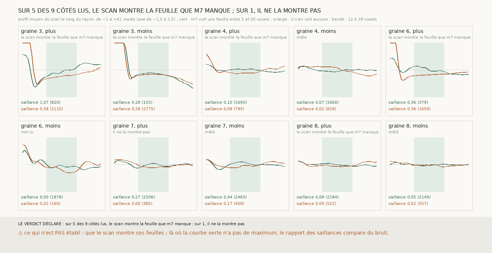

# `319` — Là où m7 ne voit pas de feuille après celle d'une nappe, le scan en montre-t-il une ? La règle dit cinq côtés sur neuf, et la figure dit que la règle ne mesurait pas ce qu'elle nommait

*`318` a montré que `m7` manque trop de feuilles pour qu'une chaîne ne tienne que par lui. Cette tranche sépare les rayons des nappes
de `301` où `m7` voit une feuille à un pas de ceux où il n'en voit aucune, et compare le scan moyen des deux. Par la règle déclarée, le
scan montre la feuille que `m7` manque sur cinq côtés sur neuf. Mais la « saillance » déclarée, le plus haut du profil entre 12 et 28
voxels moins son plus bas entre 4 et 12, mesure la remontée après le creux qui suit la feuille de la nappe, pas un maximum : sur les
graines 3 et 6 côté plus, la courbe des rayons où `m7` ne voit rien remonte sans aucun maximum et compte comme « montre ». Et là où la
courbe des rayons où `m7` voit une feuille n'a elle-même pas de maximum, saillance de 0,05 à 0,10, le rapport compare du bruit. La
tranche ne tranche pas `R4-P116`.*

## 0. Pourquoi cette tranche

C'est `R4-P116`. Si le scan montre les feuilles que `m7` manque, une chaîne peut se prolonger par le scan là où `m7` se tait.

## 1. Ce qui a été vu avant d'écrire

Tout ce que `303` à `318` publient ; aucun profil n'avait été lu sur les rayons où `m7` ne voit rien.

## 2. Ce qui est fait

- **Les rayons** : depuis les points des nappes du vote de `301` que `m7` appuie, le long de leur normale, de chaque côté.
- **Deux groupes** : les rayons où `m7` voit une plage à 5 à 30 voxels, et ceux où il n'en voit aucune.
- **Le profil** : le scan de −1 à +41 voxels, normé, moyenné par groupe.
- **La saillance déclarée** : le plus haut entre 12 et 28 voxels moins le plus bas entre 4 et 12 ; le scan montre la feuille que `m7`
  manque si la saillance des rayons où il ne voit rien vaut au moins la moitié de celle des rayons où il voit.

## 3. Ce que dit le scan

| graine | côté | rayons où m7 voit | saillance | rayons où il ne voit rien | saillance | lecture par la règle |
|---|---|---|---|---|---|---|
| 3 | plus | 820 | 1,0687 | 2110 | 0,5773 | le scan montre la feuille que m7 manque |
| 3 | moins | 155 | 0,2784 | 2775 | 0,2792 | le scan montre la feuille que m7 manque |
| 4 | plus | 1693 | 0,0998 | 795 | 0,0922 | le scan montre la feuille que m7 manque |
| 4 | moins | 1660 | 0,0688 | 828 | 0,0195 | mêlé |
| 6 | plus | 379 | 0,3561 | 1659 | 0,3617 | le scan montre la feuille que m7 manque |
| 6 | moins | 1878 | 0,0 | 160 | 0,0166 | non lu |
| 7 | plus | 2506 | 0,2659 | 385 | 0,0 | il ne la montre pas |
| 7 | moins | 2483 | 0,4355 | 408 | 0,175 | mêlé |
| 8 | plus | 2184 | 0,0847 | 522 | 0,0939 | le scan montre la feuille que m7 manque |
| 8 | moins | 2149 | 0,0483 | 557 | 0,0222 | mêlé |

⭐⭐⭐ **La règle ne mesurait pas ce qu'elle nommait** (`R4-F500`). Deux défauts, visibles sur la figure et pas dans les nombres :

- **Elle mesure une remontée, pas un maximum.** Sur les graines 3 et 6 côté plus, les profils partent haut sur la feuille de la nappe,
  plongent dans le creux qui la suit, puis remontent lentement ; la courbe orange n'a aucun maximum entre 12 et 28 voxels, et sa
  saillance vaut 0,58 et 0,36 parce que le creux est profond.
- **Le témoin lui-même est souvent plat.** Là où `m7` voit une feuille entre 5 et 30 voxels, sa place varie d'un rayon à l'autre, et
  la moyenne efface le maximum : les graines 4 et 8 ont des saillances de 0,05 à 0,10 pour les rayons où `m7` voit. Le rapport de
  deux saillances nulles ne dit rien.

Les deux côtés les plus lisibles vont en sens contraire : la graine 7 côté plus, dont les rayons où `m7` voit ont une saillance de
0,27, n'en a aucune là où il ne voit rien ; la graine 7 côté moins, 0,44 contre 0,18.

## 4. Le verdict

**SUR 5 DES 9 CÔTÉS LUS, LE SCAN MONTRE LA FEUILLE QUE M7 MANQUE ; SUR 1, IL NE LA MONTRE PAS.**

C'est le verdict de la règle, et il n'établit rien : `R4-P116` reste ouverte. Le défaut est celui de `311`, sous un autre costume,
avec un piège de plus : une moyenne de profils dont la feuille suivante n'est pas au même endroit efface ce qu'elle cherche, et une
saillance mesurée entre deux fenêtres fixes lit la forme du creux plutôt que la présence d'une feuille.

## 5. Ce que cette tranche ne dit pas

- ⚠⚠ Si le scan montre les feuilles que `m7` manque : il faut une lecture rayon par rayon.

## 6. Les sondes

Une batterie de **9** contrôles et une figure de **9**. Quatre règles cassées exprès ont fait échouer la batterie : des groupes lus d'un
seul côté du rayon, une saillance sans creux, un seuil de moitié abaissé à un tiers, et le décalage des profils oublié. Aucune ne
pouvait voir le défaut de la règle elle-même, qui n'est pas dans son code mais dans ce qu'elle mesure : c'est la figure qui l'a montré.

## 7. Ce qui reste

`R4-P117` s'ouvre : rayon par rayon, là où `m7` ne voit rien, le profil du scan a-t-il un maximum local entre 12 et 28 voxels, et
aussi souvent que là où `m7` voit une feuille ?
