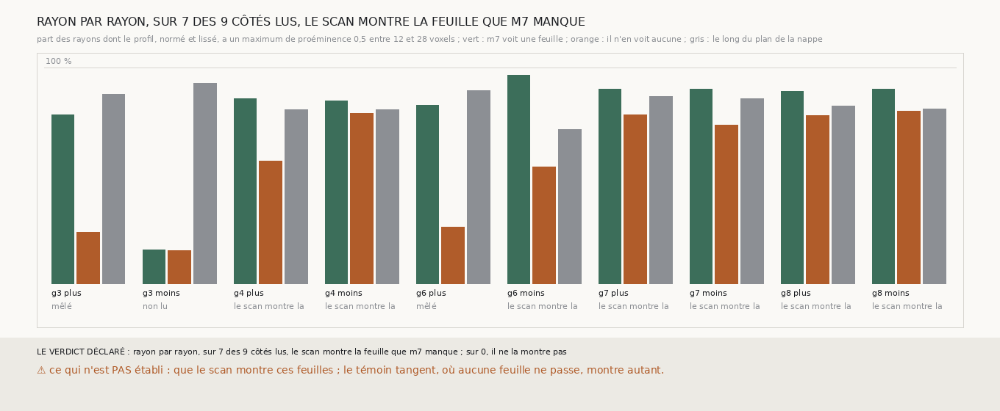

# `320` — Rayon par rayon, là où m7 ne voit pas de feuille après celle d'une nappe, le profil du scan a-t-il un maximum à un pas ? La règle dit sept côtés sur neuf, et le témoin tangent dit que le compte ne distingue pas une feuille de la texture

*`319` avait lu la remontée après un creux plutôt qu'un maximum, sur des profils moyens qui effacent ce qu'ils cherchent. Cette tranche
compte, rayon par rayon, les profils du scan qui ont un maximum de proéminence 0,5 entre 12 et 28 voxels. Par la règle, le scan montre
la feuille que `m7` manque sur sept côtés sur neuf : là où `m7` ne voit rien, 56 à 80 % des rayons des graines 4, 7 et 8 ont ce
maximum, contre 85 à 90 % là où il voit une feuille. Mais le témoin tangent, ajouté après la première mesure, lit les mêmes points le
long du plan de la nappe, là où aucune feuille ne traverse le rayon : il trouve ce maximum sur 71 à 93 % des rayons, autant ou plus que
là où `m7` voit une feuille. Le compte mesure la texture du scan, pas les feuilles. `R4-P117` reste ouverte.*

## 0. Pourquoi cette tranche

C'est `R4-P117`. Compter rayon par rayon ne dépend ni de la place exacte de la feuille suivante, que la moyenne efface, ni de la forme
du creux, que la saillance de `319` lisait.

## 1. Ce qui a été vu avant d'écrire

Tout ce que `303` à `319` publient, dont les profils moyens des deux groupes sur la figure de `319`.

## 2. Ce qui est fait

- **Les rayons** : ceux de `319`, sans en changer un.
- **Un rayon montre une feuille à un pas** si son profil normé et lissé a un maximum de proéminence au moins 0,5 entre 12 et 28 voxels.
- **L'issue** : le scan montre la feuille que `m7` manque si la part des rayons où il ne voit rien vaut au moins la moitié de celle où il
  voit, le témoin montrant une feuille sur au moins 30 % de ses rayons.
- **Le témoin tangent**, ajouté après la première mesure, le 2026-09-29 : les mêmes points, le long d'une direction du plan de la nappe.

## 3. Ce que dit le scan

Chaque case : la part des rayons qui montrent un maximum à un pas, et entre parenthèses le nombre de rayons lus.

| graine | côté | m7 voit une feuille | m7 ne voit rien | témoin tangent | lecture par la règle |
|---|---|---|---|---|---|
| 3 | plus | 0,7817 (820) | 0,237 (2110) | 0,8775 (2930) | mêlé |
| 3 | moins | 0,1548 (155) | 0,1528 (2775) | 0,9276 (2927) | non lu |
| 4 | plus | 0,8547 (1693) | 0,5648 (795) | 0,8047 (2488) | le scan montre la feuille que m7 manque |
| 4 | moins | 0,8464 (1660) | 0,7862 (828) | 0,8039 (2488) | le scan montre la feuille que m7 manque |
| 6 | plus | 0,8232 (379) | 0,2598 (1659) | 0,8935 (2038) | mêlé |
| 6 | moins | 0,9627 (1878) | 0,5375 (160) | 0,713 (2038) | le scan montre la feuille que m7 manque |
| 7 | plus | 0,899 (2506) | 0,7818 (385) | 0,8651 (2891) | le scan montre la feuille que m7 manque |
| 7 | moins | 0,8985 (2483) | 0,7328 (408) | 0,8571 (2891) | le scan montre la feuille que m7 manque |
| 8 | plus | 0,8878 (2184) | 0,7759 (522) | 0,8226 (2706) | le scan montre la feuille que m7 manque |
| 8 | moins | 0,8981 (2149) | 0,7989 (557) | 0,8075 (2706) | le scan montre la feuille que m7 manque |

⭐⭐⭐⭐ **Le compte ne distingue pas une feuille de la texture** (`R4-F501`) : le long du plan de la nappe, où aucune feuille ne
traverse le rayon, 71 à 93 % des profils ont un maximum de proéminence 0,5 dans la fenêtre, autant que les rayons où `m7` voit une
feuille à un pas (78 à 96 % hors de la graine 3 côté moins). Un profil de 43 voxels du scan de PHerc0358, normé et lissé, a presque
toujours un tel maximum dans une fenêtre de 17 voxels. Le seul contraste lisible est ailleurs : sur les graines 3 et 6 côté plus, les
rayons où `m7` ne voit rien n'ont ce maximum que dans 24 à 26 % des cas, sous le témoin tangent de 88 à 89 % ; ils vont vers le
vide, et le vide est plus lisse que la texture.

## 4. Le verdict

**RAYON PAR RAYON, SUR 7 DES 9 CÔTÉS LUS, LE SCAN MONTRE LA FEUILLE QUE M7 MANQUE ; SUR 0, IL NE LA MONTRE PAS.**

C'est le verdict de la règle, et le témoin tangent le vide de son sens : il n'établit rien. `R4-P116` et `R4-P117` restent ouvertes. À
9,362 µm, un maximum local du scan ne suffit pas à dire qu'il y a une feuille.

## 5. Ce que cette tranche ne dit pas

- ⚠⚠ Si le scan montre les feuilles que `m7` manque.
- ⚠ Quel seuil de proéminence séparerait une feuille de la texture : le choisir maintenant, en connaissant les deux courbes, serait
  choisir la réponse.

## 6. Les sondes

Une batterie de **10** contrôles et une figure de **9**. Quatre règles cassées exprès ont fait échouer la batterie, dont une seulement
après qu'un contrôle a été ajouté : une fenêtre élargie à 40 voxels, une proéminence nulle, le témoin ignoré, et un seuil de moitié
abaissé à un tiers (vu quand un cas entre le quart et la moitié a été ajouté). Aucune sonde ne pouvait voir que la règle mesurait la
texture : c'est le témoin tangent, ajouté après la première mesure, qui l'a dit.

## 7. Ce qui reste

La vérification qui manque à toute la série sur PHerc0358 a un terrain : PHercParis4 publie la même prédiction, `m7`, au niveau 2,
9,6 µm, la résolution de PHerc0358, et il a un tracé humain. `R4-P118` s'ouvre : la nappe de `m7` tirée sur PHercParis4 comme sur
PHerc0358 coïncide-t-elle avec le tracé humain, et sa chaîne avec les spires voisines du segment ?
