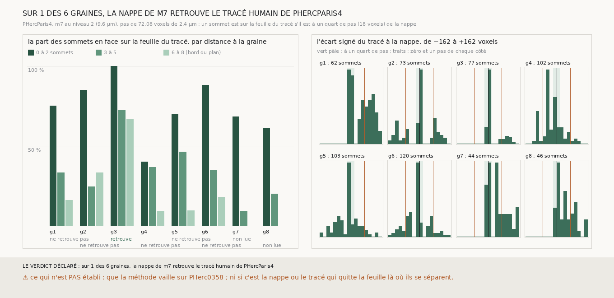

# `321` — La nappe de m7 tirée sur PHercParis4 comme sur PHerc0358 retrouve-t-elle le tracé humain ? Sur une graine sur six : elle part de sa feuille et la quitte en s'éloignant de sa graine

*Toute la série `300` à `320` a mesuré des nappes de `m7` sur PHerc0358 sans référent. PHercParis4 publie la même prédiction au même
pas de 9,6 µm et a un tracé humain : cette tranche y tire la nappe de `300`, au pas de ce rouleau, depuis huit sommets du segment, et la
compare au tracé. Par la règle déclarée, elle le retrouve sur une graine sur six lues. Près de sa graine, 40 à 100 % des sommets du tracé
en face d'elle sont à un quart de pas ; au bord du plan, 9 à 67 %. Sur quatre graines, elle ne quitte le tracé que d'un côté, et sa
spire de l'autre côté revient sur lui : la nappe change de feuille, pas la chaîne de `m7`. Ce que `304` avait lu sans référent sur
PHerc0358, un plan qui suit l'empilement et non une feuille, est ici mesuré contre une réponse connue.*

## 0. Pourquoi cette tranche

C'est `R4-P118`. Les juges sans référent de la série se sont révélés aveugles à la position (`R4-F488` à `R4-F490`) ; un tracé humain
ne l'est pas. Si la nappe de `m7` tombe sur lui, ce que la série a mesuré sur PHerc0358 a un appui ; sinon, on sait où elle le perd.

## 1. Ce qui a été vu avant d'écrire

Tout ce que `296` à `320` publient, dont `R4-F490` : sur PHercParis4, le tracé humain est posé sur la face de sa feuille, à une place
qui varie d'un bloc à l'autre. Aucune nappe de `m7` n'avait été tirée sur PHercParis4.

## 2. Ce qui est fait

- **Les graines** : huit sommets du segment réduit de `296`, sur une grille régulière de ses sommets valides, à au moins huit sommets
  du bord ; ramenés au niveau 2 (divisés par 4), avec la normale du segment.
- **La nappe** : celle de `300`, sans en changer une règle, avec le pas de PHercParis4 (18,02 voxels au niveau 2, 72,08 voxels de
  2,4 µm) et une demi-portée d'un pas et demi de ce pas.
- **La comparaison** : les sommets du segment dans l'emprise du plan (huit sommets de part et d'autre de la graine) ; pour chacun en face
  d'un point de la nappe appuyé sur `m7` (à au plus 40 voxels de côté), l'écart signé le long de sa normale.
- **La règle** : la nappe retrouve le tracé si au moins 50 sommets lui font face, si l'écart médian est à au plus un quart de pas (18
  voxels) et si au moins la moitié des sommets en face sont à un quart de pas.
- **Rapporté, ajouté après la première mesure le 2026-09-29, sans toucher à la règle** : la part retrouvée par anneau autour de la
  graine (0 à 2, 3 à 5 et 6 à 8 sommets), l'écart du plan lui-même au segment, et l'histogramme des écarts. La seconde mesure rend,
  sur tout ce qui décide, les mêmes nombres que la première.

`m7` a été lu en 771 chunks, 353 663 225 octets, sans panne ni chunk absent.

## 3. Ce que dit le tracé

Chaque case d'anneau : la part des sommets en face à un quart de pas de la nappe, et entre parenthèses leur nombre.

| graine | sommets en face | écart médian (voxels) | part à un quart de pas | lecture | près de la graine | à mi-distance | au bord du plan |
|---|---|---|---|---|---|---|---|
| 1 | 67 | 71,26 | 0,3433 | ne retrouve pas | 0,75 (12) | 0,3333 (30) | 0,16 (25) |
| 2 | 78 | 4,07 | 0,4231 | ne retrouve pas | 0,85 (20) | 0,2432 (37) | 0,3333 (21) |
| 3 | 79 | 5,61 | 0,7722 | retrouve | 1,0 (19) | 0,7222 (36) | 0,6667 (24) |
| 4 | 105 | −35,73 | 0,2571 | ne retrouve pas | 0,4 (20) | 0,3659 (41) | 0,0909 (44) |
| 5 | 107 | −5,54 | 0,4019 | ne retrouve pas | 0,6957 (23) | 0,4615 (52) | 0,0938 (32) |
| 6 | 127 | −6,58 | 0,4016 | ne retrouve pas | 0,88 (25) | 0,3492 (63) | 0,1795 (39) |
| 7 | 48 | — | — | non lue | 0,6818 (22) | 0,0909 (22) | 0,0 (4) |
| 8 | 48 | — | — | non lue | 0,6087 (23) | 0,2 (20) | 0,0 (5) |

⭐⭐⭐⭐⭐ **La nappe part de la feuille du tracé et la quitte en s'éloignant de sa graine** (`R4-F502`). Près de la graine, 40 à 100 %
des sommets en face sont à un quart de pas d'elle ; à mi-distance, 9 à 72 % ; au bord du plan, 9 à 67 % sur les six graines qui y ont
au moins dix sommets en face. Le plan de `300` lui-même, un plan tangent à la graine, est au bord à 34,0 à 99,58 voxels du segment sur les graines 1 à 6 :
le segment est courbe, le plan plat, et la nappe ne rattrape pas la courbure en suivant `m7`.

⭐⭐⭐⭐ **Sur quatre graines, elle ne quitte le tracé que d'un côté, et sa spire de l'autre côté revient sur lui** (`R4-F503`). Sur les
graines 1, 3, 7 et 8, aucun sommet en face n'a d'écart entre −162 et −18 voxels : la nappe est sur le tracé ou au-dessus (39, 16, 27 et
28 sommets entre +18 et +162). Et sa spire du côté moins est à un quart de pas du tracé pour 40, 49, 18 et 26 sommets. La nappe est
passée à la feuille voisine, et la spire suivante de `m7` retombe sur celle du tracé : c'est la nappe qui change de feuille ; la feuille
du tracé est encore dans la suite des surfaces de `m7`, un saut plus bas. Sur les graines 4, 5 et 6, elle s'écarte des deux côtés (57, 35 et 42 sommets sous −18
voxels, 18, 25 et 27 au-dessus de +18).

Les spires suivantes, qui devraient être à un pas du tracé, ne le sont sur aucune graine lue :

| graine | spire plus : écart médian | part à un pas | spire moins : écart médian | part à un pas |
|---|---|---|---|---|
| 1 | 116,96 | 0,3077 | −0,86 | 0,1818 |
| 2 | 10,36 | 0,1695 | 3,72 | 0,2347 |
| 3 | 79,12 | 0,2034 | −1,45 | 0,1132 |
| 4 | 23,91 | 0,1134 | −60,43 | 0,1731 |
| 5 | 31,04 | 0,1828 | −65,08 | 0,2679 |
| 6 | 45,16 | 0,3558 | −57,37 | 0,2719 |
| 7 | — | — | 37,05 | 0,2535 |
| 8 | — | — | 6,34 | 0,08 |

Là où la nappe a changé de feuille, sa spire retombe sur le tracé au lieu d'être à un pas de lui ; là où elle est restée, sa spire est
près d'un pas (graines 4, 5 et 6 côté moins, −57,37 à −65,08 voxels), mais 17 à 27 % seulement des sommets y sont à un quart de pas.

## 4. Le verdict

**SUR 1 DES 6 GRAINES, LA NAPPE DE M7 RETROUVE LE TRACÉ HUMAIN DE PHERCPARIS4**

Le plan de `300` ne tient pas une feuille sur ses 2560 voxels de 2,4 µm : il la tient près de sa graine et en change plus loin. C'est ce
que `R4-F485` avait lu sans référent sur PHerc0358 (les nappes suivent l'empilement, pas une feuille), mesuré ici contre un tracé
humain. `R4-P118` est répondue : non, sauf près de la graine.

## 5. Ce que cette tranche ne dit pas

- ⚠⚠ Que ce qui vaut sur PHercParis4 vaille sur PHerc0358 : le scan, la feuille et la courbure y diffèrent.
- ⚠⚠ Là où la nappe et le tracé se séparent sans que la spire revienne sur lui (graines 4, 5 et 6), lequel des deux quitte la feuille :
  `R4-F490` dit que le tracé humain n'est pas à une place fixe dans la sienne.
- ⚠ Si la nappe qui croît de `305`, qui refuse de changer de feuille, tiendrait le tracé jusqu'au bord.

## 6. Les sondes

Une batterie de **17** contrôles et une figure de **11**. Neuf règles cassées exprès ont fait échouer la batterie, dont deux seulement
après qu'un contrôle a été ajouté : une tolérance de médiane doublée (vue quand un cas où la moitié est à 10 et la moitié à 30 voxels a
été ajouté) et des anneaux dont la borne haute était exclue (vue quand des sommets aux bornes ont été ajoutés). Les autres : une part
exigée abaissée à 0,3, le filtre des sommets en face retiré, la fenêtre étendue au segment entier, la demi-portée laissée à celle de
PHerc0358, la part d'une spire lue autour de zéro au lieu d'un pas, la part à un pas lue avec son signe, et les sommets qui ne font pas face comptés à zéro.
Trois sondes de la figure l'ont fait échouer : des anneaux de moins de dix sommets dessinés, deux lectures posées au même endroit, un
histogramme compté par son maximum.

## 7. Ce qui reste

`R4-P119` s'ouvre : la nappe qui croît de `305`, tirée sur PHercParis4 depuis les mêmes graines, reste-t-elle sur la feuille du tracé
jusqu'au bord du plan ? Et `R4-P120` : là où la nappe et le tracé se séparent, le plus dense du scan de `309` dit-il lequel des deux a
quitté la feuille ?
