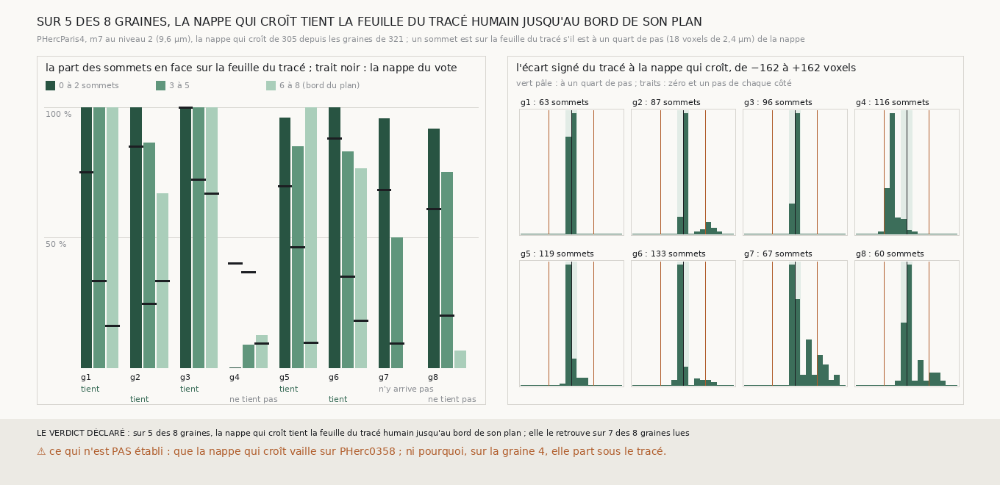

# `322` — La nappe qui croît de 305 tient-elle la feuille du tracé humain de PHercParis4 jusqu'au bord de son plan ? Sur cinq graines sur huit, là où la nappe du vote la perdait

*`321` a montré que la nappe du vote de `300`, tirée sur PHercParis4 depuis huit sommets du tracé humain, part de sa feuille et la quitte
en s'éloignant de la graine. `305` avait été écrite pour qu'une nappe ne puisse pas changer de feuille en un pas de grille, et n'avait
été jugée que sans référent. Depuis les mêmes graines, au pas de PHercParis4, la nappe qui croît retrouve le tracé sur sept graines sur
huit, et le tient jusqu'au bord de son plan de 2560 voxels de 2,4 µm sur cinq : au bord, 67 à 100 % des sommets en face sont à un quart
de pas d'elle, là où la nappe du vote en tenait 9 à 67 %. Sur les graines 1 et 3, tous les sommets en face le sont. Sur la graine 4,
elle part d'une feuille de `m7` à un peu plus d'un demi-pas sous le tracé, et la tient.*

## 0. Pourquoi cette tranche

C'est `R4-P119`. Si refuser le saut suffit à tenir une feuille courbe contre un tracé humain, la méthode de `305`, appliquée sans
référent sur PHerc0358, a un appui que le juge aveugle à la position de `301` ne pouvait pas lui donner (`R4-F488`).

## 1. Ce qui a été vu avant d'écrire

Tout ce que `296` à `321` publient, dont `R4-F502` et `R4-F503`. Aucune nappe qui croît n'avait été tirée sur PHercParis4.

## 2. Ce qui est fait

- **Les graines** : les huit de `321`, dans leur ordre.
- **La nappe** : celle de `305`, sans en changer une règle : le point central prend la feuille de `m7` la plus proche du plan, puis
  chaque voisin d'un point posé prend la feuille la plus proche de la médiane de ses voisins posés, à au plus un quart de pas, ou attend.
  Au pas de PHercParis4 : une tolérance de 4,51 voxels du niveau 2 et une demi-portée de 27,03. `305` gagne pour cela deux arguments,
  la tolérance et la demi-portée, qui valent par défaut celles de PHerc0358 ; sa batterie passe inchangée.
- **La comparaison** : celle de `321`, sans rien y changer, sur les points posés.
- **La règle** : celle de `321` pour « retrouve » ; et, pour `R4-P119`, l'anneau du bord (6 à 8 sommets de la graine) : la nappe **tient
  le tracé jusqu'au bord** si au moins 10 sommets de cet anneau lui font face et qu'au moins la moitié sont à un quart de pas, **ne le
  tient pas** sinon, et **n'atteint pas le bord** sous 10 sommets en face.

## 3. Ce que dit le tracé

Chaque case d'anneau : la part des sommets en face à un quart de pas de la nappe, et entre parenthèses leur nombre.

| graine | part du plan posée | sommets en face | écart médian (voxels) | part à un quart de pas | lecture | près de la graine | à mi-distance | au bord du plan | au bord |
|---|---|---|---|---|---|---|---|---|---|
| 1 | 0,3351 | 63 | 0,2 | 1,0 | retrouve | 1,0 (13) | 1,0 (29) | 1,0 (21) | tient jusqu'au bord |
| 2 | 0,3172 | 87 | 5,17 | 0,8506 | retrouve | 1,0 (22) | 0,8636 (44) | 0,6667 (21) | tient jusqu'au bord |
| 3 | 0,3389 | 96 | 3,46 | 1,0 | retrouve | 1,0 (23) | 1,0 (39) | 1,0 (34) | tient jusqu'au bord |
| 4 | 0,5647 | 116 | −46,84 | 0,0862 | ne retrouve pas | 0,0 (21) | 0,087 (46) | 0,1224 (49) | ne tient pas |
| 5 | 0,4201 | 119 | −3,96 | 0,9076 | retrouve | 0,96 (25) | 0,8485 (66) | 1,0 (28) | tient jusqu'au bord |
| 6 | 0,613 | 135 | −4,47 | 0,8444 | retrouve | 1,0 (25) | 0,8289 (76) | 0,7647 (34) | tient jusqu'au bord |
| 7 | 0,5517 | 67 | 3,42 | 0,6119 | retrouve | 0,9565 (23) | 0,5 (38) | 0,0 (6) | n'atteint pas le bord |
| 8 | 0,7524 | 68 | 4,69 | 0,6471 | retrouve | 0,9167 (24) | 0,75 (28) | 0,0625 (16) | ne tient pas |

⭐⭐⭐⭐⭐ **Refuser le saut tient la feuille du tracé que le vote perdait** (`R4-F504`). Sur les graines 1, 2, 3, 5 et 6, au bord du
plan, 66,67 à 100 % des sommets en face sont à un quart de pas de la nappe qui croît, contre 9,38 à 66,67 % pour la nappe du vote de
`321` sur les mêmes sommets. Sur les graines 1 et 3, les 63 et 96 sommets en face sont tous à un quart de pas, et l'histogramme n'a
aucun sommet au-delà de 18 voxels de part et d'autre. Ce qui manquait à la nappe du vote n'était pas `m7` : sa feuille continue le tracé
sur 2560 voxels de 2,4 µm, et c'est le vote qui en changeait.

⭐⭐⭐⭐ **Sur la graine 4, la nappe qui croît part sous le tracé et y reste** (`R4-F505`). Aucun des 21 sommets en face près de la graine
n'est à un quart de pas d'elle ; 105 des 116 sommets en face sont entre −162 et −18 voxels, et l'écart médian vaut −46,84 voxels, 0,65
pas. Le point central a pris une feuille de `m7` à un peu plus d'un demi-pas sous le tracé, et la croissance l'a tenue. Entre un demi-pas
et un pas, c'est ou le tracé qui est posé hors du cœur de sa feuille, ce que `R4-F490` a vu sur d'autres blocs, ou `m7` qui ne marque
pas la feuille du tracé à cet endroit.

Les deux graines qui ne tiennent pas jusqu'au bord sans être la 4 : la 7 n'y arrive pas (6 sommets en face), la 8 y arrive sur une autre
feuille (1 sommet sur 16 à un quart de pas).

## 4. Le verdict

**SUR 5 DES 8 GRAINES, LA NAPPE QUI CROÎT TIENT LA FEUILLE DU TRACÉ HUMAIN JUSQU'AU BORD DE SON PLAN ; ELLE LE RETROUVE SUR 7 DES 8 GRAINES LUES**

`R4-P119` est répondue : oui, sur cinq graines sur huit. Contre un tracé humain, et au même pas que PHerc0358, la nappe de `305` tient
une feuille courbe là où le plan de `300` la perd. C'est le premier appui avec référent pour une méthode de la série appliquée sans
référent sur PHerc0358, où `305` n'avait été jugée que par un juge aveugle à la position.

## 5. Ce que cette tranche ne dit pas

- ⚠⚠ Que la nappe qui croît tienne sa feuille sur PHerc0358 : le scan, la feuille et `m7` y diffèrent, et ses nappes n'y couvrent
  qu'une partie du plan.
- ⚠ Si, sur la graine 4, c'est le tracé ou `m7` qui est hors de la feuille (`R4-P120`).
- ⚠ Ce que vaut la nappe qui croît au-delà de son plan de 65 × 65 points, ni sa spire suivante.

## 6. Les sondes

Une batterie de **10** contrôles et une figure de **13**. Quatre règles cassées exprès ont fait échouer la batterie : un bord tenu à
strictement plus de la moitié, un minimum de sommets au bord abaissé à 9, la tolérance et la demi-portée de PHerc0358 laissées à la
nappe (vue par une feuille synthétique qui monte de 5 voxels par point), et une issue qui compte comme tenues les graines qui n'atteignent
pas le bord. Deux sondes de la figure l'ont fait échouer, dont une seulement après qu'un contrôle a été ajouté : des traits lus dans la
mesure de `322` au lieu de celle de `321`. Une troisième passe, et elle ne change rien : tracer la part écrêtée plutôt que la part
mesurée, les deux étant égales quand aucune part ne sort de [0, 1].

## 7. Ce qui reste

`R4-P121` s'ouvre : la spire suivante de la nappe qui croît, tirée par le saut de `306`, tombe-t-elle sur le segment là où il repasse un
tour plus loin ? C'est la chaîne, jugée contre une réponse connue. `R4-P120` reste ouverte, avec la graine 4 pour cas.
