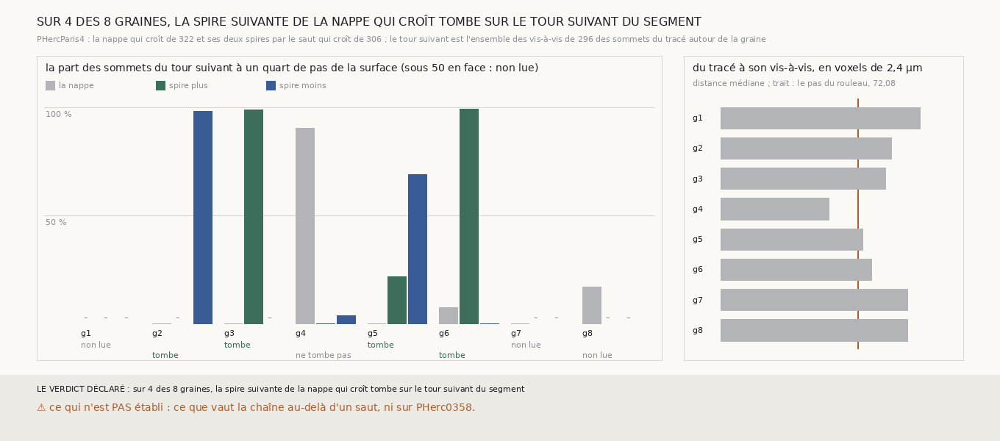

# `323` — La spire suivante de la nappe qui croît tombe-t-elle sur le segment de PHercParis4 là où il repasse un tour plus loin ? Sur quatre graines sur huit, et à 98 à 99 % sur trois d'entre elles

*`322` a montré que la nappe qui croît de `305` tient la feuille du tracé humain de PHercParis4. Le segment fait plus d'un tour : autour
de chaque graine, un tour plus loin, passent d'autres de ses sommets, les vis-à-vis de `296`. Cette tranche tire, de chaque côté de la
nappe qui croît, la spire suivante par le saut qui croît de `306`, et la compare à ce tour suivant. Sur quatre graines sur huit, l'une
des deux spires tombe dessus ; sur les graines 2, 3 et 6, 98 à 99 % des sommets du tour suivant en face d'elle sont à un quart de pas.
La nappe elle-même n'y est pas, sauf sur la graine 4 : la feuille à 0,65 pas sous le tracé où elle s'était posée (`R4-F505`) est le tour
suivant du segment, là où les deux tours ne sont qu'à 57 voxels l'un de l'autre. C'est la chaîne, sur un saut, jugée contre un tracé
humain, et tirée de `m7` sans main.*

## 0. Pourquoi cette tranche

C'est `R4-P121`. Sur un rouleau sans tracé, une chaîne se juge sans référent ; ici, la spire suivante a une réponse connue, le tour que
la main humaine a tracé ensuite.

## 1. Ce qui a été vu avant d'écrire

Tout ce que `296` à `322` publient. ⚠ Et une exploration de la seule géométrie du segment, hors de ce dépôt et sans lire `m7` : le
vis-à-vis des sommets autour des huit graines est à 47 à 146 voxels de 2,4 µm, et autour de la graine 4 à −36 à −54 voxels le long de la
normale, là où la nappe qui croît s'était posée. La lecture de la nappe contre le tour suivant était donc en partie connue pour la
graine 4 ; celle des spires ne l'était pour aucune graine.

## 2. Ce qui est fait

- **La nappe** : celle de `322`, depuis les mêmes graines, sans rien y changer.
- **Les spires** : de chaque côté, le saut qui croît de `306`, sans en changer une règle, au pas de PHercParis4 : sa tolérance d'un
  quart de pas (4,51 voxels du niveau 2), trois pas de recherche ; aucun point n'est posé sans `m7`.
- **Le tour suivant** : les vis-à-vis de `296` des sommets du segment dans la fenêtre de `321` (le sommet le plus proche en 3D à plus de
  30 mailles sur la surface), sans doublon, avec leurs normales.
- **La règle** : celle de `321`, sur les sommets du tour suivant. La chaîne tombe sur le tour suivant si l'une des deux spires le
  retrouve.

`m7` a été lu en 709 chunks, 325 822 650 octets, sans panne ni chunk absent.

## 3. Ce que dit le tracé

Chaque case de surface : l'écart médian au tour suivant en voxels, la part des sommets en face à un quart de pas, et entre parenthèses
leur nombre ; « — » sous 50 sommets en face.

| graine | sommets du tour suivant | du tracé à son vis-à-vis (voxels) | la nappe | la spire plus | la spire moins | lecture |
|---|---|---|---|---|---|---|
| 1 | 124 | 105,11 | — · — (46) | — · — (32) | — · — (44) | non lue |
| 2 | 266 | 89,92 | 95,69 · 0,0 (72) | — · — (26) | 4,35 · 0,9818 (55) | tombe sur le tour suivant |
| 3 | 289 | 87,03 | −84,24 · 0,0 (79) | 3,77 · 0,9872 (78) | — · — (40) | tombe sur le tour suivant |
| 4 | 172 | 57,11 | −4,92 · 0,9043 (115) | 80,75 · 0,0 (94) | −68,14 · 0,037 (108) | ne tombe pas sur le tour suivant |
| 5 | 260 | 74,98 | 52,09 · 0,0 (105) | 94,16 · 0,2143 (70) | −6,14 · 0,69 (100) | tombe sur le tour suivant |
| 6 | 285 | 79,43 | −64,13 · 0,0735 (136) | −4,17 · 0,9908 (109) | −120,31 · 0,0 (104) | tombe sur le tour suivant |
| 7 | 136 | 98,57 | 63,14 · 0,0 (50) | — · — (35) | — · — (33) | non lue |
| 8 | 179 | 98,47 | 8,22 · 0,1695 (59) | — · — (29) | — · — (26) | non lue |

⭐⭐⭐⭐⭐ **La spire suivante tirée de `m7` tombe sur le tour que la main humaine a tracé** (`R4-F506`). Sur les graines 2, 3 et 6, 54
des 55, 77 des 78 et 108 des 109 sommets du tour suivant en face de la spire sont à un quart de pas d'elle ; sur la graine 5, 69 des
100. **Et la comparaison sépare deux tours** : sur ces quatre graines, la nappe elle-même, qui tient la feuille du tracé (`R4-F504`), a
0 à 7,35 % des sommets du tour suivant à un quart de pas, à 52,09 à 95,69 voxels de lui. La spire est du côté où le segment repasse :
moins pour les graines 2 et 5, plus pour les graines 3 et 6 ; de l'autre côté, la spire en est loin (94,16 et −120,31 voxels sur les
graines 5 et 6) ou n'a pas assez de sommets en face pour être lue.

⭐⭐⭐⭐ **Sur la graine 4, la nappe est sur le tour suivant** (`R4-F507`). Ses 115 sommets en face du tour suivant sont à 90,43 % à un
quart de pas, écart médian −4,92 voxels ; et le tracé n'y est qu'à 57,11 voxels de son vis-à-vis, 0,79 pas du rouleau. La feuille de
`m7` à 0,65 pas sous le tracé où la nappe s'était posée n'est donc ni un défaut du tracé ni un défaut de `m7` : c'est le tour que la main
humaine a tracé ensuite, là où deux tours se serrent. Le point central de la nappe a pris ce tour plutôt que le sien, et la croissance
l'a tenu. Ses deux spires sont alors à un pas de lui, et ne le retrouvent pas.

Sur les graines 1, 7 et 8, aucune spire n'a 50 sommets du tour suivant en face d'elle : elles ne sont pas lues. Hors de la règle, sur la
graine 1, 43 des 44 sommets en face de la spire moins sont à un quart de pas, et sur la graine 7, 29 des 33.

## 4. Le verdict

**SUR 4 DES 8 GRAINES, LA SPIRE SUIVANTE DE LA NAPPE QUI CROÎT TOMBE SUR LE TOUR SUIVANT DU SEGMENT**

`R4-P121` est répondue : oui, sur quatre graines sur huit ; sur la graine 4, la chaîne part du tour suivant lui-même, et sur les graines
1, 7 et 8, aucune spire n'a assez de sommets en face pour être lue. Contre un tracé humain, la nappe qui croît et son saut qui croît
font sur PHercParis4 ce que la série cherchait sur PHerc0358 : une surface et la suivante, tirées de la seule prédiction publiée, chacune
sur la bonne feuille.

## 5. Ce que cette tranche ne dit pas

- ⚠⚠ Que la chaîne tienne au-delà d'un saut : le segment ne repasse qu'une fois autour de ces graines.
- ⚠⚠ Que le saut qui croît fasse de même sur PHerc0358, où `306` l'a vu ne pas tenir dès le premier saut (`R4-F487`).
- ⚠ Pourquoi, sur la graine 4, le point central a pris le tour suivant : le tracé et `m7` y sont à 0,65 pas l'un de l'autre, et la
  règle de départ de `305` prend la feuille la plus proche du plan.

## 6. Les sondes

Une batterie de **9** contrôles et une figure de **11**. Quatre règles cassées exprès ont fait échouer la batterie, dont deux seulement
après qu'un contrôle a été ajouté : des vis-à-vis cherchés sans exclure la même feuille (vue par un segment synthétique dont les voisins
de grille sont plus proches que le tour suivant) et des vis-à-vis gardés en double (vue par un tour suivant deux fois moins dense). Les
autres : la nappe comptée comme une spire, et une graine déclarée non lue dès qu'une seule spire l'est. Deux sondes de la figure l'ont
fait échouer : des surfaces non lues dessinées, une échelle des distances raccourcie qui écrête la graine 1. Une troisième passe sans rien
changer : poser les lectures sur une seule ligne, où elles ne se recouvrent pas.

## 7. Ce qui reste

`R4-P122` s'ouvre : sur PHerc0358, où `306` a vu la chaîne qui croît ne pas tenir dès le premier saut, qu'est-ce qui diffère de
PHercParis4, la part du plan que le saut pose, ou le juge de `306` ? Et `R4-P120` reste ouverte pour les graines 4, 5 et 6 de `321`.
