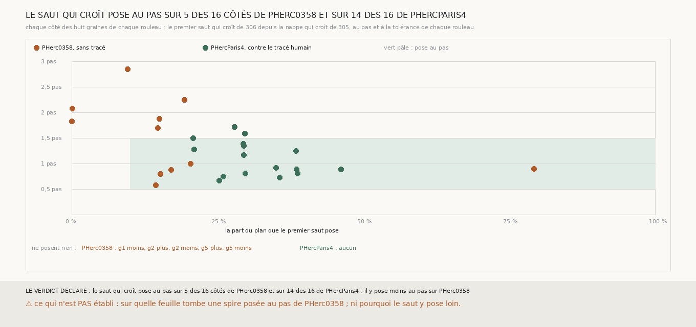

# `324` — Le saut qui croît de 306 pose-t-il au pas aussi souvent sur PHerc0358 que sur PHercParis4 ? Non : sur 5 côtés sur 16 contre 14 sur 16, et la différence est dans le saut, pas dans le juge

*Sur PHercParis4, la spire que le saut qui croît de `306` tire de la nappe qui croît tombe sur le tour que la main humaine a tracé
(`R4-F506`) ; sur PHerc0358, `306` avait jugé la même chaîne sans tenue dès le premier saut. Cette tranche tire, avec le même code, le
premier saut depuis les huit graines de chaque rouleau et compte, côté par côté, la part du plan qu'il pose et son pas médian. Sur
PHercParis4, 14 côtés sur 16 posent au pas, 20,8 à 46,15 % du plan. Sur PHerc0358, 5 côtés sur 16 : cinq côtés ne posent rien, six
posent à 1,7 à 2,85 pas, et ce sont les nappes les plus complètes, celles des graines 1 et 3, dont le saut pose le moins. Ce n'était donc
pas le juge de `306` : c'est le saut qui ne trouve pas la feuille suivante à un pas sur PHerc0358.*

## 0. Pourquoi cette tranche

C'est `R4-P122`. La même méthode tombe sur un tracé humain d'un côté et ne tenait pas de l'autre ; il faut savoir où est la différence
avant de rejuger quoi que ce soit sur PHerc0358.

## 1. Ce qui a été vu avant d'écrire

Tout ce que `296` à `323` publient, dont les quatre premiers sauts que `306` publie pour les graines 3 et 6 de PHerc0358. Les six autres
graines de PHerc0358 n'avaient jamais eu de saut qui croît ; les huit de PHercParis4 n'avaient été comptées que par leur part posée.

## 2. Ce qui est fait

- **Les graines** : les huit de `301` sur PHerc0358, les huit de `321` sur PHercParis4.
- **La nappe et le saut** : la nappe qui croît de `305` et le premier saut qui croît de `306`, sans en changer une règle, à la tolérance
  et au pas de chaque rouleau (5 et 20 voxels sur PHerc0358 ; 4,51 et 18,02 voxels du niveau 2 sur PHercParis4).
- **La règle** : un côté pose au pas si le saut pose au moins 10 % du plan à un pas médian entre un demi-pas et un pas et demi. Le saut
  se comporte pareil sur les deux rouleaux si le compte de PHerc0358 vaut au moins la moitié de celui de PHercParis4.

**La reproduction est vérifiée** : les huit nappes de PHerc0358 redonnent le nombre de points que `305` publie, et le premier saut des
graines 3 et 6 redonne la part du plan que `306` publie (0,0963, 0,0009, 0,1931 et 0,7924). `m7` a été lu en 685 chunks sur PHerc0358,
dont 40 absents du dépôt, et 709 sur PHercParis4, sans panne.

## 3. Ce que disent les deux rouleaux

| rouleau | côtés qui posent au pas | qui posent au-delà d'un pas et demi | qui ne posent rien |
|---|---|---|---|
| PHerc0358 | 5 : g6 moins, g7 plus, g7 moins, g8 plus, g8 moins | 6 : g1 plus, g3 plus, g3 moins, g4 plus, g4 moins, g6 plus | 5 : g1 moins, g2 plus, g2 moins, g5 plus, g5 moins |
| PHercParis4 | 14 | 2 : g3 moins, g8 moins | 0 |

⭐⭐⭐⭐⭐ **Le saut qui croît ne trouve pas la feuille suivante à un pas sur PHerc0358** (`R4-F508`). Sur PHercParis4, 14 côtés sur 16
posent 20,8 à 46,15 % du plan, à 0,67 à 1,5 pas. Sur PHerc0358, onze côtés ne posent rien ou posent à 1,7 à 2,85 pas, c'est-à-dire au
moins une feuille plus loin ; les cinq qui posent au pas en posent 14,44 à 79,24 %, dont deux au-delà de 20 %, la graine 6 côté moins
(79,24 %) et la graine 8 côté moins (20,38 %). Le juge de `306` n'était pas en cause : il a rejeté des spires qui ne sont pas là où la spire suivante doit être.

⭐⭐⭐⭐ **Les nappes les plus complètes ont les sauts les plus vides.** Sur PHerc0358, les nappes des graines 1 et 3 posent 98,01 et
89,73 % de leur plan, plus que n'importe quelle nappe de PHercParis4 (31,72 à 75,24 %) ; leurs sauts posent 0,02 % et rien pour la
graine 1, 9,63 % à 2,85 pas et 0,09 % pour la graine 3. `m7` y tient une feuille sur tout le plan et ne montre pas la suivante à un pas.

⚠ Poser au pas n'est pas tomber juste : sur PHercParis4, 4 des 14 côtés au pas tombent sur le tour suivant d'après `323` ; parmi les
autres, ceux qui sont lus sont du côté où le segment ne repasse pas, ou partent, comme la graine 4, du tour suivant lui-même, et les
derniers n'ont pas assez de sommets du tour suivant en face pour être lus. Le compte de cette tranche dit où le saut ne peut pas avoir
raison, pas où il l'a.

## 4. Le verdict

**LE SAUT QUI CROÎT POSE AU PAS SUR 5 DES 16 CÔTÉS DE PHERC0358 ET SUR 14 DES 16 DE PHERCPARIS4 ; IL Y POSE MOINS AU PAS SUR PHERC0358**

`R4-P122` est répondue : ce qui diffère est le saut, pas le juge de `306`. La chaîne qui croît, validée contre un tracé humain sur
PHercParis4, ne se transporte pas telle quelle sur PHerc0358.

## 5. Ce que cette tranche ne dit pas

- ⚠⚠ Sur quelle feuille tombent les cinq spires posées au pas de PHerc0358 : aucun tracé ne le dit.
- ⚠⚠ Pourquoi le saut pose loin sur PHerc0358 : `m7` y marque-t-il la feuille suivante plus loin qu'un pas, ou la marque-t-il à moins
  d'un pas, là où `312` voit ses plages se suivre à 10 à 17,5 voxels, et le saut la manque-t-il ?

## 6. Les sondes

Une batterie de **10** contrôles et une figure de **11**. Quatre règles cassées exprès ont fait échouer la batterie : une égalité exigée
stricte entre les deux comptes, une part minimale ôtée, un minimum de côtés au pas sur PHercParis4 abaissé à 3, et un pas lu avec son
signe. Trois sondes de la figure l'ont fait échouer : un seul côté vide nommé, une échelle des pas raccourcie qui écrête la graine 3, et
deux listes de côtés vides posées au même endroit.

## 7. Ce qui reste

`R4-P123` s'ouvre : sur chaque rouleau, à quelle distance, en pas du rouleau, chaque point de la nappe qui croît voit-il la feuille de
`m7` après la sienne ? Si c'est à un pas sur PHercParis4 et à moins d'un pas sur PHerc0358, `m7` y marque plus d'une surface par tour,
et le saut doit les compter plutôt que prendre la première.
