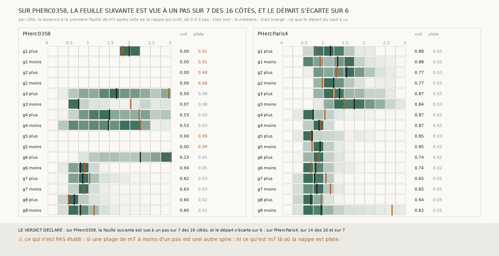

# `325` — À quelle distance m7 montre-t-il la feuille après celle de la nappe qui croît, sur PHerc0358 et sur PHercParis4 ? À un pas sur 7 côtés sur 16 contre 14, et les six côtés aveugles de PHerc0358 sont ceux de trois nappes plates

*`324` a montré que le saut qui croît pose au pas sur 5 côtés sur 16 de PHerc0358 contre 14 de PHercParis4. Cette tranche lit, pour
chaque point de la nappe qui croît et de chaque côté, la distance à la première feuille de `m7` après la sienne, celle que le saut lit,
et la distance que le départ du saut a vue. Sur PHercParis4, 62,5 à 87,99 % des points voient la feuille suivante, à 0,69 à 1,75 pas
médian. Sur PHerc0358, six côtés n'en voient aucune : ce sont les deux côtés des graines 1, 2 et 5, et ces trois nappes sont plates,
68,41 à 99,07 % de leurs points au même décalage de leur plan, contre 1,83 à 8,49 % pour les cinq autres et 2,36 à 4,89 % sur
PHercParis4. Ailleurs, PHerc0358 voit la feuille suivante à un pas sur sept côtés sur dix. Le départ du saut s'écarte de la médiane
aussi souvent sur un rouleau que sur l'autre : ce n'est pas lui qui les distingue.*

## 0. Pourquoi cette tranche

C'est `R4-P123`. Le saut part d'un seul point ; avant d'accuser `m7`, il faut savoir si les points de la nappe voient la feuille
suivante au pas et si le départ, lui, en a vu une autre.

## 1. Ce qui a été vu avant d'écrire

Tout ce que `296` à `324` publient, dont `R4-F508` et `R4-F493`.

## 2. Ce qui est fait

- **Les graines, la nappe et le saut** : ceux de `324`, sans rien y changer ; les nappes de PHerc0358 redonnent `305`.
- **La distance** : pour chaque point posé de la nappe, de chaque côté, la première feuille de `m7` après la sienne sur trois pas, celle
  que le saut de `306` lit, en pas du rouleau. `306` rend désormais cette carte avec la spire, sans rien changer d'autre ; sa batterie
  passe inchangée.
- **La règle** : un côté voit la feuille suivante à un pas si au moins la moitié des points en voient une, à une distance médiane entre
  un demi-pas et un pas et demi ; le départ s'écarte si ce qu'il a vu est à plus d'un quart de pas de cette médiane.
- **Rapporté, ajouté après la première mesure le 2026-09-29, sans toucher à la règle** : pour chaque nappe, la part de ses points posés
  au décalage le plus fréquent. La seconde mesure rend les mêmes nombres sur tout ce qui décide.

## 3. Ce que disent les deux rouleaux

Chaque ligne : la part des points de la nappe qui voient une feuille suivante, la distance médiane et celle du départ en pas du rouleau,
la lecture, et si le départ s'écarte.

| graine | côté | voit | médiane | départ | lecture | départ qui s'écarte |
|---|---|---|---|---|---|---|
| 1 | plus | 0,0005 | 1,987 | 1,825 | rarement vue | non |
| 1 | moins | 0,0 | — | — | rarement vue | non |
| 2 | plus | 0,0 | — | — | rarement vue | non |
| 2 | moins | 0,0 | — | — | rarement vue | non |
| 3 | plus | 0,4999 | 1,675 | 2,95 | rarement vue | oui |
| 3 | moins | 0,0694 | 0,75 | 2,025 | rarement vue | oui |
| 4 | plus | 0,533 | 1,5 | 2,225 | à un pas | oui |
| 4 | moins | 0,5311 | 1,475 | 2,25 | à un pas | oui |
| 5 | plus | 0,0 | — | — | rarement vue | non |
| 5 | moins | 0,0 | — | — | rarement vue | non |
| 6 | plus | 0,2319 | 2,25 | 3,0 | rarement vue | oui |
| 6 | moins | 0,9376 | 0,8 | 0,9 | à un pas | non |
| 7 | plus | 0,6207 | 0,85 | 1,025 | à un pas | non |
| 7 | moins | 0,6257 | 0,875 | 0,875 | à un pas | non |
| 8 | plus | 0,5951 | 0,65 | 0,5 | à un pas | non |
| 8 | moins | 0,5972 | 0,8 | 1,125 | à un pas | oui |

*PHerc0358, ci-dessus ; PHercParis4, ci-dessous.*

| graine | côté | voit | médiane | départ | lecture | départ qui s'écarte |
|---|---|---|---|---|---|---|
| 1 | plus | 0,8799 | 1,165 | 0,805 | à un pas | oui |
| 1 | moins | 0,8799 | 1,346 | 0,916 | à un pas | oui |
| 2 | plus | 0,7701 | 1,554 | 1,304 | plus loin | non |
| 2 | moins | 0,7687 | 1,249 | 0,971 | à un pas | oui |
| 3 | plus | 0,8715 | 1,387 | 1,276 | à un pas | non |
| 3 | moins | 0,8387 | 1,748 | 1,498 | plus loin | non |
| 4 | plus | 0,8671 | 0,749 | 1,027 | à un pas | oui |
| 4 | moins | 0,8671 | 0,888 | 0,916 | à un pas | non |
| 5 | plus | 0,8473 | 0,721 | 0,694 | à un pas | non |
| 5 | moins | 0,8473 | 0,916 | 0,721 | à un pas | non |
| 6 | plus | 0,7425 | 0,888 | 0,888 | à un pas | non |
| 6 | moins | 0,7425 | 0,805 | 0,694 | à un pas | non |
| 7 | plus | 0,6469 | 0,777 | 1,054 | à un pas | oui |
| 7 | moins | 0,6469 | 0,832 | 1,165 | à un pas | oui |
| 8 | plus | 0,642 | 0,694 | 0,943 | à un pas | non |
| 8 | moins | 0,625 | 0,943 | 2,664 | à un pas | oui |

⭐⭐⭐⭐⭐ **Les six côtés aveugles de PHerc0358 sont ceux de trois nappes plates** (`R4-F510`). Sur les graines 1, 2 et 5, pas un point de
la nappe ne voit de feuille suivante sur trois pas, d'un côté ou de l'autre (0,05 % sur la graine 1 côté plus). Et ces trois nappes ont
90,58, 68,41 et 99,07 % de leurs points posés au même décalage de leur plan (−10, 0 et 13 voxels), contre 1,83 à 8,49 % pour les cinq
autres nappes de PHerc0358 et 2,36 à 4,89 % pour les huit de PHercParis4. Une nappe qui croît en suivant une feuille courbe ne garde pas
le même décalage d'un plan sur des milliers de points ; celles-ci ne suivent pas une feuille, et ce sont celles dont `305` publiait la
couverture la plus haute (98,01 % pour la graine 1).

⭐⭐⭐⭐ **Ailleurs, `m7` montre la feuille suivante à un pas sur PHerc0358 aussi** (`R4-F509`). Sur les dix côtés des cinq nappes qui ne
sont pas plates, sept voient la feuille suivante à un pas (0,65 à 1,5 pas médian), dont la graine 6 côté moins à 93,76 % ; sur
PHercParis4, 14 côtés sur 16, à 0,69 à 1,39 pas, les deux autres à 1,55 et 1,75. Restent sur PHerc0358 les deux côtés de la graine 3 et
la graine 6 côté plus, où 6,94 à 49,99 % seulement des points voient la feuille suivante.

⭐⭐⭐ **Le départ du saut s'écarte aussi souvent sur les deux rouleaux**, sur 6 côtés de PHerc0358 et 7 de PHercParis4. Il déplace le
saut là où il est loin de la médiane : sur la graine 4 de PHerc0358, la médiane est à 1,475 à 1,5 pas et le départ à 2,225 à 2,25, et
le saut de `324` a posé à 1,7 et 1,875 pas. Sur PHercParis4 aussi : sur la graine 8 côté moins, le départ a vu 2,664 pas pour une
médiane de 0,943, et le saut a posé à 1,582, l'un des deux côtés de `324` au-delà d'un pas et demi.

## 4. Le verdict

**SUR PHERC0358, LA FEUILLE SUIVANTE EST VUE À UN PAS SUR 7 DES 16 CÔTÉS, ET LE DÉPART S'ÉCARTE SUR 6 ; SUR PHERCPARIS4, SUR 14 DES 16 ET SUR 7**

`R4-P123` est répondue : là où la nappe de PHerc0358 suit une feuille, `m7` y montre la suivante à un pas presque aussi souvent que sur
PHercParis4 ; ce qui fait échouer le saut, ce sont d'abord trois nappes plates qui ne suivent pas de feuille et ne voient rien après la
leur, et ensuite, sur la graine 4, un départ pris dans une distribution large.

## 5. Ce que cette tranche ne dit pas

- ⚠⚠ Ce qu'est `m7` là où la nappe est plate : une plage qui remplit toute la portée le long de la normale, un bord de la prédiction, ou
  une feuille que la nappe ne suit pas.
- ⚠ Si une plage à moins d'un pas est une autre spire ou une autre face de la même.

## 6. Les sondes

Une batterie de **13** contrôles et une figure de **11**. Quatre règles cassées exprès ont fait échouer la batterie, dont une seulement
après qu'un contrôle a été ajouté : un départ jugé écarté à plus d'un pas au lieu d'un quart (vu quand un départ à 0,4 pas de la médiane
a été ajouté). Les autres : la moitié qui voit exigée strictement, les points hors de la nappe comptés, et les distances au-delà de 3 pas
laissées hors de l'histogramme. Trois sondes de la figure l'ont fait échouer : une platitude non écrite, une échelle raccourcie qui écrête
le départ de la graine 6, et le départ tracé à la place de la médiane.

## 7. Ce qui reste

`R4-P124` s'ouvre : là où la nappe qui croît de PHerc0358 est plate, graines 1, 2 et 5, que marque `m7` le long de la normale, et sur
quelle longueur ? Si c'est une plage qui remplit toute la portée, la nappe y est posée dans un bloc et non sur une feuille, et il faut
refuser de partir d'un bloc.
