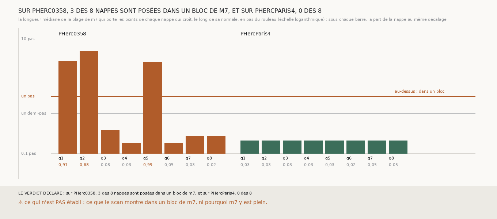

# `326` — La nappe plate de PHerc0358 est-elle posée dans un bloc de m7 ? Oui, les trois : leur plage de m7 fait 3,9 à 6,05 pas, celle des autres 0,15 à 0,25

*`325` a montré que les six côtés aveugles du saut sur PHerc0358 sont ceux de trois nappes plates, graines 1, 2 et 5. Cette tranche
lit, sous chaque point de chaque nappe qui croît, la longueur de la plage de `m7` qui le porte, le long de la normale, sur trois pas de
chaque côté. Sous les trois nappes plates, elle fait 3,9 à 6,05 pas en médiane, et sous la graine 2 elle remplit toute la portée pour
67,08 % des points : ces nappes sont posées au milieu d'un bloc de `m7`. Sous les cinq autres nappes de PHerc0358, 0,15 à 0,25 pas, et
sous les huit de PHercParis4, 0,166 : des feuilles. Entre le bloc le plus mince et la feuille la plus épaisse, un facteur 15. Un rouleau
sans tracé peut le voir seul : c'est un critère de départ.*

## 0. Pourquoi cette tranche

C'est `R4-P124`. Une nappe qui garde le même décalage sur des milliers de points et ne voit rien après sa feuille peut être posée sur
une feuille plane isolée, au bord de la prédiction, ou dans un bloc ; seule la longueur de la plage le dit.

## 1. Ce qui a été vu avant d'écrire

Tout ce que `296` à `325` publient, dont `R4-F510` et la carte de `305` : la nappe de la graine 1 est posée à −10 voxels d'un plan cherché
sur ±30, là où une plage de −30 à +10 aurait son centre. Aucune longueur de plage n'avait été lue.

## 2. Ce qui est fait

- **Les graines et la nappe** : celles de `325`, sans rien y changer ; les nappes de PHerc0358 redonnent `305`.
- **La plage** : pour au plus 1200 points posés de chaque nappe, pris régulièrement, le long de sa normale recalculée, `m7` sur trois pas
  de chaque côté ; la plage est la suite de voxels vus qui contient le point, ou la plus proche. Sa longueur en pas du rouleau ; elle
  remplit la portée si elle touche les deux bouts du rayon.
- **La règle** : une nappe est dans un bloc si la longueur médiane atteint un pas, sur une feuille si elle ne dépasse pas un demi-pas.

`m7` a été lu en 438 chunks sur PHerc0358, dont 16 absents, et 433 sur PHercParis4, sans panne.

## 3. Ce que dit m7 sous les nappes

| graine | longueur médiane (pas) | part qui remplit la portée | platitude (`325`) | lecture |
|---|---|---|---|---|
| 1 | 4,05 | 0,0725 | 0,9058 | dans un bloc |
| 2 | 6,05 | 0,6708 | 0,6841 | dans un bloc |
| 3 | 0,25 | 0,0 | 0,0849 | sur une feuille |
| 4 | 0,15 | 0,0 | 0,0342 | sur une feuille |
| 5 | 3,9 | 0,0 | 0,9907 | dans un bloc |
| 6 | 0,15 | 0,0 | 0,046 | sur une feuille |
| 7 | 0,2 | 0,0 | 0,0275 | sur une feuille |
| 8 | 0,2 | 0,0 | 0,0183 | sur une feuille |

*PHerc0358, ci-dessus ; PHercParis4, où les huit nappes ont une plage médiane de 0,166 pas, aucune qui remplisse la portée, et une
platitude de 0,0236 à 0,0489 : les huit sont sur une feuille.*

⭐⭐⭐⭐⭐ **Les trois nappes plates sont posées dans un bloc de `m7`** (`R4-F511`). Sous elles, `m7` voit une feuille sur 3,9 à 6,05 pas
d'affilée le long de la normale, soit 78 à 121 voxels ; sous la graine 2, la plage remplit les six pas de la portée pour 67,08 % des
points. La nappe qui croît y prend le centre d'une plage que sa fenêtre de recherche tronque, le même partout, d'où sa platitude, et le
saut n'y trouve pas de feuille après la sienne parce que la sienne ne finit pas.

⭐⭐⭐⭐ **Le critère sépare avec une marge d'un facteur 15.** La feuille la plus épaisse, celle de la graine 3 de PHerc0358, fait 0,25 pas ;
le bloc le plus mince, celui de la graine 5, 3,9 pas. Tout seuil entre les deux rend la même lecture, et c'est un seuil que rien ne
demande de connaître d'avance, ni tracé ni référent : un rouleau sans tracé peut refuser de partir d'une graine dont la plage de `m7`
dépasse un pas.

## 4. Le verdict

**SUR PHERC0358, 3 DES 8 NAPPES SONT POSÉES DANS UN BLOC DE M7, ET SUR PHERCPARIS4, 0 DES 8**

`R4-P124` est répondue : sous une nappe plate, `m7` est un bloc. Ce que `305` publiait comme ses nappes les plus complètes, celles des
graines 1 et 5, et celle de la graine 2, sont des nappes posées dans des blocs de la prédiction, pas sur des feuilles.

## 5. Ce que cette tranche ne dit pas

- ⚠⚠ Ce que le scan montre dans un bloc de `m7`, ni pourquoi `m7` y est plein : feuilles collées, matière compacte ou défaut de la
  prédiction.
- ⚠ Quelle part de PHerc0358 est en bloc : huit graines ne font pas un relevé.

## 6. Les sondes

Une batterie de **11** contrôles et une figure de **11**. Quatre règles cassées exprès ont fait échouer la batterie, dont une seulement
après qu'un contrôle a été ajouté : la première plage prise au lieu de la plus proche (vue quand une plage lointaine a été mise avant la
plus proche). Les autres : une plage qui touche un seul bout comptée comme remplissant la portée, et les deux bornes, bloc et feuille,
prises strictes. Deux sondes de la figure l'ont fait échouer : une échelle tronquée à 5 pas qui écrête la graine 2, et une platitude non
écrite ; une troisième passe sans rien changer, les deux rouleaux posés sans écart entre eux, où rien ne se recouvre.

## 7. Ce qui reste

`R4-P125` s'ouvre : un saut qui croît parti de la distance médiane que sa nappe voit, plutôt que de ce qu'un seul point a vu, et qui
refuse de partir d'un bloc, pose-t-il au pas plus souvent sur PHerc0358, et tombe-t-il au moins aussi souvent sur le tour suivant de
PHercParis4 ?
