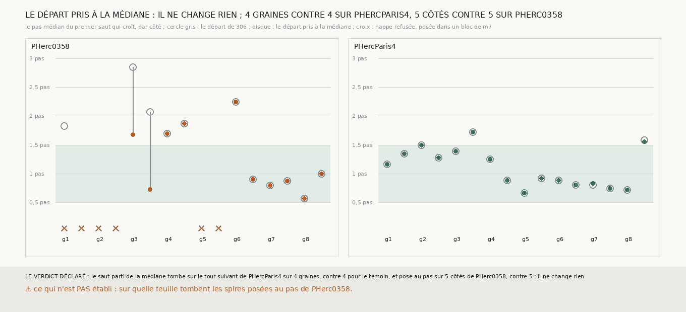

# `327` — Un saut qui croît parti de la médiane, et qui refuse les blocs de m7, pose-t-il au pas plus souvent ? Non : il ne change rien, et c'est m7 qui montre la feuille suivante loin

*`325` avait vu le départ du saut, pris d'un seul point, s'écarter de la médiane de sa nappe et déplacer le saut, et `326` trois nappes
de PHerc0358 posées dans des blocs de `m7`. Cette tranche tire, dans la même mesure, le saut de `306` tel quel et un saut dont le départ
est pris à la distance médiane que la nappe voit, qui refuse de partir d'un bloc. Sur PHercParis4, il tombe sur le tour suivant du
segment sur les quatre mêmes graines ; sur PHerc0358, il pose au pas sur les cinq mêmes côtés. Là où le départ change, la croissance
rejoint la même feuille de `m7` : sur la graine 4 de PHerc0358, le saut parti de la médiane pose encore à 1,7 et 1,875 pas. Le départ
n'était pas la cause ; c'est `m7`, qui y montre la feuille suivante à un pas et demi et plus.*

## 0. Pourquoi cette tranche

C'est `R4-P125`. Les deux corrections se lisent sans référent ; il fallait savoir si elles rendent au saut de PHerc0358 ce qu'il pose sur
PHercParis4, sans lui ôter ce qui y tombait juste.

## 1. Ce qui a été vu avant d'écrire

Tout ce que `296` à `326` publient, dont `R4-F506`, `R4-F508`, `R4-F509` et `R4-F511`. Aucun saut parti de la médiane n'avait été tiré.

## 2. Ce qui est fait

- **Les graines et la nappe** : celles de `325`, sans rien y changer.
- **Le saut parti de la médiane** : celui de `306`, dont le départ est le point le plus proche du centre dont la feuille suivante est à
  au plus un quart de pas de la médiane de celles que tous les points voient. `306` gagne pour cela un argument, qui vaut par défaut
  son départ ; sa batterie passe inchangée. Une nappe posée dans un bloc, par la règle de `326`, n'a pas de saut.
- **Le témoin** : le saut de `306`, tel quel, dans la même mesure. **Il redonne `323` et `324`** : 4 graines de PHercParis4 sur le tour
  suivant, 5 côtés de PHerc0358 au pas.
- **Les juges** : la règle de `323` sur PHercParis4, celle de `324` sur PHerc0358.

## 3. Ce que disent les deux rouleaux

| rouleau | ce qui est compté | le témoin | parti de la médiane |
|---|---|---|---|
| PHercParis4 | graines dont une spire tombe sur le tour suivant | 4 | 4 |
| PHerc0358 | côtés qui posent au pas | 5 | 5 |

⭐⭐⭐⭐ **Le départ pris à la médiane ne change rien** (`R4-F512`). Sur PHercParis4, les deux sauts tombent sur le tour suivant sur les
graines 2, 3, 5 et 6, avec les mêmes spires ; sur la graine 8 côté moins, le départ à la médiane fait passer le pas de 1,582 à 1,554, qui
reste au-delà d'un pas et demi. Sur PHerc0358, les côtés au pas sont les cinq mêmes (graine 6 côté moins, 7 et 8 des deux côtés), à la
même part du plan. Là où le départ change vraiment :

- **graine 4** : les deux sauts posent 14,77 à 15,03 % du plan à 1,7 et 1,875 pas. La croissance, partie d'un autre point, rejoint la
  même feuille de `m7`, et `m7` n'en montre pas à un pas : `R4-F509` y lit une médiane de 1,475 à 1,5 pas ;
- **graine 3 côté plus** : le saut parti de la médiane pose 29,42 % du plan à 1,675 pas au lieu de 9,63 % à 2,85 ; plus près, pas au
  pas ;
- **graine 3 côté moins** : il pose 0,07 % du plan à 0,725 pas, au pas mais sous les 10 % qu'il faut pour compter.

Les trois nappes posées dans un bloc, graines 1, 2 et 5, ne posaient rien avec le témoin non plus ; les refuser ne coûte aucun côté au
pas.

## 4. Le verdict

**LE SAUT PARTI DE LA MÉDIANE TOMBE SUR LE TOUR SUIVANT DE PHERCPARIS4 SUR 4 GRAINES, CONTRE 4 POUR LE TÉMOIN, ET POSE AU PAS SUR 5 CÔTÉS DE PHERC0358, CONTRE 5 ; IL NE CHANGE RIEN**

`R4-P125` est répondue : non. Ce qui manque au saut sur PHerc0358 n'est ni son départ ni le refus des blocs : là où la nappe suit une
feuille, `m7` montre la suivante à un pas sur les graines 6 côté moins, 7 et 8, et plus loin sur les graines 3, 4 et 6 côté plus, où la
chaîne ne peut pas trouver ce que la prédiction ne marque pas.

## 5. Ce que cette tranche ne dit pas

- ⚠⚠ Sur quelle feuille tombent les spires posées au pas de PHerc0358.
- ⚠ Si la feuille que `m7` ne marque pas à un pas sur les graines 3, 4 et 6 existe dans le scan : `319` et `320` ont montré que le
  scan, lu par ses maxima, ne le dit pas à 9,362 µm.

## 6. Les sondes

Une batterie de **10** contrôles et une figure de **10**. Quatre règles cassées exprès ont fait échouer la batterie, dont une seulement
après qu'un contrôle a été ajouté : le départ à la médiane non transmis au saut (vu quand les deux sauts ont été comparés sur la nappe
synthétique). Les autres : le témoin refusé avec les blocs, une tolérance d'une graine sur le tour suivant, et une égalité des comptes
prise pour un gain. Deux sondes de la figure l'ont fait échouer : le saut parti de la médiane tracé au pas du témoin, et une échelle
tronquée à 2,5 pas qui écrête la graine 3 ; une troisième passe, des étiquettes plus longues qui ne se recouvrent pas.

## 7. Ce qui reste

`R4-P126` s'ouvre : sur PHerc0358, depuis les cinq côtés dont le premier saut pose au pas, la chaîne qui croît, saut après saut, pose-t-elle
au pas, et sur combien de sauts ? C'est ce qu'un rouleau sans tracé peut produire avec les seules méthodes que PHercParis4 a validées.
