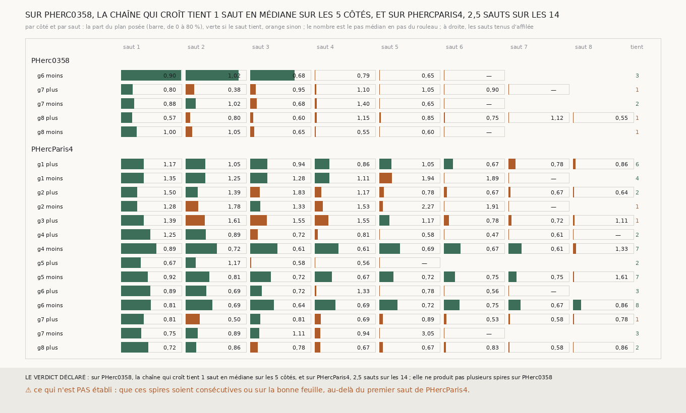

# `328` — Combien de sauts la chaîne qui croît tient-elle au pas ? Un en médiane sur PHerc0358, 2,5 sur PHercParis4, où quatre côtés en tiennent six à huit

*Depuis les côtés dont le premier saut pose au pas dans `324`, cinq sur PHerc0358 et quatorze sur PHercParis4, cette tranche tire huit
sauts qui croissent de `306`, chacun parti de la spire du précédent, et compte ceux que la chaîne tient d'affilée : au pas, hors d'un bloc
de `m7`. Sur PHerc0358, un saut en médiane ; seule la graine 6 côté moins en tient trois, à 79,24, 69,87 et 58,44 % du plan, avant de ne
plus poser que 0,66 %. Ailleurs la spire tombe sous 10 % du plan dès le deuxième ou le troisième saut : `m7` n'y montre la feuille
suivante que par morceaux. Sur PHercParis4, 2,5 sauts en médiane, et quatre côtés en tiennent six, sept, sept et huit. Aucune spire des
deux rouleaux n'est posée dans un bloc.*

## 0. Pourquoi cette tranche

C'est `R4-P126`. La nappe et le saut qui croissent sont validés sur PHercParis4 contre un tracé humain, sur un saut ; le nombre de sauts
que la chaîne tient au pas sur PHerc0358 est ce qu'un rouleau sans tracé peut produire avec ces seules méthodes.

## 1. Ce qui a été vu avant d'écrire

Tout ce que `296` à `327` publient, dont les quatre sauts que `306` publie depuis la graine 6 de PHerc0358 : côté moins, 79,24, 69,87,
58,44 puis 0,66 % du plan.

## 2. Ce qui est fait

- **Les côtés** : ceux dont le premier saut pose au pas dans `324`.
- **La chaîne** : depuis la nappe qui croît de `305`, huit sauts qui croissent de `306` au pas de chaque rouleau, chacun parti de la
  spire du précédent ; elle s'arrête au premier saut qui ne pose rien.
- **Un saut tient** s'il pose au pas (la règle de `324`) et que sa spire n'est pas posée dans un bloc (la règle de `326`, qui gagne pour
  cela la lecture d'une nappe vide ; sa batterie passe, avec un contrôle de plus).
- **La règle** : la chaîne produit plusieurs spires sur PHerc0358 si au moins la moitié de ses côtés tiennent au moins deux sauts.

`m7` a été lu en 1413 chunks sur PHerc0358 et 4280 sur PHercParis4, sans panne.

## 3. Ce que disent les deux rouleaux

| rouleau | côté | sauts tenus | ce qui arrête la chaîne |
|---|---|---|---|
| PHerc0358 | g6 moins | 3 | le saut 4 ne pose que 0,66 % du plan |
| PHerc0358 | g7 plus | 1 | le saut 2 pose à 0,375 pas |
| PHerc0358 | g7 moins | 2 | le saut 3 ne pose que 8,09 % du plan |
| PHerc0358 | g8 plus | 1 | le saut 2 ne pose que 5,78 % du plan |
| PHerc0358 | g8 moins | 1 | le saut 2 ne pose que 8,38 % du plan |

*Sur PHercParis4, les quatorze côtés tiennent 6, 4, 2, 1, 1, 2, 7, 2, 7, 3, 8, 1, 3 et 2 sauts (graines 1 à 8, dans l'ordre de la
figure) ; la graine 6 côté moins tient les huit, à 38,7 % du plan au premier saut et 10,11 % au huitième, à 0,64 à 0,86 pas.*

⭐⭐⭐⭐ **Sur PHerc0358, la chaîne ne produit pas plusieurs spires** (`R4-F513`). Deux côtés sur cinq tiennent deux sauts ou plus, la
graine 6 côté moins trois. Ce n'est ni le pas ni un bloc qui l'arrête, sauf sur la graine 7 côté plus : c'est la part posée, qui tombe
sous 10 % du plan dès le deuxième ou le troisième saut ; les spires des graines 7 et 8 ne partent qu'avec 14,44 à 20,38 % du plan. Sur
PHercParis4, la même chaîne part avec 20,8 à 46,15 % et perd moins à chaque saut. Aucune spire n'est dans un bloc : leurs plages de `m7`
font 0,15 à 0,25 pas sur PHerc0358 et 0,166 sur PHercParis4.

## 4. Le verdict

**SUR PHERC0358, LA CHAÎNE QUI CROÎT TIENT 1 SAUT EN MÉDIANE SUR LES 5 CÔTÉS, ET SUR PHERCPARIS4, 2,5 SAUTS SUR LES 14 ; ELLE NE PRODUIT PAS PLUSIEURS SPIRES SUR PHERC0358**

Sur le rouleau sans tracé, la graine 6 côté moins donne quatre surfaces empilées au pas (la nappe et trois spires) ; c'est tout ce que la
chaîne qui croît en tire. Sur PHercParis4, elle en empile jusqu'à neuf.

## 5. Ce que cette tranche ne dit pas

- ⚠⚠ Que ces spires soient consécutives ou sur la bonne feuille au-delà du premier saut de PHercParis4.
- ⚠ Noté le 2026-09-29, après la mesure de `329` : sur PHercParis4, la règle du pas nominal est une borne basse. `329` voit la chaîne
  descendre les tours publiés `5753_k` sur des côtés que cette tranche ne suit pas, dont la graine 3 côté moins, dont le premier saut pose à
  1,72 pas et retrouve pourtant `5753_-1`.

## 6. Les sondes

Une batterie de **8** contrôles et une figure de **11**. Quatre règles cassées exprès ont fait échouer la batterie, dont une seulement
après qu'un contrôle a été ajouté : une spire posée dans un bloc comptée comme tenue (vue quand le bloc synthétique a été posé au pas). Les
autres : des sauts comptés même après un saut qui ne tient pas, un seuil de trois sauts au lieu de deux, et une chaîne qui ne s'arrête pas
quand elle ne pose plus rien. Deux sondes de la figure l'ont fait échouer : une échelle tronquée à 70 % qui écrête la graine 6 de
PHerc0358, et le nombre de sauts tirés écrit à la place des sauts tenus ; une troisième passe sans rien changer, la tenue tracée par le
seul pas, aucune spire n'étant dans un bloc.

## 7. Ce qui reste

La chaîne se juge contre des tours consécutifs publiés sur PHercParis4 : c'est `329`.
