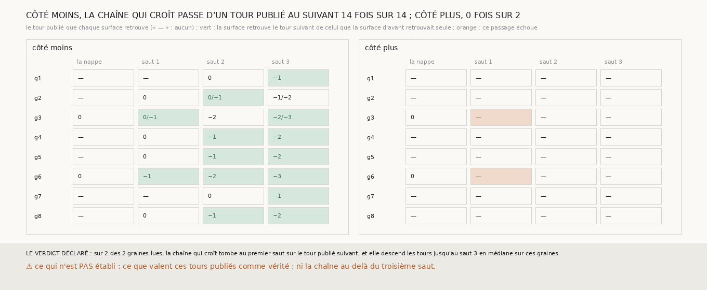

# `329` — Saut après saut, la chaîne qui croît de PHercParis4 tombe-t-elle sur les tours consécutifs que l'équipe publie ? Côté intérieur, elle passe d'un tour publié au suivant 14 fois sur 14

*PHercParis4 publie des tours tracés d'après le segment `20230702185753` : `5753_0`, puis `5753_-1`, `5753_-2`, `5753_-3` et au-delà,
de plus en plus intérieurs. Cette tranche en télécharge quatre, 144 Mo au pas de 2,4 µm, et compare chaque surface de la chaîne qui croît
(la nappe de `322` et trois sauts de `306` de chaque côté) à chacun d'eux. Par la règle déclarée, seules les graines 3 et 6 sont lues,
leur nappe étant posée sur `5753_0`, et sur les deux la chaîne descend `5753_-1`, `5753_-2`, `5753_-3`, un tour par saut. Les six
autres nappes sont posées un ou deux tours à l'extérieur de `5753_0`, sur des tours qui ne sont pas chargés ; mais, côté moins, dès que
leur chaîne touche un tour publié, elle passe au suivant à chaque saut : en tout, 14 passages sur 14, et sur les graines 7 et 8, 99,74 à
100 % des sommets en face à un quart de pas. C'est la chaîne tirée de `m7` sans main, jugée contre des tours consécutifs publiés, sur
trois sauts.*

## 0. Pourquoi cette tranche

C'est `R4-P126` vu par son référent. `328` a compté les sauts que la chaîne tient au pas, sans pouvoir dire au-delà du premier s'ils
tombent juste, parce que le segment de `296` ne repasse qu'une fois autour des graines. Les tours publiés `5753_k` donnent la réponse à
chaque saut.

## 1. Ce qui a été vu avant d'écrire

Tout ce que `296` à `328` publient, et la liste du dépôt : les boîtes englobantes des tours `5753_0` à `5753_-2` au pas de 2,4 µm
recouvrent celle du segment réduit de `296`, et leur aire décroît. Aucune de leurs géométries n'avait été lue.

## 2. Ce qui est fait

- **Les tours** : `5753_0`, `5753_-1`, `5753_-2` et `5753_-3`, leur seul maillage au pas de 2,4 µm, 36 à 39 Mo chacun, rangés dans
  `data/tours_publies_5753/` ; 1 937 463 à 2 222 727 sommets à normale connue, espacés de 20 voxels.
- **Les graines, la nappe et la chaîne** : les huit graines de `321`, la nappe qui croît de `322`, et de chaque côté trois sauts qui
  croissent de `306`, au pas de PHercParis4, sans rien y changer.
- **La comparaison** : celle de `321`, sur les sommets de chaque tour dans la boîte englobante de la surface élargie de 100 voxels.
- **La règle** : une graine est lue si sa nappe retrouve un seul tour publié ; sa chaîne descend les tours jusqu'au saut h si la spire
  de chaque saut j ≤ h retrouve le tour de la nappe moins j.
- **Rapporté, ajouté après la première mesure le 2026-09-29, sans toucher à la règle** : les passages d'un tour publié au suivant, pour
  toute surface de la chaîne qui retrouve un seul tour. La seconde mesure rend les mêmes nombres sur tout ce qui décide.

## 3. Ce que disent les tours publiés

Côté moins. La nappe : son écart médian à `5753_0` et la part de ses sommets en face à un quart de pas ; puis, pour chaque saut, le ou
les tours publiés que la spire retrouve.

| graine | la nappe contre 5753_0 | saut 1 | saut 2 | saut 3 | passages réussis | descente par la règle |
|---|---|---|---|---|---|---|
| 1 | 186,66 · 0,0 | — | 0 | −1 | 1 | 0 |
| 2 | 104,99 · 0,0 | 0 | 0/−1 | −1/−2 | 1 | 0 |
| 3 | 1,69 · 0,6186 | 0/−1 | −2 | −2/−3 | 2 | 3 |
| 4 | 62,5 · 0,044 | 0 | −1 | −2 | 2 | 0 |
| 5 | 54,35 · 0,1874 | 0 | −1 | −2 | 2 | 0 |
| 6 | −1,07 · 0,544 | −1 | −2 | −3 | 3 | 3 |
| 7 | 115,42 · 0,0 | — | 0 | −1 | 1 | 0 |
| 8 | 133,4 · 0,0 | 0 | −1 | −2 | 2 | 0 |

⭐⭐⭐⭐⭐ **Côté intérieur, la chaîne passe d'un tour publié au suivant à chaque saut** (`R4-F514`). Sur les graines 3 et 6, dont la nappe
est sur `5753_0`, la chaîne descend les trois tours suivants, un par saut, sur le seul côté moins : sur la graine 6, 62,19, 69,52 et
90,21 % des sommets en face de `5753_-1`, `5753_-2` et `5753_-3` sont à un quart de pas de sa spire. Sur les six autres, la chaîne touche
`5753_0` au premier ou au deuxième saut, puis passe au tour suivant à chaque saut ; sur les graines 7 et 8, 99,74 à 100 % des sommets en
face. En tout, 14 passages d'un tour publié au suivant, 14 réussis. Côté plus, aucune spire ne retrouve un tour publié : la chaîne y va
vers l'extérieur, où aucun tour n'est chargé, et les deux « passages » manqués, depuis les nappes des graines 3 et 6, sont ceux-là.

⭐⭐⭐⭐ **Le segment de `296` n'est pas `5753_0` partout** (`R4-F515`). Les nappes des graines 1, 2, 4, 5, 7 et 8, qui tiennent la feuille
du tracé (`R4-F504`), sont à 54,35 à 186,66 voxels de `5753_0` en médiane, et leur chaîne touche `5753_0` au premier saut (graines 2, 4,
5 et 8) ou au deuxième (1 et 7) : le segment réduit de `20230702185753` y est un ou deux tours à l'extérieur de `5753_0`. C'est la même
géométrie que `R4-F507` voyait sur la graine 4, un tour suivant à 57 voxels : un segment qui fait plus d'un tour n'est pas un seul tour
publié.

Là où une spire retrouve deux tours à la fois (graines 2 et 3), deux tours publiés passent tous deux à un quart de pas d'elle : ils y
sont à moins d'un demi-pas l'un de l'autre, et la règle n'ouvre alors aucun passage.

## 4. Le verdict

**SUR 2 DES 2 GRAINES LUES, LA CHAÎNE QUI CROÎT TOMBE AU PREMIER SAUT SUR LE TOUR PUBLIÉ SUIVANT, ET ELLE DESCEND LES TOURS JUSQU'AU SAUT 3 EN MÉDIANE SUR CES GRAINES**

C'est le verdict de la règle, et la règle ne lisait que les nappes posées sur `5753_0`. Ce que les huit graines montrent, rapporté à côté
et compté après la première mesure, est plus large : côté intérieur, la chaîne qui croît passe d'un tour publié au suivant 14 fois sur
14, sur les trois tours chargés.

## 5. Ce que cette tranche ne dit pas

- ⚠⚠ Ce que valent les tours `5753_k` comme vérité : ils sont tracés par une méthode que ce dépôt n'a pas jugée, et ils ne sont pas
  indépendants de `m7` s'ils en ont été tirés.
- ⚠⚠ La chaîne au-delà de `5753_-3` : quatre tours seulement sont chargés.
- ⚠ La règle de lecture est à revoir avant la tranche suivante : une nappe posée sur un tour non chargé ne dit rien de la chaîne.

## 6. Les sondes

Une batterie de **14** contrôles et une figure de **10**. Cinq règles cassées exprès ont fait échouer la batterie, dont deux seulement après
qu'un contrôle a été ajouté : une descente qui continue après un tour manqué (vue quand un tour retrouvé après un manque a été ajouté) et
une surface suivante non lue comptée comme un échec (vue quand un tel cas a été ajouté). Les autres : une nappe comptée sur le premier tour
retrouvé même quand elle en retrouve deux, une descente qui accepte n'importe quel tour retrouvé, et tous les sommets d'un tour comparés
au lieu des seuls proches. Deux sondes de la figure l'ont fait échouer : un passage ouvert depuis une surface qui retrouve deux tours, et
une colonne de saut retirée ; une troisième passe, un non lu compté comme un échec, parce qu'aucun passage de cette mesure ne tombe sur
un non lu.

## 7. Ce qui reste

`R4-P127` s'ouvre : avec les tours `5753_-4` à `5753_-7` chargés et une règle qui part du premier tour publié que la chaîne touche, la
chaîne qui croît descend-elle les tours publiés au-delà du troisième saut, et jusqu'où ?
