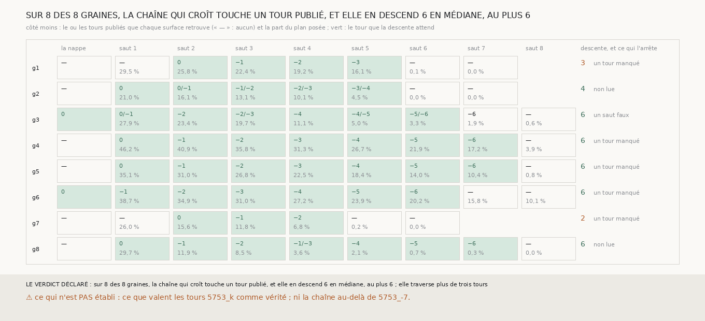

# `330` — Jusqu'à quel tour publié la chaîne qui croît de PHercParis4 descend-elle ? Six tours d'affilée en médiane, de 5753_0 à 5753_-6, sur les huit graines

*`329` avait vu la chaîne qui croît passer d'un tour publié au suivant 14 fois sur 14 sur les quatre tours chargés. Cette tranche charge
les huit, `5753_0` à `5753_-7` (265 Mo en tout), tire huit sauts, et suit la descente depuis le premier tour publié que la chaîne touche.
Sur les huit graines, la chaîne en touche un ; elle en descend six en médiane, de `5753_0` à `5753_-6`, sur cinq graines, et trois, quatre
et deux sur les autres. Ce qui l'arrête n'est presque jamais un faux saut : la spire se réduit à quelques pour cent du plan, ou le tour
suivant, `5753_-7`, ne passe pas là où elle est. C'est la portée de la chaîne tirée de `m7` sans main, jugée contre des tours consécutifs
publiés : au moins six tours.*

## 0. Pourquoi cette tranche

C'est `R4-P127`. Combien de tours consécutifs une chaîne tirée de `m7` sans main traverse avant de se tromper est la portée qu'un rouleau
sans tracé peut espérer. `329` n'en chargeait que quatre, et sa règle ne lisait que les nappes posées sur l'un d'eux.

## 1. Ce qui a été vu avant d'écrire

Tout ce que `296` à `329` publient, dont `R4-F514` et `R4-F515`. Les tours `5753_-4` à `5753_-7` n'avaient pas été téléchargés, et aucune
chaîne de plus de trois sauts n'avait été comparée à un tour publié.

## 2. Ce qui est fait

- **Les tours** : `5753_0` à `5753_-7`, leur maillage au pas de 2,4 µm ; de 2 222 727 sommets pour `5753_0` à 1 477 091 pour `5753_-6` et
  1 024 738 pour `5753_-7`, le plus intérieur et le plus petit.
- **La chaîne** : celle de `329`, avec huit sauts de chaque côté ; la comparaison de `329`, sans rien y changer.
- **La règle** : le tour de départ est celui que la première surface de la chaîne qui en retrouve un seul retrouve, nappe comprise ; puis
  chaque surface suivante descend un tour si elle retrouve, parmi ses tours, celui qui suit le précédent ; la descente s'arrête à la
  première qui ne le retrouve pas. La chaîne traverse plus de trois tours si la descente médiane est d'au moins quatre.

`m7` a été lu en 3680 chunks, sans panne.

## 3. Ce que disent les tours publiés

Côté moins ; côté plus, aucune chaîne ne descend, elle va vers l'extérieur de `5753_0`.

| graine | premier tour touché | tours descendus | part du plan de la dernière spire | ce qui arrête | sommets du tour attendu en face |
|---|---|---|---|---|---|
| 1 | saut 2 | 3 | 16,14 % | un tour manqué | 0 |
| 2 | saut 1 | 4 | 4,52 % | non lue | 19 |
| 3 | la nappe | 6 | 3,27 % | un saut faux | 0 |
| 4 | saut 1 | 6 | 17,25 % | un tour manqué | 5 |
| 5 | saut 1 | 6 | 10,39 % | un tour manqué | 0 |
| 6 | la nappe | 6 | 20,19 % | un tour manqué | 106 |
| 7 | saut 2 | 2 | 6,82 % | un tour manqué | 47 |
| 8 | saut 1 | 6 | 0,26 % | non lue | 0 |

Le premier tour touché est `5753_0` sur les huit graines.

⭐⭐⭐⭐⭐ **La chaîne qui croît traverse six tours publiés d'affilée** (`R4-F516`). Sur les graines 3, 4, 5, 6 et 8, elle descend de `5753_0`
à `5753_-6`, un tour par saut : sur la graine 4, sept spires consécutives, de 46,2 à 17,25 % du plan, chacune sur le tour publié suivant
de la précédente ; sur la graine 6, la nappe et six spires, de 38,7 à 20,19 %. Sur les graines 1, 2 et 7, elle en descend trois, quatre et
deux.

⭐⭐⭐⭐ **Ce qui l'arrête est la part posée et le bout des tours, presque jamais un faux saut.** Sur les graines 1, 2, 7 et 8, la spire
suivante ne pose plus que 0 à 0,2 % du plan : `m7` n'y montre plus la feuille suivante. Sur les graines 3, 4, 5, 6 et 8, le tour attendu
est `5753_-7`, qui n'a que 0 à 106 sommets en face de la spire, contre des milliers pour `5753_-6` : il ne passe pas là. Le seul faux saut,
sur la graine 3, est une spire qui reste sur `5753_-6` au lieu de descendre, à 1,9 % du plan. Là où une spire retrouve deux tours à la
fois (graines 2, 3 et 8), la règle l'accepte si le tour attendu en est ; la graine 8 en passe un, à 3,6 % du plan.

## 4. Le verdict

**SUR 8 DES 8 GRAINES, LA CHAÎNE QUI CROÎT TOUCHE UN TOUR PUBLIÉ, ET ELLE EN DESCEND 6 EN MÉDIANE, AU PLUS 6 ; ELLE TRAVERSE PLUS DE TROIS TOURS**

`R4-P127` est répondue : au moins six tours consécutifs, sur cinq graines sur huit, avant que la chaîne ne s'épuise ou que les tours chargés
ne finissent. Contre la même référence, une nappe tirée de `m7` sans main et sa chaîne de sauts qui croissent déroulent `5753_0` à
`5753_-6` ; la seule surface qui tombe sur un tour faux, sur la graine 3, le fait après le sixième tour, en restant sur `5753_-6`.

## 5. Ce que cette tranche ne dit pas

- ⚠⚠ Ce que valent les tours `5753_k` comme vérité : tracés par une méthode que ce dépôt n'a pas jugée, ils peuvent avoir été tirés d'une
  prédiction proche de `m7`, et un accord avec eux n'est alors pas indépendant.
- ⚠⚠ Ce que vaut la chaîne au-delà de `5753_-7`, ni sur PHerc0358, où elle ne tient qu'un saut au pas (`R4-F513`).
- ⚠ Le plan de 65 × 65 points reste le même d'un saut à l'autre : une spire qui rétrécit n'est pas relancée sur une surface plus grande.

## 6. Les sondes

Une batterie de **9** contrôles et une figure de **11**. Quatre règles cassées exprès ont fait échouer la batterie : une descente qui accepte
n'importe quel tour retrouvé, un départ pris sur le premier tour retrouvé même quand la surface en retrouve deux, un seuil de traversée
strict, et un bout des tours chargés reculé de cinq tours. Deux sondes de la figure l'ont fait échouer, dont une seulement après qu'un
contrôle a été ajouté : une colonne de saut retirée (vue quand le nombre de colonnes a été comparé à la plus longue chaîne) et les parts
posées écrites sur les tours ; une troisième passe, une descente dont le compte n'est plus borné, parce qu'aucune surface après la fin
d'une descente ne retrouve le tour qu'elle aurait attendu.

## 7. Ce qui reste

`R4-P128` s'ouvre : la chaîne qui s'épuise est une chaîne dont la spire rétrécit dans un plan fixe. Relancer chaque saut sur la surface
entière du tour atteint, plutôt que sur le plan de la graine, prolonge-t-il la descente sur PHercParis4, et la chaîne de PHerc0358 ?
