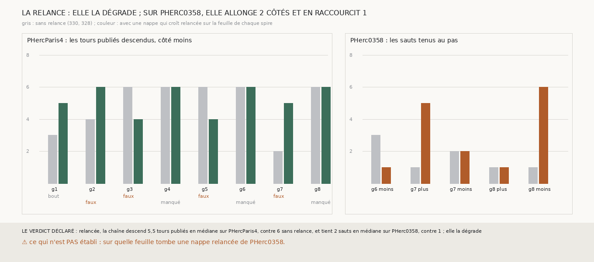

# `331` — Une chaîne relancée à chaque tour en une nappe entière descend-elle plus loin ? Elle garde sa surface, mais elle se trompe de tour quatre fois : 5,5 tours publiés en médiane contre 6

*`330` voyait la chaîne qui croît s'arrêter quand sa spire rétrécissait, de 46 % du plan au premier saut à quelques pour cent au huitième.
Cette tranche relance, après chaque saut, une nappe qui croît de `305` sur la feuille que la spire a atteinte, et repart de cette nappe
entière. La surface est gardée : les nappes relancées de PHercParis4 posent jusqu'à 84 % du plan, et au huitième saut encore 12 à 54 % sur six graines. Mais sur les tours publiés,
la chaîne relancée descend 5,5 tours en médiane contre 6 : elle allonge trois graines, en raccourcit deux, et se trompe de tour quatre
fois, en restant sur le même ou en en sautant un, là où la chaîne sans relance ne se trompait qu'une fois. Sur PHerc0358, elle tient 2
sauts en médiane contre 1, jusqu'à six sur la graine 8 côté moins, mais un de moins sur la graine 6. Par la règle déclarée, la relance
dégrade.*

## 0. Pourquoi cette tranche

C'est `R4-P128`. Le saut pose sa spire sur la grille de la surface d'où il part, et un point perdu l'est pour tous les sauts suivants.
Une nappe relancée sur la feuille atteinte repart d'un plan entier.

## 1. Ce qui a été vu avant d'écrire

Tout ce que `296` à `330` publient, dont `R4-F516` et `R4-F513`. Aucune chaîne relancée n'avait été tirée.

## 2. Ce qui est fait

- **La chaîne relancée** : après chaque saut qui croît de `306`, le point posé de la spire, à normale connue, le plus proche du barycentre
  de ses points posés devient la graine d'une nappe qui croît de `305`, au pas de chaque rouleau ; le saut suivant part de cette nappe.
- **Les juges** : sur PHercParis4, la descente de `330` sur la suite des nappes relancées ; sur PHerc0358, la tenue de `328`, avec la
  nappe relancée hors d'un bloc.
- **La règle** : la relance prolonge la chaîne si PHerc0358 tient plus d'un saut en médiane et que PHercParis4 descend au moins six tours ;
  elle la dégrade si PHercParis4 en descend moins de six.

`m7` a été lu en 8027 chunks sur PHercParis4 et 3101 sur PHerc0358, sans panne.

## 3. Ce que disent les deux rouleaux

| graine de PHercParis4 | sans relance (`330`) | avec relance | ce qui arrête la chaîne relancée |
|---|---|---|---|
| 1 | 3 | 5 | le bout de la chaîne |
| 2 | 4 | 6 | un saut faux |
| 3 | 6 | 4 | un saut faux |
| 4 | 6 | 6 | un tour manqué |
| 5 | 6 | 4 | un saut faux |
| 6 | 6 | 6 | un tour manqué |
| 7 | 2 | 5 | un saut faux |
| 8 | 6 | 6 | un tour manqué |

| côté de PHerc0358 | sans relance (`328`) | avec relance |
|---|---|---|
| g6 moins | 3 | 1 |
| g7 plus | 1 | 5 |
| g7 moins | 2 | 2 |
| g8 plus | 1 | 1 |
| g8 moins | 1 | 6 |

⭐⭐⭐⭐ **La relance garde la surface et perd la justesse** (`R4-F517`). Sur PHercParis4, les graines 1, 2 et 7, dont la chaîne sans relance
s'épuisait, descendent maintenant cinq, six et cinq tours ; mais les graines 3 et 5, qui en descendaient six, s'arrêtent à quatre sur un
saut faux : sur la graine 3, la nappe relancée reste sur `5753_-4` au lieu de descendre, et sur la graine 5 elle saute de `5753_-4` à
`5753_-6`. Quatre sauts faux en tout, contre un sans relance. La nappe relancée prend la feuille de `m7` la plus proche d'un plan posé sur
la spire ; là où deux tours sont serrés, ce peut être le même, ou celui d'après.

⭐⭐⭐ **Sur PHerc0358, elle allonge deux côtés et en raccourcit un.** La graine 8 côté moins tient six sauts au lieu d'un, la graine 7 côté
plus cinq au lieu d'un ; la graine 6 côté moins, qui en tenait trois, n'en tient plus qu'un : son deuxième saut, parti de la nappe
relancée, ne pose que 0,31 % du plan à 0,375 pas.

## 4. Le verdict

**RELANCÉE, LA CHAÎNE DESCEND 5,5 TOURS PUBLIÉS EN MÉDIANE SUR PHERCPARIS4, CONTRE 6 SANS RELANCE, ET TIENT 2 SAUTS EN MÉDIANE SUR PHERC0358, CONTRE 1 ; ELLE LA DÉGRADE**

`R4-P128` est répondue : non, pas telle quelle. Relancer une nappe sur la feuille atteinte rend sa surface à la chaîne, mais la nappe
relancée ne sait pas quel tour elle doit prendre ; la chaîne sans relance, qui ne peut que rétrécir, ne se trompe presque jamais.

## 5. Ce que cette tranche ne dit pas

- ⚠⚠ Sur quelle feuille tombent les nappes relancées de PHerc0358 : aucun tour n'y est publié.
- ⚠ Si une relance qui garde la position de chaque point de la spire, au lieu d'un nouveau plan, garderait la justesse avec la surface.

## 6. Les sondes

Une batterie de **9** contrôles et une figure de **11**. Trois règles cassées exprès ont fait échouer la batterie, dont deux seulement après
qu'un contrôle a été ajouté : le saut suivant parti de la spire au lieu de la nappe relancée (vu quand les surfaces de départ des sauts
ont été enregistrées) et la graine de la relance prise au premier point posé (vu quand la région posée a été rendue asymétrique). La
troisième : une égalité de tenue prise pour un gain. Deux sondes de la figure l'ont fait échouer : une échelle
tronquée à cinq qui écrête les barres, et des barres sans relance lues dans la mesure de `331` ; une troisième passe, les causes d'arrêt
posées sur une seule ligne, où elles ne se recouvrent pas.

## 7. Ce qui reste

`R4-P129` s'ouvre : une relance qui fait croître la nappe à partir de la spire entière, chaque point posé gardant sa feuille, plutôt que
d'un plan neuf posé en son centre, garde-t-elle la justesse de la chaîne sans relance en rendant sa surface ?
