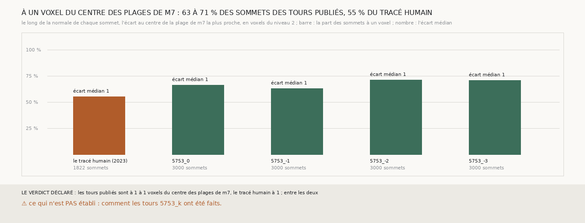

# `332` — Les tours publiés 5753_k sont-ils posés au cœur des plages de m7, comme une surface qui en serait tirée ? La mesure ne les sépare pas du tracé humain

*`329` et `330` jugent la chaîne tirée de `m7` contre les tours publiés `5753_k`, avec une réserve : si ces tours ont eux-mêmes été
tirés d'une prédiction comme `m7`, l'accord n'est pas indépendant. Une surface tirée de `m7` passe au centre de ses plages ; cette
tranche mesure où y passent les tours publiés, et où y passe le tracé humain de 2023. Les deux sont à un voxel médian du niveau 2 du
centre de la plage la plus proche ; 63 à 71 % des sommets des tours y sont à un voxel, contre 55 % du tracé humain. Les tours sont un peu
plus près de `m7` que le tracé, pas au point de s'en distinguer : `m7` passe lui-même à un voxel du tracé humain. La réserve reste.*

## 0. Pourquoi cette tranche

C'est la réserve de `329` et de `330`. Aucune source publiée ne dit comment les tours `5753_k` ont été faits ; leur place dans les plages
de `m7` est ce qu'on peut en mesurer.

## 1. Ce qui a été vu avant d'écrire

Tout ce que `296` à `331` publient, dont `R4-F490` : le tracé humain de PHercParis4 est posé sur la face de sa feuille, à une place qui
varie d'un bloc à l'autre, rapportée au plus dense du scan. Aucun sommet d'un tour publié n'avait été rapporté à `m7`.

## 2. Ce qui est fait

- **Les surfaces** : le segment réduit de `296` (le tracé humain de 2023) et les tours `5753_0` à `5753_-3`.
- **Les sommets** : les 1822 du segment dans les fenêtres de `321` autour des huit graines ; pour chaque tour, 3000 de ses sommets dans la
  boîte englobante de ces fenêtres élargie de 100 voxels, pris régulièrement.
- **La lecture** : le long de la normale de chaque sommet, `m7` au niveau 2 sur un pas de chaque côté ; l'écart au centre de la plage la
  plus proche.
- **La règle** : les tours sont au cœur de `m7` si leur écart médian est d'au plus un voxel et d'au plus la moitié de celui du tracé
  humain ; ils n'y sont pas si l'un d'eux dépasse le tracé humain.

## 3. Ce que dit m7

| surface | sommets | part qui voit une plage | écart médian (voxels du niveau 2) | part à un voxel |
|---|---|---|---|---|
| le tracé humain | 1822 | 0,9989 | 1,0 | 0,5511 |
| 5753_0 | 3000 | 0,995 | 1,0 | 0,6626 |
| 5753_-1 | 3000 | 0,9957 | 1,0 | 0,6294 |
| 5753_-2 | 3000 | 0,9973 | 1,0 | 0,7092 |
| 5753_-3 | 3000 | 0,996 | 1,0 | 0,7078 |

⭐⭐⭐ **À un voxel, la mesure ne sépare pas les tours publiés du tracé humain** (`R4-F518`). Tous passent à un voxel médian du niveau 2,
9,6 µm, du centre d'une plage de `m7` ; les tours y ont 63 à 71 % de leurs sommets à un voxel, le tracé humain 55 %. `m7` est un masque
seuillé, dont un centre de plage ne se lit qu'au demi-voxel : à cette résolution, une surface tirée de `m7` et une surface tracée à la main
là où `m7` est juste ne se distinguent pas. Et `m7` lui-même passe à un voxel du tracé humain : sa prédiction est proche de ce qu'un humain
trace.

## 4. Le verdict

**LES TOURS PUBLIÉS SONT À 1 À 1 VOXELS DU CENTRE DES PLAGES DE M7, LE TRACÉ HUMAIN À 1 ; ENTRE LES DEUX**

La réserve de `329` et `330` n'est ni levée ni confirmée : les tours `5753_k` sont un peu plus près de `m7` que le tracé humain, pas au
point d'en être tirés à coup sûr.

## 5. Ce que cette tranche ne dit pas

- ⚠⚠ Comment les tours `5753_k` ont été faits : c'est une question pour ceux qui les publient, pas une mesure.
- ⚠ Ce qu'une probabilité de `m7`, au lieu de son masque seuillé, dirait sous le voxel : elle n'est pas publiée.

## 6. Les sondes

Une batterie de **7** contrôles et une figure de **9**. Quatre règles cassées exprès ont fait échouer la batterie, dont une seulement après
qu'un contrôle a été ajouté : la première plage prise au lieu de la plus proche (vue quand deux plages ont été posées de part et d'autre).
Les autres : la condition de la moitié ôtée, un tour lointain jugé sur le plus proche des tours, et les sommets sans plage comptés à zéro.
Une sonde de la figure l'a fait échouer, des barres serrées dont les étiquettes se recouvrent ; une autre passe, la part tracée à la place
de la part mesurée, les deux étant égales.

## 7. Ce qui reste

`R4-P129` reste la suite de la chaîne. La provenance des tours `5753_k` est à demander à ceux qui les publient.
