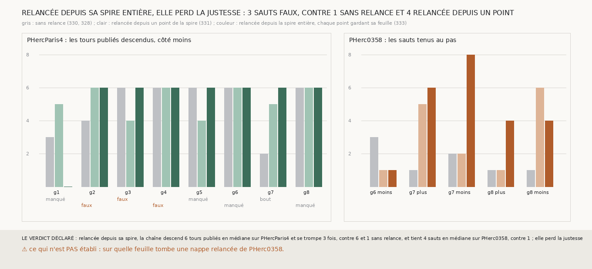

# `333` — Une relance qui fait croître la nappe depuis la spire entière garde-t-elle la justesse en rendant la surface ? Elle rend la surface et descend six tours publiés sur sept graines, mais se trompe trois fois au septième saut

*`331` relançait après chaque saut une nappe qui croît depuis un seul point de la spire ; elle gardait la surface et se trompait de tour
quatre fois. Cette tranche sème chaque point posé de la spire sur sa propre feuille, dans le même plan, et ne fait croître que ce qui
manque. Sur PHercParis4, la chaîne relancée depuis sa spire descend six tours publiés en médiane, comme sans relance, et atteint
`5753_-6` sur sept graines contre cinq sans relance et quatre avec la relance de `331` ; ses nappes relancées posent jusqu'à 91 % du plan
côté moins, et encore 9 à 76 % au huitième saut. Mais elle fait trois sauts faux, contre un sans relance, tous au septième saut, après
`5753_-6`. Sur PHerc0358, elle tient 4 sauts au pas en médiane, contre 1 sans relance et 2 avec `331`. Par la règle déclarée, trois sauts
faux lui font perdre la justesse.*

## 0. Pourquoi cette tranche

C'est `R4-P129`. La relance de `331` repose tout le plan par une croissance partie d'un seul point : là où la spire a une lacune, la
croissance peut passer sur la feuille voisine, et reposer de l'autre côté une région que la spire avait posée sur la bonne. Semer chaque
point de la spire sur sa propre feuille ferme ce passage.

## 1. Ce qui a été vu avant d'écrire

Tout ce que `296` à `332` publient, dont `R4-F516` et `R4-F517`. Aucune nappe n'avait été relancée depuis une spire entière.

## 2. Ce qui est fait

- **Le plan et la lecture** : ceux de la relance de `331`, centrés sur le point posé de la spire le plus proche du barycentre de ses
  points posés, perpendiculaires à sa normale.
- **Les semis** : chaque point posé de la spire tombe dans une maille du plan, et celui qui y tombe le plus près de son centre y est
  gardé. La maille prend la feuille de `m7` la plus proche du décalage de ce point, à au plus un quart de pas, et n'est pas semée au-delà.
- **La croissance** : celle de `305`, partie de toutes les mailles semées à la fois. Pour la faire partir de plusieurs points, sa boucle
  a été sortie de `croitre` en une fonction `etendre`, que `croitre` appelle pour un seul point ; la batterie de `305` passe, et le premier
  saut de chaque côté redonne celui de `331`, sur les seize côtés de PHercParis4 et les cinq de PHerc0358.
- **Les juges** : ceux de `331`, sans rien y changer. Sa mesure prend maintenant la relance en paramètre, et sa batterie passe.
- **La règle** : la relance depuis la spire garde la justesse et rend la surface si PHercParis4 descend au moins six tours en médiane avec
  au plus un saut faux et que PHerc0358 tient plus d'un saut en médiane ; elle perd la justesse si PHercParis4 descend moins de six tours
  ou fait plus d'un saut faux.

`m7` a été lu en 8044 chunks sur PHercParis4 et 4048 sur PHerc0358, sans panne.

## 3. Ce que disent les deux rouleaux

| graine de PHercParis4 | sans relance (`330`) | depuis un point (`331`) | depuis la spire | ce qui arrête la chaîne relancée depuis la spire |
|---|---|---|---|---|
| 1 | 3 | 5 | 0 | un tour manqué |
| 2 | 4 | 6 | 6 | un saut faux |
| 3 | 6 | 4 | 6 | un saut faux |
| 4 | 6 | 6 | 6 | un saut faux |
| 5 | 6 | 4 | 6 | un tour manqué |
| 6 | 6 | 6 | 6 | un tour manqué |
| 7 | 2 | 5 | 6 | le bout de la chaîne |
| 8 | 6 | 6 | 6 | un tour manqué |

| côté de PHerc0358 | sans relance (`328`) | depuis un point (`331`) | depuis la spire |
|---|---|---|---|
| g6 moins | 3 | 1 | 1 |
| g7 plus | 1 | 5 | 6 |
| g7 moins | 2 | 2 | 8 |
| g8 plus | 1 | 1 | 4 |
| g8 moins | 1 | 6 | 4 |

⭐⭐⭐⭐ **Relancée depuis sa spire, la chaîne rend la surface et va jusqu'à `5753_-6` sur sept graines sur huit** (`R4-F519`). Sans relance,
cinq graines l'atteignaient, et quatre avec la relance de `331`. Les graines 2 et 7, dont la chaîne sans relance s'arrêtait à quatre et
deux tours, en descendent six ; les graines 3 et 5, que la relance de `331` arrêtait à quatre sur un saut faux, en descendent six. Les
nappes relancées côté moins posent jusqu'à 91 % du plan, et au huitième saut 9 à 76 % sur les huit graines, contre 1 à 54 % avec `331`.
Seule la graine 1 recule : la surface qui suit la première à toucher `5753_0` n'en retrouve aucun.

⭐⭐⭐ **Mais elle fait trois sauts faux, et ils tombent tous après `5753_-6`.** Sur les graines 2 et 4, la surface qui devait retrouver
`5753_-7` retrouve encore `5753_-6` ; sur la graine 3, elle retrouve `5753_-1`. Cette lecture de l'endroit où tombent les sauts faux
est faite après coup, sur la mesure, et ne change pas la règle : jusqu'à `5753_-6`, aucun saut de la chaîne relancée depuis sa spire
n'est faux, comme sans relance, là où trois des quatre sauts faux de `331` tombaient avant.

⭐⭐⭐ **Sur PHerc0358, elle tient 4 sauts en médiane.** La graine 7 côté moins tient les huit sauts, la graine 7 côté plus six ; la graine
8 côté moins en tient quatre, deux de moins qu'avec `331`, et la graine 6 côté moins un seul, comme avec `331`.

## 4. Le verdict

**RELANCÉE DEPUIS SA SPIRE, LA CHAÎNE DESCEND 6 TOURS PUBLIÉS EN MÉDIANE SUR PHERCPARIS4 ET SE TROMPE 3 FOIS, CONTRE 6 ET 1 SANS RELANCE, ET TIENT 4 SAUTS EN MÉDIANE SUR PHERC0358, CONTRE 1 ; ELLE PERD LA JUSTESSE**

`R4-P129` est répondue : pas tout à fait. Semer la spire entière rend la surface et la descente, et ne se trompe plus avant `5753_-6` ; au
septième saut, la chaîne se trompe trois fois, là où la chaîne sans relance ne se trompait qu'une fois.

## 5. Ce que cette tranche ne dit pas

- ⚠⚠ Si, au septième saut, la spire elle-même est déjà sur le mauvais tour, ou si c'est la croissance au-delà de la spire qui y retombe :
  la lecture porte sur la nappe relancée, pas sur la spire.
- ⚠ Sur quelle feuille tombent les nappes relancées de PHerc0358 : aucun tour n'y est publié.

## 6. Les sondes

Une batterie de **18** contrôles et une figure de **13**. Sept règles cassées exprès ont fait échouer la batterie, dont une seulement après
qu'un contrôle a été ajouté : chaque maille semée sur la feuille la plus proche du plan au lieu de celle de son point de la spire (vue
quand le plan a été posé entre deux feuilles, la spire sur la plus haute). Les autres : un seul semis central, le premier de deux points
gardé dans une maille, la croissance ôtée, la tolérance des semis ôtée, les sauts faux ignorés par la règle, et les deux axes du plan
permutés. Trois sondes de la figure l'ont fait échouer : l'espacement des barres de `331`, avec lequel la dernière barre sortait de son
cadre, vu quand ce contrôle a été ajouté ; une échelle tronquée à six ; et les barres de `331` lues dans la mesure de `330`. Une quatrième
passe, les causes d'arrêt sur une seule ligne, où elles ne se recouvrent pas.

## 7. Ce qui reste

`R4-P130` s'ouvre : au septième saut, là où la chaîne relancée depuis sa spire se trompe, la spire elle-même est-elle sur le mauvais tour,
ou est-ce la croissance au-delà de la spire qui y retombe ?
