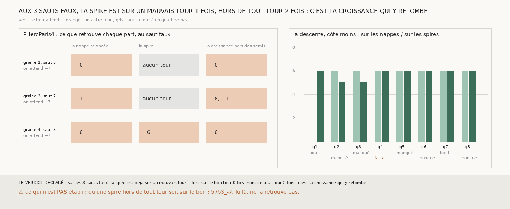

# `334` — Au septième saut, là où la chaîne relancée depuis sa spire se trompe, la spire ou la croissance se trompe-t-elle ? Deux fois sur trois, la spire n'est sur aucun tour et c'est la croissance qui retombe sur un tour publié

*`333` lisait la nappe relancée entière, et trouvait trois sauts faux au septième saut. Cette tranche refait la même chaîne, qui redonne
`333` sur les seize côtés, et lit aussi, à chaque saut, la spire seule et la part que la croissance a posée hors des semis. Au saut faux de
la graine 4, la spire est déjà sur `5753_-6`, qu'elle aurait dû quitter. Aux sauts faux des graines 2 et 3, la spire n'est sur aucun
tour à un quart de pas, et c'est la croissance qui retrouve `5753_-6` ou `5753_-1`. Par la règle déclarée, c'est la croissance qui y
retombe ; mais ces deux spires ne sont pas non plus sur `5753_-7`, qui passe là. Jugée sur ses spires seules, la chaîne descend six tours
en médiane avec un seul saut faux.*

## 0. Pourquoi cette tranche

C'est `R4-P130`. La nappe relancée de `333` a deux parts : les mailles semées depuis la spire, et ce que la croissance a posé au-delà. Si
la spire est déjà sur un mauvais tour, c'est le saut qui se trompe ; sinon c'est la croissance, et c'est elle qu'il faudrait borner.

## 1. Ce qui a été vu avant d'écrire

Tout ce que `296` à `333` publient, dont `R4-F519`. `333` n'avait lu que la nappe relancée.

## 2. Ce qui est fait

- **La chaîne** : celle de `333` sur PHercParis4, sans rien y changer. Elle redonne, côté par côté, la descente et ce qui l'arrête que `333`
  publie ; sinon la tranche était indécidable.
- **Les lectures** : à chaque saut, ce que la comparaison de `321` dit, contre `5753_0` à `5753_-7`, de la spire (ses points posés), et
  de la part de la nappe relancée posée par la croissance hors de ses semis. Pour cela, la mesure de `331` sait maintenant lire ces deux
  parts et ne mesurer que PHercParis4, et la relance de `333` rend le masque de ses semis ; les deux batteries passent, celle de `333` avec
  un contrôle de plus, sur ce masque.
- **La règle** : pour chaque saut faux, la spire du saut qui arrête la descente est **sur un mauvais tour** si elle en retrouve un sans
  retrouver celui qu'on attend, **sur le bon tour** si elle retrouve celui qu'on attend, **hors de tout tour** sinon ; c'est la spire qui
  se trompe si elle est sur un mauvais tour plus d'une fois sur deux, c'est la croissance qui y retombe si c'est moins d'une fois sur deux.

`m7` a été lu en 8044 chunks sur PHercParis4, sans panne.

## 3. Ce que disent les trois parts

| saut faux | on attend | la nappe relancée | la spire | la croissance hors des semis |
|---|---|---|---|---|
| graine 2, saut 8 | `5753_-7` | `5753_-6` | aucun tour | `5753_-6` |
| graine 3, saut 7 | `5753_-7` | `5753_-1` | aucun tour | `5753_-6` et `5753_-1` |
| graine 4, saut 8 | `5753_-7` | `5753_-6` | `5753_-6` | `5753_-6` |

⭐⭐⭐⭐ **Deux fois sur trois, la spire n'est sur aucun tour, et c'est la croissance qui retombe sur un tour publié** (`R4-F520`). Aux
sauts faux des graines 2 et 3, la part que la croissance pose hors des semis retrouve `5753_-6`, et sur la graine 3 aussi `5753_-1`, six
tours avant celui qu'on attend ; la spire ne retrouve aucun tour. Au saut faux de la graine 4, la spire est déjà sur `5753_-6` : ce saut ne l'a pas
quitté.

⚠⚠ **Hors de tout tour ne veut pas dire sur le bon.** Aux trois sauts faux, `5753_-7` a assez de sommets en face de la spire pour être lu,
et ne la retrouve pas : les spires des graines 2 et 3 ne sont ni sur `5753_-6` ni sur `5753_-7` à un quart de pas.

| graine, côté moins | jugée sur les nappes relancées (`333`) | jugée sur les spires seules |
|---|---|---|
| 1 | 0, un tour manqué | 6, le bout de la chaîne |
| 2 | 6, un saut faux | 5, un tour manqué |
| 3 | 6, un saut faux | 5, un tour manqué |
| 4 | 6, un saut faux | 6, un saut faux |
| 5 | 6, un tour manqué | 6, un tour manqué |
| 6 | 6, un tour manqué | 6, un tour manqué |
| 7 | 6, le bout de la chaîne | 6, le bout de la chaîne |
| 8 | 6, un tour manqué | 6, non lue |

⭐⭐⭐ **Jugée sur ses spires seules, la chaîne descend six tours en médiane et ne fait qu'un saut faux**, rapporté à côté et qui ne décide
rien. La graine 1, que la lecture de ses nappes arrêtait dès le premier tour, descend six tours par ses spires ; les graines 2 et 3
s'arrêtent à cinq sur un tour manqué au lieu d'un saut faux.

## 4. Le verdict

**SUR LES 3 SAUTS FAUX, LA SPIRE EST DÉJÀ SUR UN MAUVAIS TOUR 1 FOIS, SUR LE BON TOUR 0 FOIS, HORS DE TOUT TOUR 2 FOIS ; C'EST LA CROISSANCE QUI Y RETOMBE**

`R4-P130` est répondue : surtout la croissance. Là où la spire se perd entre deux tours, la croissance au-delà des semis va se poser sur un
tour publié, et c'est ce tour que la nappe relancée retrouve.

## 5. Ce que cette tranche ne dit pas

- ⚠⚠ Où sont les spires des graines 2 et 3 au septième saut : entre `5753_-6` et `5753_-7`, ou à cheval sur les deux ; la lecture ne garde
  que le verdict de `321`, pas l'écart.
- ⚠ Ce que ferait une croissance bornée autour des semis.

## 6. Les sondes

Une batterie de **13** contrôles et une figure de **13**. Six règles cassées exprès ont fait échouer la batterie : le saut qui arrête compté
depuis la nappe au lieu de la première surface qui retrouve un seul tour, la spire du saut suivant lue au lieu de la sienne, le bon tour
exigé seul, la spire désignée dès un saut faux sur un mauvais tour, la reproduction de `333` jugée sur la descente sans ce qui l'arrête,
et la reproduction ignorée. Une attente de la batterie était fausse et a été corrigée avant la mesure : la descente jugée sur les spires
d'un exemple construit vaut trois, pas quatre. Quatre sondes de la figure l'ont fait échouer, dont une seulement après qu'un contrôle a été
ajouté : les cases de la troisième colonne, qui sortaient de leur cadre au premier rendu. Les autres : le tour attendu jamais en vert, les
spires lues du côté plus, et une échelle tronquée à cinq.

## 7. Ce qui reste

`R4-P131` s'ouvre : une relance depuis la spire dont la croissance ne s'éloigne pas de plus de quelques mailles de ses semis garde-t-elle
la justesse sans perdre la surface ?
