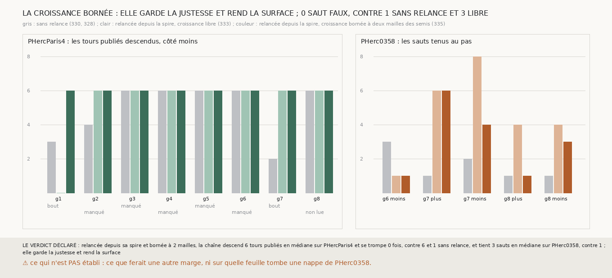

# `335` — Une relance depuis la spire dont la croissance reste à deux mailles de ses semis garde-t-elle la justesse sans perdre la surface ? Oui : six tours publiés sur les huit graines, sans un saut faux

*`334` montrait que c'est surtout la croissance loin des semis qui va se poser sur un tour publié quand la spire se perd. Cette tranche
refait la chaîne de `333` en ne laissant la croissance de chaque relance poser qu'à deux mailles au plus d'une maille semée. Sur
PHercParis4, la chaîne descend alors six tours publiés, de `5753_0` à `5753_-6`, sur les huit graines, et ne fait aucun saut faux, contre
un sans relance et trois avec la croissance libre de `333`. Ses nappes relancées posent moins que celles de `333`, jusqu'à 62 % du plan
côté moins au lieu de 91 %, mais encore 8 à 35 % au huitième saut, là où la spire sans relance était tombée à 10 % au plus. Sur
PHerc0358, elle tient 3 sauts au pas en médiane, contre 1 sans relance et 4 avec `333`. Par la règle déclarée, elle garde la justesse et
rend la surface.*

## 0. Pourquoi cette tranche

C'est `R4-P131`. Si c'est la croissance loin des semis qui retombe sur un tour publié quand la spire se perd (`R4-F520`), une croissance
qui reste près des semis ne le peut plus ; elle rend moins de surface à chaque relance, et la chaîne pourrait rétrécir comme sans relance.

## 1. Ce qui a été vu avant d'écrire

Tout ce que `296` à `334` publient, dont `R4-F519` et `R4-F520`. Aucune relance bornée n'avait été tirée.

## 2. Ce qui est fait

- **La chaîne** : celle de `333` sur les deux rouleaux, sans rien y changer, sauf la croissance de chaque relance.
- **La croissance bornée** : celle de `305`, partie des mailles semées depuis la spire, qui ne pose rien à plus de deux mailles d'une
  maille semée, diagonales comprises. Deux mailles font 20 voxels du plan : un pas de PHerc0358, un peu plus d'un pas du niveau 2 de
  PHercParis4. La boucle de croissance de `305` sait maintenant ne poser que des mailles permises ; sa batterie passe.
- **Les juges et la règle** : ceux de `333`, sans rien y changer. La relance bornée garde la justesse et rend la surface si PHercParis4
  descend au moins six tours en médiane avec au plus un saut faux et que PHerc0358 tient plus d'un saut en médiane.

`m7` a été lu en 7763 chunks sur PHercParis4 et 3047 sur PHerc0358, sans panne.

## 3. Ce que disent les deux rouleaux

| graine de PHercParis4 | sans relance (`330`) | croissance libre (`333`) | croissance bornée | ce qui arrête la chaîne bornée |
|---|---|---|---|---|
| 1 | 3 | 0 | 6 | le bout de la chaîne |
| 2 | 4 | 6 | 6 | un tour manqué |
| 3 | 6 | 6 | 6 | un tour manqué |
| 4 | 6 | 6 | 6 | un tour manqué |
| 5 | 6 | 6 | 6 | un tour manqué |
| 6 | 6 | 6 | 6 | un tour manqué |
| 7 | 2 | 6 | 6 | le bout de la chaîne |
| 8 | 6 | 6 | 6 | non lue |

| côté de PHerc0358 | sans relance (`328`) | croissance libre (`333`) | croissance bornée |
|---|---|---|---|
| g6 moins | 3 | 1 | 1 |
| g7 plus | 1 | 6 | 6 |
| g7 moins | 2 | 8 | 4 |
| g8 plus | 1 | 4 | 1 |
| g8 moins | 1 | 4 | 3 |

⭐⭐⭐⭐⭐ **Bornée à deux mailles de ses semis, la chaîne relancée descend six tours publiés sur les huit graines, sans un saut faux**
(`R4-F521`). Sans relance, cinq graines atteignaient `5753_-6` et une s'y trompait ; avec la croissance libre, sept l'atteignaient et
trois se trompaient au septième saut. Aucune des huit chaînes bornées ne s'arrête sur un saut faux : au septième saut, la surface ne
retrouve aucun tour ou n'est pas lue, ou la chaîne est au bout de ses huit sauts. La graine 1, que la lecture des nappes libres arrêtait
dès le premier tour, descend les six.

⭐⭐⭐ **La surface est rendue, en partie.** Côté moins, les nappes relancées bornées posent jusqu'à 62 % du plan et, au huitième saut, 8 à
35 % sur les sept graines relancées jusque-là ; la spire sans relance était tombée, au huitième saut, à 0,02 à 10 % sur les cinq graines qui
y arrivaient. Les nappes libres de `333` posaient jusqu'à 91 %. Sur PHerc0358, la chaîne bornée tient 3 sauts en médiane contre 1 sans
relance : la graine 7 côté plus en tient six, comme avec la croissance libre, mais la graine 7 côté moins en tient quatre au lieu de huit,
et la graine 8 côté plus un seul au lieu de quatre.

## 4. Le verdict

**RELANCÉE DEPUIS SA SPIRE ET BORNÉE À 2 MAILLES, LA CHAÎNE DESCEND 6 TOURS PUBLIÉS EN MÉDIANE SUR PHERCPARIS4 ET SE TROMPE 0 FOIS, CONTRE 6 ET 1 SANS RELANCE, ET TIENT 3 SAUTS EN MÉDIANE SUR PHERC0358, CONTRE 1 ; ELLE GARDE LA JUSTESSE ET REND LA SURFACE**

`R4-P131` est répondue : oui. Semer la spire sur sa propre feuille et ne faire croître que deux mailles autour garde chaque saut sur le tour
suivant jusqu'à `5753_-6`, et rend à la chaîne une surface que les sauts seuls perdaient.

## 5. Ce que cette tranche ne dit pas

- ⚠⚠ Pourquoi aucune chaîne, bornée ou non, ne retrouve `5753_-7` au septième saut, alors que ce tour est lu en face des spires (`R4-F520`).
- ⚠ Ce que ferait une autre marge ; deux mailles ont été choisies avant la mesure, et une seule marge a été tirée.
- ⚠ Sur quelle feuille tombent les nappes relancées de PHerc0358 : aucun tour n'y est publié.

## 6. Les sondes

Une batterie de **13** contrôles et une figure de **14**. Six règles cassées exprès ont fait échouer la batterie, dont une seulement après
qu'un contrôle a été ajouté : la relance de PHerc0358 laissée sans marge (vue quand les deux relances ont été sorties de la mesure pour
être exercées). Les autres : une marge de trois mailles, la relance de PHercParis4 sans marge, les sauts faux ignorés par la règle, la
borne ignorée par la croissance de `305`, et la dilatation remplacée par les semis seuls. Une attente de la batterie était fausse et a été
corrigée avant la mesure : la nappe libre couvre toute la région au-delà du pont, pas toute la grille. Le piège d'une marge nulle est
gardé : `binary_dilation` de scipy, avec zéro itération, dilate jusqu'à ne plus rien changer et remplirait toute la grille. Quatre sondes
de la figure l'ont fait échouer : le verdict sur une seule ligne, qui débordait de la toile au premier rendu et a été coupé en deux ; une
échelle tronquée à six ; les barres libres lues dans la mesure de `331` ; et l'espacement des barres de `331`.

## 7. Ce qui reste

`R4-P132` s'ouvre : au septième saut, pourquoi aucune chaîne ne retrouve-t-elle `5753_-7` ; la surface tombe-t-elle entre `5753_-6` et
`5753_-7`, ou `5753_-7` est-il décalé de la feuille que `m7` voit ?
