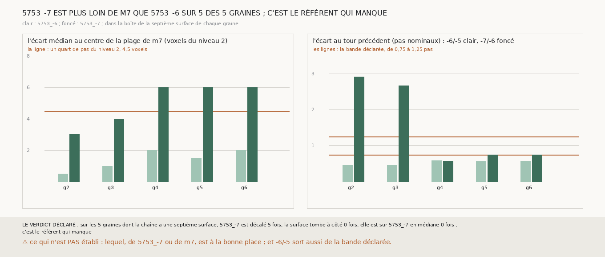

# `336` — Au septième saut, pourquoi aucune chaîne ne retrouve-t-elle `5753_-7` ? Là où la chaîne l'attend, `5753_-7` est plus loin des plages de `m7` que `5753_-6` ; mais la mesure de l'écart entre tours a révélé que les tours publiés ne sont pas à un pas nominal l'un de l'autre

*Aucune chaîne, sans relance, relancée libre ou bornée, n'a retrouvé `5753_-7`. Cette tranche refait la chaîne bornée de `335`, qui
redonne `335` sur les seize côtés, et mesure, dans la boîte de la surface qui devait retrouver `5753_-7`, où sont cette surface,
`5753_-6`, `5753_-7` et les plages de `m7`. Sur les cinq graines qui ont une telle surface, `5753_-7` est à 3 à 6 voxels du niveau 2, en
médiane, du centre de la plage de `m7` la plus proche, quand `5753_-6` en est à 0,5 à 2 dans les mêmes boîtes ; aucune de ces surfaces
n'est à un quart de pas de `5753_-7`. Par la règle déclarée, `5753_-7` est décalé sur les cinq : c'est le référent qui manque. Mais un des
deux critères de la règle, l'écart de `5753_-7` à `5753_-6` rapporté au pas nominal, ne sépare rien : `5753_-6` et `5753_-5` sont
eux-mêmes à 0,45 à 0,59 pas nominal l'un de l'autre, là où la chaîne retrouve `5753_-6`.*

## 0. Pourquoi cette tranche

C'est `R4-P132`. Deux causes donneraient la même lecture : une surface qui tombe à côté de `5753_-7`, ou un `5753_-7` qui n'est pas là où
une surface tirée de `m7` peut le trouver.

## 1. Ce qui a été vu avant d'écrire

Tout ce que `296` à `335` publient, dont `R4-F520` et `R4-F521`. Aucune septième surface n'avait été rapportée à `5753_-6` et `5753_-7`.

## 2. Ce qui est fait

- **La chaîne** : celle de `335` sur PHercParis4, sans rien y changer ; elle redonne `335` côté par côté, sinon la tranche était
  indécidable. La mesure de `331` montre maintenant chaque saut à un observateur, qui garde ici chaque nappe relancée ; sa batterie passe.
- **La septième surface** : pour chaque graine dont la descente, côté moins, atteint `5753_-6` et s'arrête sur une surface lue, celle qui
  devait retrouver `5753_-7`. Cinq graines en ont une ; les graines 1 et 7 sont au bout de leurs huit sauts, et la huitième surface de la
  graine 8 n'est pas lue.
- **Les mesures**, dans la boîte de cette surface élargie de 100 voxels : l'écart de la surface à `5753_-6` et à `5753_-7` par la
  comparaison de `321` ; l'écart de `5753_-7` à `5753_-6` en pas nominaux (72,08 voxels de 2,4 µm) ; l'écart de `5753_-7` au centre de la
  plage de `m7` la plus proche, comme `332`. Et, rapportés à côté, les mêmes écarts un tour plus haut : `5753_-6` à `5753_-5`, et `5753_-6`
  à `m7`.
- **La règle** : `5753_-7` est décalé si son écart à `5753_-6` sort de 0,75 à 1,25 pas nominal ou si son écart médian à `m7` dépasse un
  quart de pas du niveau 2 (4,5 voxels) ; sinon la surface tombe à côté de `5753_-7` si elle en est à plus d'un quart de pas ou s'il n'est
  pas lu en face d'elle ; sinon elle est sur `5753_-7` en médiane sans le retrouver. La cause qui l'emporte sur les deux autres donne
  l'issue.

`m7` a été lu en 7763 chunks pour la chaîne et 158 pour les tours, sans panne.

## 3. Ce que disent les mesures

| graine | saut | la surface et `5753_-6` (pas) | la surface et `5753_-7` (pas) | `5753_-7` et `5753_-6` (pas) | `5753_-6` et `5753_-5` (pas) | `5753_-7` et `m7` (voxels) | `5753_-6` et `m7` (voxels) |
|---|---|---|---|---|---|---|---|
| 2 | 8 | −0,543 | 2,896 | 2,912 | 0,466 | 3,0 | 0,5 |
| 3 | 7 | −0,157 | non lu | 2,67 | 0,448 | 4,0 | 1,0 |
| 4 | 8 | −1,607 | −1,226 | 0,579 | 0,591 | 6,0 | 2,0 |
| 5 | 8 | −1,294 | −1,109 | 0,75 | 0,561 | 6,0 | 1,5 |
| 6 | 7 | −0,5 | 0,391 | 0,747 | 0,572 | 6,0 | 2,0 |

⭐⭐⭐⭐ **Là où la chaîne l'attend, `5753_-7` n'est pas posé sur `m7` comme `5753_-6` l'est** (`R4-F522`). Sur les cinq graines,
`5753_-7` est plus loin du centre de la plage de `m7` la plus proche que `5753_-6` : 3 à 6 voxels du niveau 2 en médiane contre 0,5 à 2, et
10 à 27 % de ses sommets à un voxel contre 35 à 77 %. Aucune septième surface n'est à un quart de pas de `5753_-7` : elles en sont à plus
d'un pas sur les graines 2, 4 et 5, à 0,39 pas sur la graine 6, et `5753_-7` n'a pas assez de sommets en face de la surface de la graine 3.
Sur les graines 2 et 3, `5753_-7` passe à peine dans la boîte : 140 et 241 de ses sommets en face de `5753_-6`, à près de trois pas
nominaux.

⭐⭐⭐⭐ **Et les tours publiés consécutifs ne sont pas à un pas nominal l'un de l'autre.** Dans les mêmes boîtes, `5753_-6` est à 0,45 à
0,59 pas nominal de `5753_-5`, sur 5844 à 17 384 sommets en face ; c'est là que la chaîne retrouve `5753_-6`. La bande de 0,75 à 1,25 pas
déclarée pour `5753_-7` n'a donc pas de sens ici : un tour que la chaîne retrouve en sort aussi. Cette lecture est faite après coup, sur la
mesure, et ne change pas la règle. Avec le seul critère de `m7`, `5753_-7` est décalé sur les graines 4, 5 et 6, et la surface tombe à
côté de lui sur les graines 2 et 3 ; la cause qui l'emporte reste le référent, par trois contre deux.

## 4. Le verdict

**SUR LES 5 GRAINES DONT LA CHAÎNE A UNE SEPTIÈME SURFACE, 5753_-7 EST DÉCALÉ 5 FOIS, LA SURFACE TOMBE À CÔTÉ 0 FOIS, ELLE EST SUR 5753_-7 EN MÉDIANE 0 FOIS ; C'EST LE RÉFÉRENT QUI MANQUE**

`R4-P132` est répondue, avec une réserve sur la règle : `5753_-7` n'est pas là où une surface tirée de `m7` peut le trouver, et c'est la
seule différence que la mesure montre entre lui et `5753_-6`. La moitié de la règle qui portait sur l'écart entre tours ne sépare rien.

## 5. Ce que cette tranche ne dit pas

- ⚠⚠ Lequel, de `5753_-7` ou de `m7`, est à la bonne place : la mesure dit qu'ils ne s'accordent pas, pas qui a raison.
- ⚠⚠ Ce que valent les lectures « retrouve » de `321`, tolérantes à un quart du pas nominal, entre des tours publiés à un demi-pas
  nominal l'un de l'autre : une surface à mi-chemin de deux tours y serait à un quart de pas de chacun. C'est `R4-P133`.
- ⚠ Où irait un huitième saut.

## 6. Les sondes

Une batterie de **18** contrôles et une figure de **12**. Huit règles cassées exprès ont fait échouer la batterie : le critère de `m7` ôté,
l'écart de la surface à `5753_-7` pris avec son signe, la septième surface cherchée sans exiger `5753_-7`, les chaînes au bout de leurs
sauts comptées, l'écart entre deux tours pris avec son signe (un contrôle ajouté avant la première sonde, sur des normales retournées),
l'égalité tranchée au lieu de rendue, une surface non mesurable comptée, la reproduction de `335` ignorée ; et une sonde mal posée a été
reposée. Quatre sondes de la figure l'ont fait échouer, dont une seulement après qu'un contrôle a été ajouté : les étiquettes des lignes
posées sur les lignes, que la barre de la graine 5 recouvrait au premier rendu. Les autres : une échelle des pas tronquée, des barres mal
étiquetées, et un titre qui ne lit pas la mesure.

## 7. Ce qui reste

`R4-P133` s'ouvre : là où la chaîne les descend, à quel écart les tours publiés consécutifs `5753_0` à `5753_-7` sont-ils l'un de l'autre,
et la lecture « retrouve » à un quart du pas nominal y distingue-t-elle encore un tour du suivant ?
