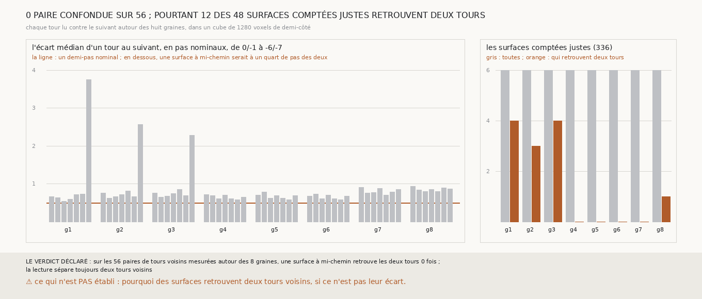

# `337` — Deux tours publiés voisins se distinguent-ils à un quart de pas ? Oui : aucune surface à mi-chemin ne les retrouve tous les deux ; ce n'est donc pas leur écart qui fait que 12 surfaces de la descente en retrouvent deux

*`336` avait trouvé `5753_-6` et `5753_-5` à 0,45 à 0,59 pas nominal l'un de l'autre, et la lecture de `321` retrouve un tour à un quart
du pas nominal : entre deux tours à moins d'un demi-pas, une surface à mi-chemin serait à un quart de pas des deux. Cette tranche mesure,
dans un cube de 1280 voxels de demi-côté autour de chacune des huit graines, l'écart de chaque tour publié au suivant, de `5753_0` à
`5753_-7`, et lit contre les deux tours une surface posée à mi-chemin. Sur les 56 paires, l'écart médian va de 0,53 à 0,93 pas nominal,
hors de `5753_-6` et `5753_-7` autour des graines 1 à 3 où il dépasse deux pas ; aucune surface à mi-chemin ne retrouve les deux tours. La
lecture sépare toujours deux tours voisins. Pourtant, dans la descente de la chaîne bornée, 12 des 48 surfaces comptées justes retrouvent
deux tours, toutes sur les graines 1, 2, 3 et 8 : ce n'est pas leur écart qui en est la cause.*

## 0. Pourquoi cette tranche

C'est `R4-P133`. La descente de `330`, reprise par `331` à `336`, compte un saut juste dès que la surface retrouve le tour attendu, même
avec un autre ; si deux tours voisins pouvaient être retrouvés ensemble par leur seul écart, une descente pourrait être comptée juste sans
l'être.

## 1. Ce qui a été vu avant d'écrire

Tout ce que `296` à `336` publient, dont `R4-F522`, et des surfaces de `333` et `334` qui retrouvent deux tours à la fois. Aucune surface à
mi-chemin de deux tours n'avait été lue.

## 2. Ce qui est fait

- **Les boîtes** : autour de chacune des huit graines de `321`, un cube de 1280 voxels de 2,4 µm de demi-côté, la demi-largeur du plan
  des nappes.
- **Les paires** : pour chaque graine et chaque paire de tours consécutifs, les sommets du premier dans la boîte, au plus 20 000, et leur
  écart au second le long de leur normale.
- **La surface à mi-chemin** : chaque sommet du premier tour qui a le second en face, déplacé de la moitié de son écart, lue contre les deux
  tours par la lecture de `329`.
- **La règle** : deux tours voisins sont confondus autour d'une graine si leur surface à mi-chemin les retrouve tous les deux ; la lecture
  sépare toujours deux tours voisins si aucune paire ne l'est.
- **Rapporté à côté** : dans la descente de la chaîne bornée telle que `336` l'a relevée, les surfaces comptées justes qui retrouvent aussi
  un autre tour.

Les 56 paires ont toutes au moins 2624 sommets en face ; la mesure n'a lu que les tours publiés, pas `m7`.

## 3. Ce que disent les tours publiés

⭐⭐⭐⭐⭐ **Aucune surface à mi-chemin ne retrouve deux tours voisins** (`R4-F523`). Sur les 56 paires, 55 surfaces à mi-chemin ne
retrouvent aucun des deux tours, et une en retrouve un seul (`5753_-3` autour de la graine 1, où `5753_-2` et `5753_-3` sont au plus près,
à 0,532 pas nominal). L'écart médian d'un tour au suivant va de 0,53 à 0,93 pas nominal, 0,70 en médiane, sauf `5753_-6` à `5753_-7` autour
des graines 1, 2 et 3, où il vaut 3,75, 2,57 et 2,28 pas : `5753_-7` n'y passe pas à un pas de `5753_-6`. La part des sommets à moins d'un
demi-pas nominal de leur voisin ne dépasse pas 48 %, et vaut 24 % en médiane : une surface posée à mi-chemin a toujours plus de la moitié
de ses sommets en face au-delà d'un quart de pas.

| graine | surfaces comptées justes | qui retrouvent aussi un autre tour |
|---|---|---|
| 1 | 6 | 4 |
| 2 | 6 | 3 |
| 3 | 6 | 4 |
| 4 | 6 | 0 |
| 5 | 6 | 0 |
| 6 | 6 | 0 |
| 7 | 6 | 0 |
| 8 | 6 | 1 |

⭐⭐⭐ **Et pourtant 12 surfaces comptées justes retrouvent deux tours**, rapporté à côté. Elles sont sur les graines 1, 2 et 3, les mêmes
autour desquelles `5753_-7` est à plus de deux pas de `5753_-6`, et une sur la graine 8. Puisque l'écart entre tours ne peut pas en être la
cause, une surface qui en retrouve deux doit être posée, par endroits, sur l'un et, ailleurs, sur l'autre.

## 4. Le verdict

**SUR LES 56 PAIRES DE TOURS VOISINS MESURÉES AUTOUR DES 8 GRAINES, UNE SURFACE À MI-CHEMIN RETROUVE LES DEUX TOURS 0 FOIS ; LA LECTURE SÉPARE TOUJOURS DEUX TOURS VOISINS**

`R4-P133` est répondue : à un quart du pas nominal, la lecture ne peut pas donner une même surface à deux tours voisins par leur seul
écart. Les tours publiés sont à 0,7 pas nominal l'un de l'autre en médiane là où la chaîne descend, pas à un pas ; l'écart de 0,45 à 0,59
relevé par `336` était celui des boîtes plus étroites de ses septièmes surfaces.

## 5. Ce que cette tranche ne dit pas

- ⚠⚠ Pourquoi des surfaces retrouvent deux tours voisins, si ce n'est pas leur écart ; et si les graines 1, 2 et 3 sont près de l'endroit où
  un tour publié finit et le suivant commence.
- ⚠ Si les tours publiés sont à la bonne place.

## 6. Les sondes

Une batterie de **12** contrôles et une figure de **12**. Six règles cassées exprès ont fait échouer la batterie, dont une seulement après
qu'un contrôle a été ajouté : une paire mesurée sans le minimum de 50 sommets en face (vue quand un tour réduit à un sommet a été mis en
face d'un plan). Les autres : la surface posée sur le second tour au lieu de mi-chemin, deux tours dits confondus dès que l'un est
retrouvé, la surface d'avant et celle d'après comptées dans la descente, et une seule paire confondue tolérée. Une septième, les écarts
gardés d'un seul signe, a fait échouer la batterie par une exception avant qu'un contrôle ne la lise proprement. Deux montages de la
batterie ont été refaits avant la mesure : la descente construite ne distinguait pas la surface d'avant de celle d'après, et un tour de 25
sommets avait 78 sommets en face au lieu de moins de 50. Quatre sondes de la figure l'ont fait échouer : l'espacement des barres du
premier rendu, qui sortaient de leur cadre ; une échelle tronquée à trois pas ; un titre figé ; et les barres orange lues dans le mauvais
champ.

## 7. Ce qui reste

`R4-P134` s'ouvre : les surfaces qui retrouvent deux tours voisins passent-elles là où un tour publié finit et le suivant commence ?
