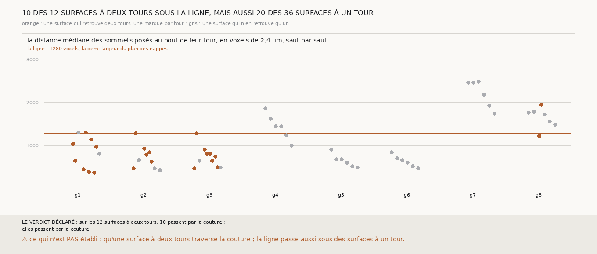

# `338` — Les surfaces qui retrouvent deux tours publiés voisins passent-elles là où un tour finit et le suivant commence ? Par la règle, dix sur douze ; mais la règle ne les sépare pas des surfaces à un tour

*`337` montrait que la lecture ne peut pas donner une surface à deux tours voisins par leur seul écart, et que pourtant 12 des 48 surfaces
comptées justes par la descente de la chaîne bornée en retrouvent deux. Une feuille découpée en tours a une couture là où un tour finit et
le suivant commence ; une surface qui la traverse est sur un tour d'un côté et sur l'autre de l'autre. Cette tranche refait la chaîne
bornée, qui redonne `335`, et mesure, pour chaque tour qu'une surface comptée retrouve, la distance de ses sommets posés au bout de ce
tour, le long de leurs rangées. Dix des douze surfaces à deux tours ont leurs deux tours à moins de 1280 voxels, en médiane, de leur bout
: par la règle déclarée, elles passent par la couture. Mais 20 des 36 surfaces qui ne retrouvent qu'un tour sont elles aussi à moins de
1280 voxels du bout de leur tour : toute la région des graines est près du bout des tours publiés, et la règle ne distingue pas une
surface qui traverse la couture d'une surface qui s'arrête avant.*

## 0. Pourquoi cette tranche

C'est `R4-P134`. Si les surfaces à deux tours traversent la couture entre deux tours publiés, elles sont justes, et la descente les compte à
bon droit ; si elles ne la traversent pas, elles sont à cheval sur deux tours ailleurs, ce qui serait une faute que la descente cache.

## 1. Ce qui a été vu avant d'écrire

Tout ce que `296` à `337` publient, dont `R4-F523` ; et la forme des tours publiés : chacun est une grille dont les rangées vont en hauteur
et les colonnes font le tour, à 20 voxels l'une de l'autre, sur 576 à 688 colonnes. Un tour publié finit à sa première et à sa dernière
colonne posées.

## 2. Ce qui est fait

- **La chaîne** : celle de `335`, qui la redonne côté par côté ; chaque nappe relancée est gardée.
- **Les surfaces comptées** : côté moins, les surfaces que la descente compte justes, 48 en tout, dont 12 retrouvent deux tours voisins.
- **Les sommets posés** : pour chaque tour qu'une surface retrouve, ses sommets dans la boîte de la surface élargie de 100 voxels, qui ont
  la surface en face à au plus un quart de pas.
- **Le bout du tour** : pour chacun, la distance le long de sa rangée à la première ou à la dernière colonne posée, la plus proche.
- **La règle** : une surface à deux tours passe par la couture si, pour ses deux tours, cette distance médiane est d'au plus 1280 voxels, la
  demi-largeur du plan des nappes ; elles y passent si c'est le cas de plus de la moitié.

`m7` a été lu en 7763 chunks, sans panne.

## 3. Ce que disent les surfaces

| graine | saut | les deux tours | distance au bout du premier | distance au bout du second | passe par la couture |
|---|---|---|---|---|---|
| 1 | 3 | `5753_0` et `5753_-1` | 640 | 1040 | oui |
| 1 | 5 | `5753_-2` et `5753_-3` | 440 | 1300 | non |
| 1 | 6 | `5753_-3` et `5753_-4` | 380 | 1140 | oui |
| 1 | 7 | `5753_-4` et `5753_-5` | 360 | 960 | oui |
| 2 | 2 | `5753_0` et `5753_-1` | 1280 | 460 | oui |
| 2 | 4 | `5753_-2` et `5753_-3` | 920 | 780 | oui |
| 2 | 5 | `5753_-3` et `5753_-4` | 840 | 620 | oui |
| 3 | 1 | `5753_0` et `5753_-1` | 1280 | 460 | oui |
| 3 | 3 | `5753_-2` et `5753_-3` | 900 | 800 | oui |
| 3 | 4 | `5753_-3` et `5753_-4` | 800 | 640 | oui |
| 3 | 5 | `5753_-4` et `5753_-5` | 740 | 500 | oui |
| 8 | 4 | `5753_-2` et `5753_-3` | 1220 | 1940 | non |

⭐⭐⭐ **Par la règle, dix des douze surfaces à deux tours passent par la couture** (`R4-F524`). Les douze retrouvent deux tours
consécutifs, jamais deux tours plus éloignés. Leurs sommets posés sont à 360 à 1940 voxels du bout de leur tour, 800 en médiane.

⚠⚠ **Mais la règle ne les sépare pas des surfaces à un tour.** Les 36 surfaces qui ne retrouvent qu'un tour ont leurs sommets posés à 420
à 2480 voxels du bout de leur tour, 950 en médiane, et 20 d'entre elles sont sous 1280 voxels. Les sommets posés de toutes les surfaces
comptées sont, en médiane, à moins de 2500 voxels du bout des tours publiés, qui font le tour en 576 à 688 colonnes de 20 voxels : être
près du bout ne dit pas qu'une surface traverse la couture. Cette lecture de la règle est faite après coup, sur la mesure ; elle ne change
pas le verdict déclaré, elle le réduit à une compatibilité.

## 4. Le verdict

**SUR LES 12 SURFACES À DEUX TOURS, 10 PASSENT PAR LA COUTURE ; ELLES PASSENT PAR LA COUTURE**

`R4-P134` est répondue par la règle, et pas établie par la mesure : les surfaces à deux tours sont près du bout de leurs deux tours, comme
le serait une surface qui traverse la couture, mais la moitié des surfaces à un tour le sont aussi.

## 5. Ce que cette tranche ne dit pas

- ⚠⚠ Si une surface à deux tours traverse la couture, ses sommets posés sur chacun des deux tours doivent aller jusqu'au bout de ce tour ;
  ceux d'une surface à un tour peuvent s'arrêter avant. La médiane ne le dit pas : c'est `R4-P135`.
- ⚠ Si la couture des tours publiés est au bon endroit.

## 6. Les sondes

Une batterie de **12** contrôles et une figure de **12**. Six règles cassées exprès ont fait échouer la batterie : la distance comptée aux
bouts de la grille au lieu de ceux de la rangée, un seul des deux tours près de son bout suffisant, les sommets posés pris sans le quart de
pas, la surface de départ comptée dans la descente, une surface non mesurable comptée, et la reproduction de `335` ignorée. Quatre sondes de
la figure l'ont fait échouer : une échelle tronquée à 2000 voxels, un titre figé, les deux genres de surface confondus, et des marques trop
écartées qui sortaient du cadre.

## 7. Ce qui reste

`R4-P135` s'ouvre : les sommets posés d'une surface à deux tours vont-ils jusqu'au bout de chacun de ses deux tours, là où ceux d'une
surface à un tour s'arrêtent avant ?
